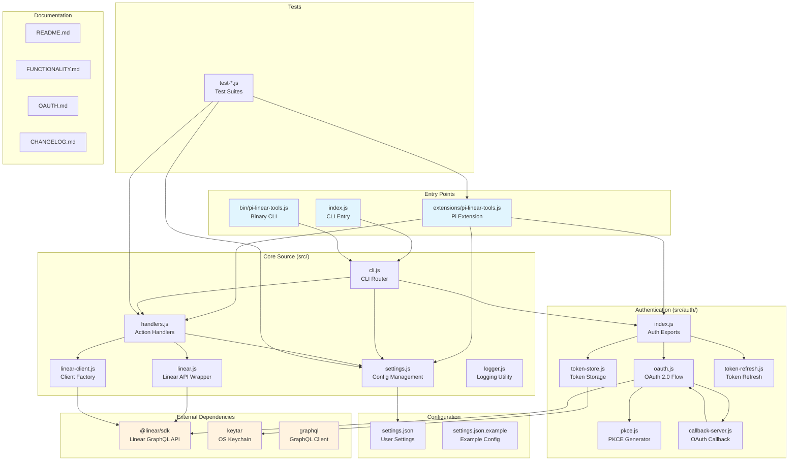
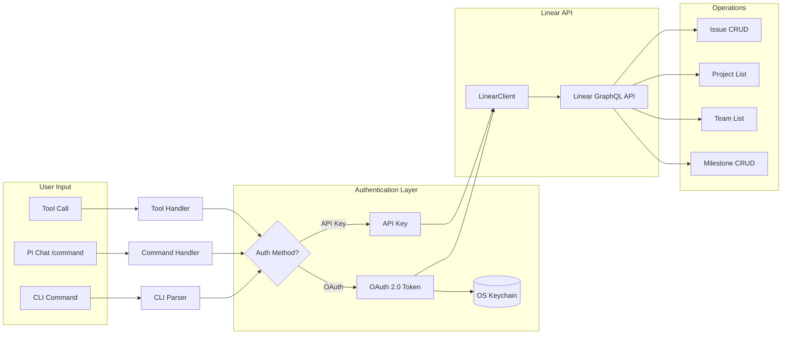
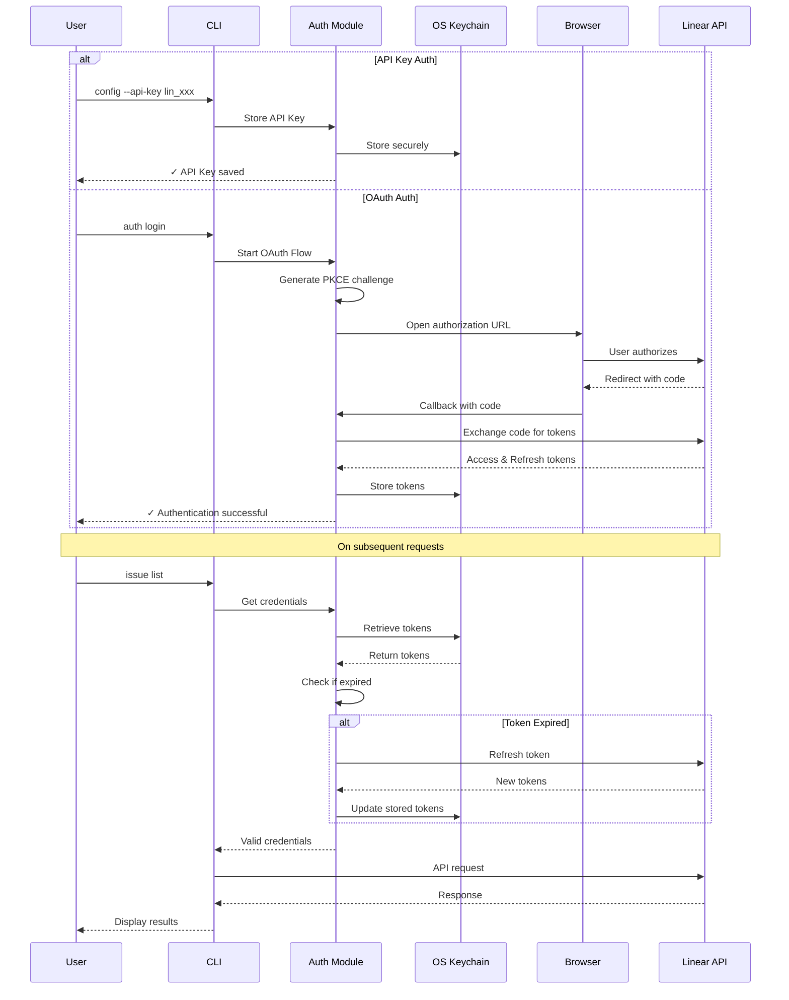
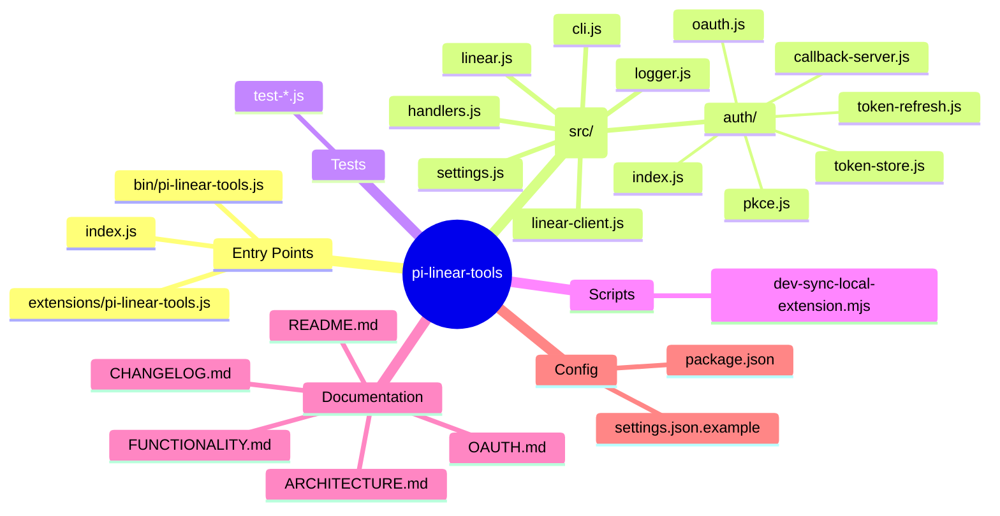

# pi-linear-tools Architecture

## Repository Structure Diagram



## Data Flow Diagram



## Component Diagram

```mermaid
graph TB
    subgraph "Pi Extension Interface"
        CMD1[/linear-tools-config]
        CMD2[/linear-tools-help]
        CMD3[/linear-tools-reload]
        TOOL1[linear_issue]
        TOOL2[linear_project]
        TOOL3[linear_team]
        TOOL4[linear_milestone]
    end

    subgraph "CLI Interface"
        CLI_AUTH[auth login/logout/status]
        CLI_CONFIG[config]
        CLI_ISSUE[issue list/view/create/update/comment/start/delete]
        CLI_PROJECT[project list]
        CLI_TEAM[team list]
        CLI_MILESTONE[milestone list/view/create/update/delete]
    end

    subgraph "Core Handlers"
        H_LIST[executeIssueList]
        H_VIEW[executeIssueView]
        H_CREATE[executeIssueCreate]
        H_UPDATE[executeIssueUpdate]
        H_COMMENT[executeIssueComment]
        H_START[executeIssueStart]
        H_DELETE[executeIssueDelete]
        H_PROJ[executeProjectList]
        H_TEAM[executeTeamList]
        H_MLIST[executeMilestoneList]
        H_MVIEW[executeMilestoneView]
        H_MCREATE[executeMilestoneCreate]
        H_MUPDATE[executeMilestoneUpdate]
        H_MDELETE[executeMilestoneDelete]
    end

    CMD1 --> CONFIG[Config Handler]
    TOOL1 --> ISSUE_H[Issue Dispatcher]
    TOOL2 --> H_PROJ
    TOOL3 --> H_TEAM
    TOOL4 --> MILESTONE_H[Milestone Dispatcher]

    CLI_ISSUE --> ISSUE_H
    CLI_MILESTONE --> MILESTONE_H

    ISSUE_H --> H_LIST
    ISSUE_H --> H_VIEW
    ISSUE_H --> H_CREATE
    ISSUE_H --> H_UPDATE
    ISSUE_H --> H_COMMENT
    ISSUE_H --> H_START
    ISSUE_H --> H_DELETE

    MILESTONE_H --> H_MLIST
    MILESTONE_H --> H_MVIEW
    MILESTONE_H --> H_MCREATE
    MILESTONE_H --> H_MUPDATE
    MILESTONE_H --> H_MDELETE
```

## Authentication Flow



## File Tree Overview


