# pi-linear-tools Project Structure

## 📊 Project Overview - Mermaid Mind Map

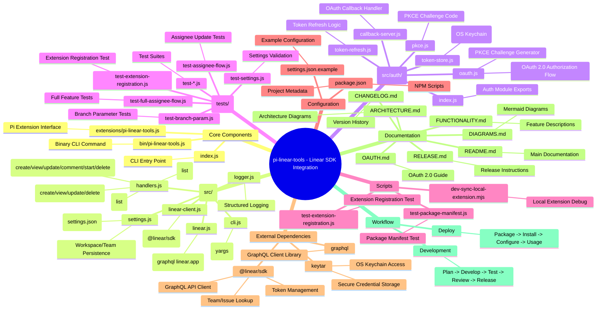

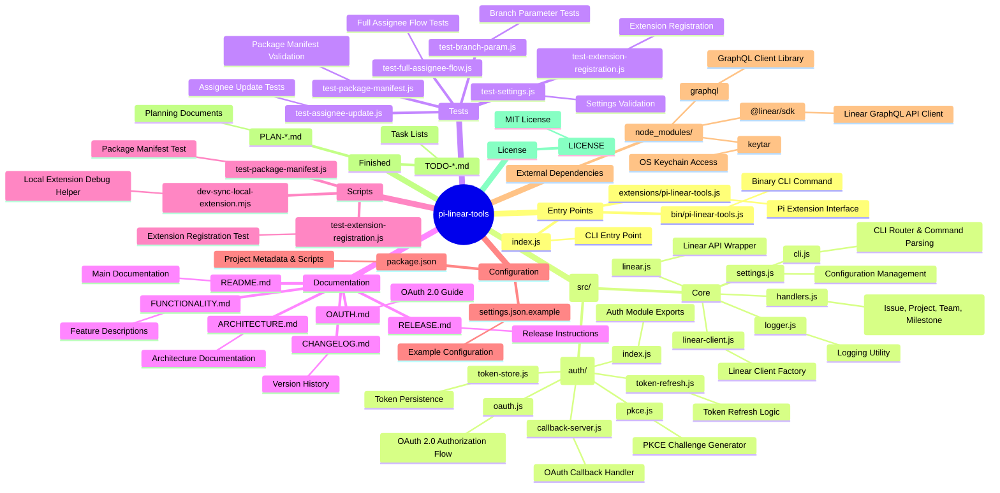

---

## 2. Architecture - Flowchart

```mermaid
flowchart TB
    subgraph User_Interaction["User Interaction"]
        U1[CLI Command<br/>pi-linear-tools issue list]
        U2[Pi Chat /command<br/>/linear-tools-config]
        U3[Tool Call<br/>linear_issue list]
    end

    subgraph Entry_Points["Entry Points"]
        A[index.js<br/>CLI Entry]
        B[bin/pi-linear-tools.js<br/>Binary CLI]
        C[extensions/pi-linear-tools.js<br/>Pi Extension]
    end

    subgraph Core_Source["Core Source"]
        D[cli.js<br/>CLI Router]
        E[handlers.js<br/>Action Handlers]
        F[linear.js<br/>Linear API Wrapper]
        G[linear-client.js<br/>Client Factory]
        H[settings.js<br/>Config Management]
        I[logger.js<br/>Logging Utility]
    end

    subgraph Auth_Layer["Authentication Layer"]
        J[auth/index.js<br/>Auth Module]
        K[oauth.js<br/>OAuth Flow]
        L[pkce.js<br/>PKCE]
        M[token-store.js<br/>Token Storage]
        N[token-refresh.js<br/>Token Refresh]
        O[callback-server.js<br/>Callback Handler]
    end

    subgraph External["External Dependencies"]
        P[@linear/sdk<br/>Linear SDK]
        Q[keytar<br/>OS Keychain]
        R[graphql<br/>GraphQL]
    end

    subgraph Configuration["Configuration"]
        S[settings.json<br/>User Settings]
        T[settings.json.example<br/>Example Config]
    end

    subgraph Output["Output"]
        R1[CLI Output]
        R2[Pi Chat Output]
        R3[Tool Results]
    end

    U1 --> A
    U2 --> C
    U3 --> C

    A --> D
    B --> D
    C --> E
    C --> H
    C --> J

    D --> E
    D --> H
    D --> J

    E --> F
    E --> G
    E --> H
    E --> I

    J --> K
    J --> M
    J --> N
    K --> L
    K --> O
    K --> P
    M --> Q

    F --> P
    G --> P

    H --> S

    E --> R1
    D --> R1
    C --> R2
    J --> R3

    style User_Interaction fill:#ffebee
    style Entry_Points fill:#e3f2fd
    style Core_Source fill:#e8f5e9
    style Auth_Layer fill:#fff3e0
    style External fill:#f3e5f5
    style Configuration fill:#fce4ec
    style Output fill:#e0f7fa
```

---

## 3. CLI Command Flow

```mermaid
flowchart LR
    subgraph Start["Start"]
        A[User Command<br/>pi-linear-tools issue list]
    end

    subgraph Parse["Parse Input"]
        B[Argument Parser<br/>yargs]
        C[Validate Arguments]
    end

    subgraph Route["Route Command"]
        D[Command Router<br/>cli.js]
        E[Match Command to Handler]
    end

    subgraph Auth["Authentication Check"]
        F{Auth Required?}
        G[Get Credentials<br/>from Settings/Env]
        H[Store in Session]
    end

    subgraph Execute["Execute Handler"]
        I[Initialize Client<br/>linear-client.js]
        J[Call API<br/>linear.js]
        K[Format Output<br/>format.js]
    end

    subgraph Output["Output Results"]
        L[Display to Terminal]
    end

    Start --> Parse
    Parse --> Route
    Route --> Auth
    Auth --> Execute
    Execute --> Output

    style Start fill:#e1f5fe
    style Parse fill:#b3e5fc
    style Route fill:#81d4fa
    style Auth fill:#4fc3f7
    style Execute fill:#29b6f6
    style Output fill:#039be5
```

---

## 4. Pi Extension Flow

```mermaid
flowchart LR
    subgraph Pi["Pi System"]
        P1[/message_received<br/>user request]
        P2[Context Analyzer]
        P3[Tool Dispatcher]
        P4[/tool_call<br/>linear_issue]
    end

    subgraph Extension["Pi Extension"]
        X1[Command Handler<br/>handlers.js]
        X2[Config Manager<br/>settings.js]
        X3[Auth Provider<br/>auth/]
    end

    subgraph Linear["Linear SDK"]
        L1[GraphQL API]
        L2[API Client]
    end

    P1 --> P2
    P2 --> P3
    P3 --> X1
    P3 --> X2
    P3 --> X3
    X1 --> L1
    X3 --> L1
    L1 --> P4
    P4 --> P2

    style Pi fill:#fce4ec
    style Extension fill:#f8bbd0
    style Linear fill:#f48fb1
```

---

## 5. Authentication Flow - Sequence

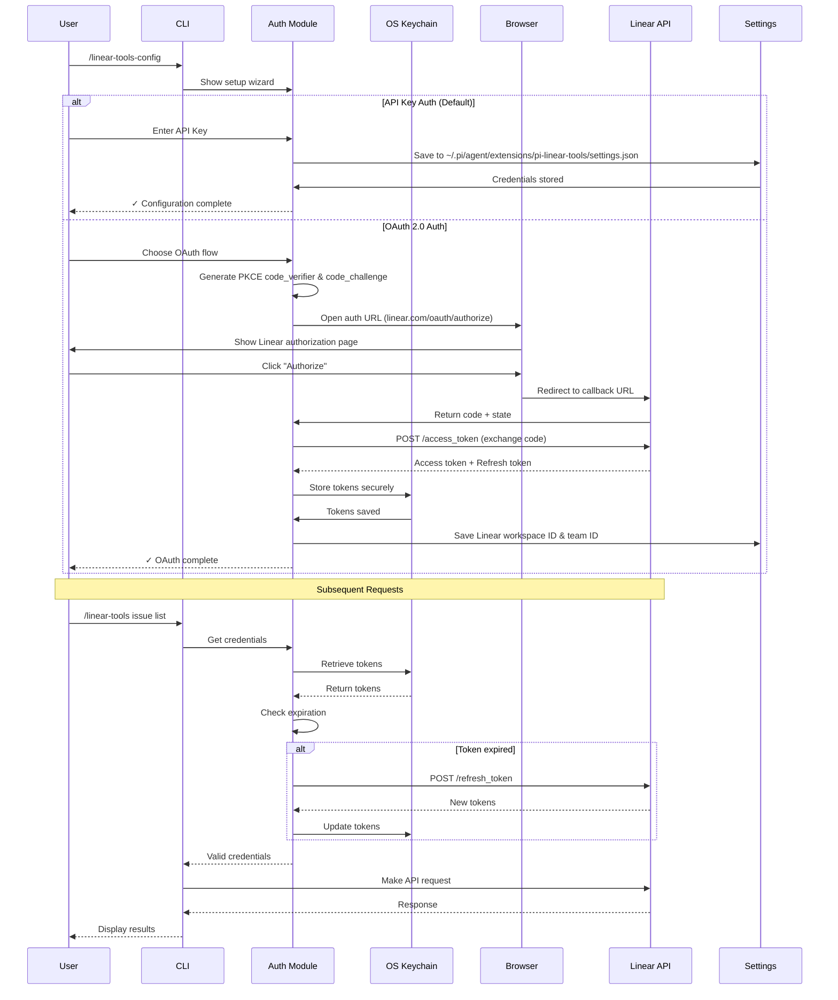

---

## 6. REST API Flow

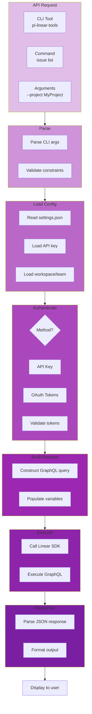

---

## 7. Test Flow

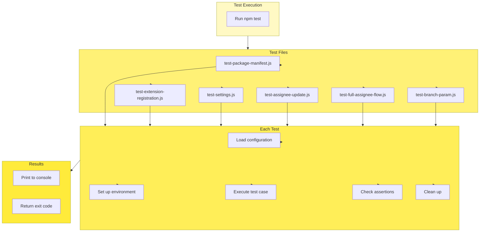

---

## 8. Development Workflow

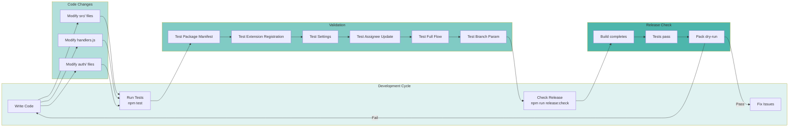

---

## 9. Component Interaction

```mermaid
graph TB
    subgraph Interface["Interfaces"]
        CMD[/linear-tools-config]
        HELP[/linear-tools-help]
        TOOL[linear_issue]
        EXT[pi-linear-tools.js]
    end

    subgraph CLI["CLI Component"]
        CLI_PARSER[Argument Parser]
        ROUTER[Command Router]
        FORMATTER[Output Formatter]
    end

    subgraph Handlers["Handlers Component"]
        ISSUES[Issue Handlers]
        PROJECTS[Project Handlers]
        TEAMS[Team Handlers]
        MILESTONES[Milestone Handlers]
    end

    subgraph Core["Core Component"]
        CLIENT[LinearClient]
        API[LinearAPI]
        CONFIG[Settings Manager]
        LOG[Logger]
    end

    subgraph Auth["Auth Component"]
        OAuth[OAuth Flow]
        Token[Token Manager]
        Store[Token Store]
    end

    subgraph ExtSDK["Linear SDK"]
        SDK[@linear/sdk]
    end

    CMD --> ROUTER
    HELP --> FORMATTER
    TOOL --> ISSUES

    ROUTER --> ISSUES
    ROUTER --> PROJECTS
    ROUTER --> TEAMS
    ROUTER --> MILESTONES

    ISSUES --> CLI_PARSER
    PROJECTS --> CLI_PARSER
    TEAMS --> CLI_PARSER
    MILESTONES --> CLI_PARSER

    CLI_PARSER --> CONFIG
    CLI_PARSER --> FORMATTER

    ISSUES --> CLIENT
    PROJECTS --> CLIENT
    TEAMS --> CLIENT
    MILESTONES --> CLIENT

    CLIENT --> API
    API --> SDK

    CONFIG --> AUTH
    CLIENT --> AUTH

    AUTH --> Store
    Store --> Token
    Token --> OAuth

    style Interface fill:#ffebee
    style CLI fill:#e3f2fd
    style Handlers fill:#e8f5e9
    style Core fill:#fff3e0
    style Auth fill:#f3e5f5
    style ExtSDK fill:#fce4ec
```

---

## 10. Deployment Flow

```mermaid
flowchart LR
    subgraph Preparation["Preparation"]
        P1[Run Tests<br/>npm test]
        P2[Verify Release<br/>npm run release:check]
    end

    subgraph Build["Build"]
        B1[Package Files<br/>npm pack]
        B2[Exclude Node_modules<br/>except files[]]
    end

    subgraph Install["Install"]
        I1[Users: pi install<br/>@fink-andreas/pi-linear-tools]
        I2[Global: npm install<br/>-g @fink-andreas/pi-linear-tools]
    end

    subgraph Configure["Configure"]
        C1[Run /linear-tools-config]
        C2[Select workspace/team]
        C3[Enter API Key or<br/>Authorize OAuth]
    end

    subgraph Usage["Usage"]
        U1[CLI: pi-linear-tools<br/>issue list]
        U2[Pi: /linear-tools-config]
        U3[Tools: linear_issue<br/>linear_project]
    end

    Preparation --> Build --> Install --> Configure --> Usage

    style Preparation fill:#e8f5e9
    style Build fill:#c8e6c9
    style Install fill:#a5d6a7
    style Configure fill:#81c784
    style Usage fill:#66bb6a
```

---

## 11. Issue Management Flow

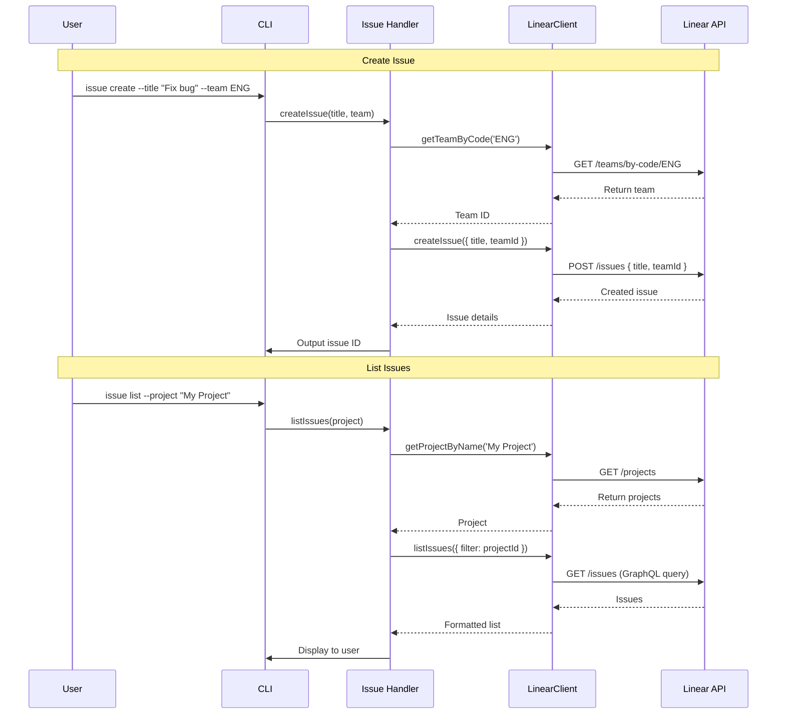

---

## 12. Data Storage Architecture

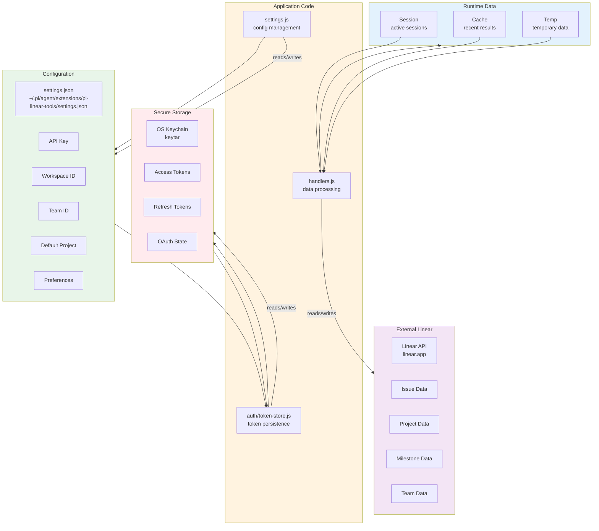

---

## 13. Authentication Methods Comparison

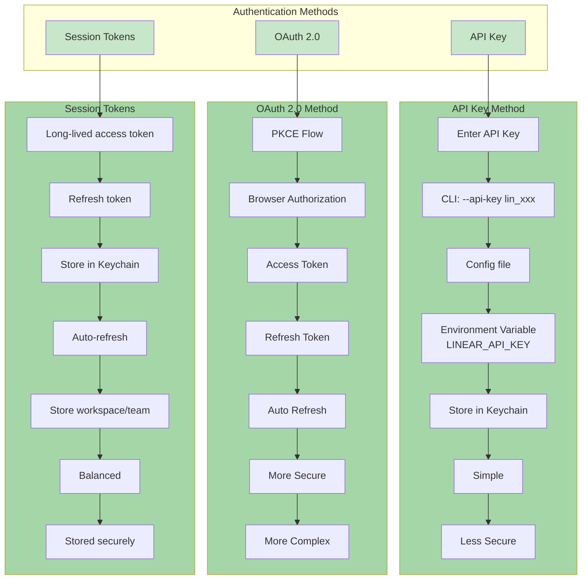

---

## 14. Extension Lifecycle

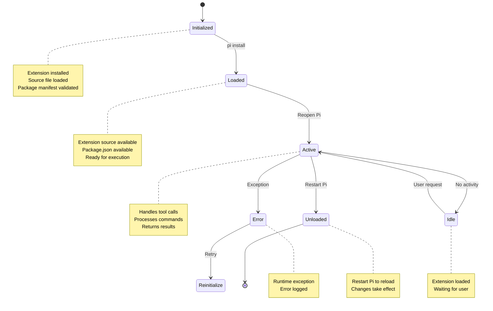

---

## 15. Directory Tree (ASCII-style)

```
pi-linear-tools/
├── bin/
│   └── pi-linear-tools.js          # CLI binary entry point
├── extensions/
│   └── pi-linear-tools.js          # Pi extension interface
├── src/
│   ├── auth/                        # Authentication modules
│   │   ├── index.js
│   │   ├── oauth.js
│   │   ├── pkce.js
│   │   ├── token-store.js
│   │   ├── token-refresh.js
│   │   └── callback-server.js
│   ├── cli.js                       # CLI router
│   ├── handlers.js                  # Action handlers
│   ├── linear.js                    # Linear API wrapper
│   ├── linear-client.js             # Client factory
│   ├── settings.js                  # Configuration management
│   └── logger.js                    # Logging utility
├── tests/
│   ├── test-package-manifest.js
│   ├── test-extension-registration.js
│   ├── test-settings.js
│   ├── test-assignee-update.js
│   ├── test-full-assignee-flow.js
│   └── test-branch-param.js
├── docs/
│   └── linear-schema.graphql        # Linear API schema
├── scripts/
│   └── dev-sync-local-extension.mjs  # Local extension helper
├── index.js                         # Main entry point
├── package.json                     # Project metadata
├── settings.json.example            # Example configuration
├── README.md                        # Documentation
├── ARCHITECTURE.md                  # Architecture docs
├── FUNCTIONALITY.md                 # Feature descriptions
├── OAUTH.md                         # OAuth guide
├── CHANGELOG.md                     # Version history
├── RELEASE.md                       # Release instructions
└── POST_RELEASE_CHECKLIST.md        # Post-release checklist
```

---

## 16. Data Relationships

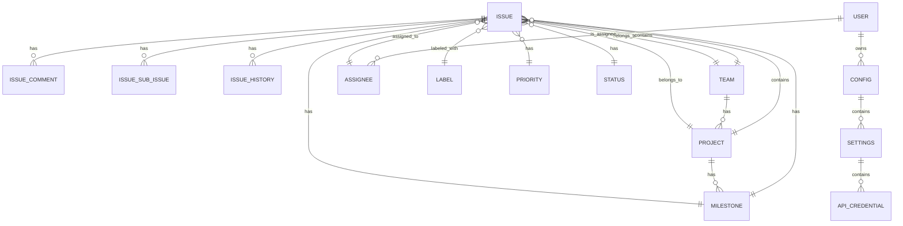

---

## 17. Network Request Flow

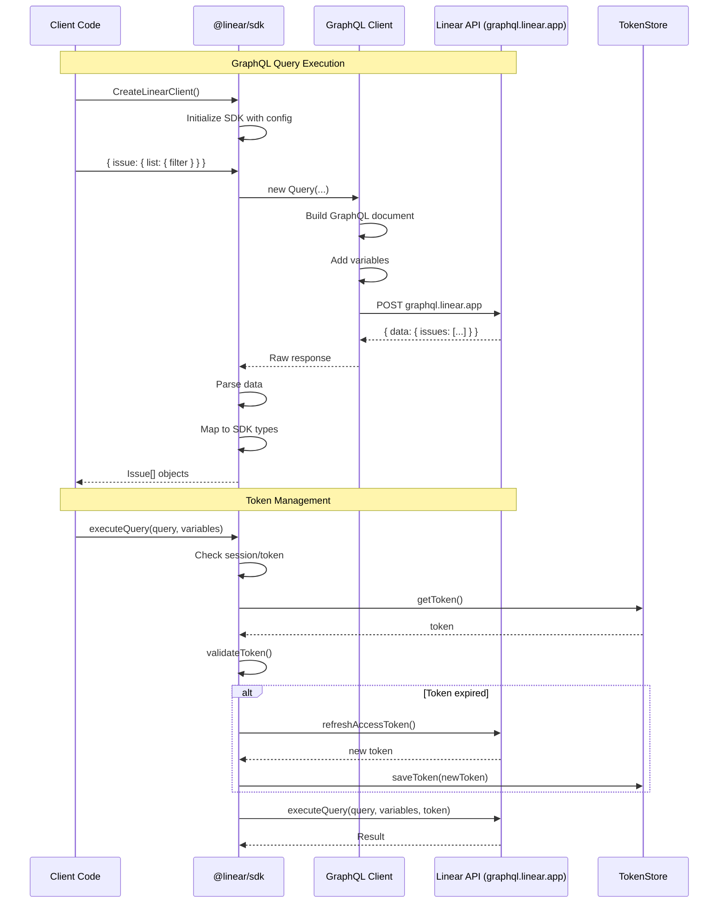

---

## 18. Git Workflow

```mermaid
flowchart LR
    subgraph Local["Local Repository"]
        L1[main branch<br/>stable version]
        L2[feature branches<br/>feature/xxx]
        L3[uncommitted changes]
    end

    subgraph Actions["Actions"]
        A1[git checkout -b<br/>feature/new-feature]
        A2[develop feature]
        A3[git add .]
        A4[git commit -m "Description"]
        A5[git push origin<br/>feature/new-feature]
        A6[create Pull Request]
        A7[git checkout main]
        A8[git pull origin main]
        A9[git merge feature/new-feature]
        A10[git push origin main]
    end

    L2 --> A1
    A2 --> A3
    A3 --> A4
    A4 --> A5
    A5 --> A6
    A6 --> A7
    A7 --> A8
    A8 --> A9
    A9 --> A10
    A10 --> L1

    L3 -.-> A3

    style Local fill:#e8f5e9
    style Actions fill:#c8e6c9
```

---

## 19. Feature Development Pipeline

```mermaid
flowchart LR
    subgraph Design["Design"]
        D1[Analyze Requirement]
        D2[Design Solution]
        D3[Plan Implementation]
    end

    subgraph Develop["Develop"]
        Dev1[Write Code]
        Dev2[Update Handlers]
        Dev3[Add Tests]
    end

    subgraph Test["Test"]
        T1[Unit Tests]
        T2[Integration Tests]
        T3[Manual Testing]
    end

    subgraph Review["Review"]
        R1[Code Review]
        R2[Test Review]
        R3[Approval]
    end

    subgraph Release["Release"]
        Re1[NPM Pack]
        Re2[NPM Publish]
        Re3[Update Documentation]
    end

    Design --> Develop --> Test --> Review --> Release

    style Design fill:#e3f2fd
    style Develop fill:#bbdefb
    style Test fill:#90caf9
    style Review fill:#64b5f6
    style Release fill:#42a5f5
```

---

## 20. Error Handling Flow

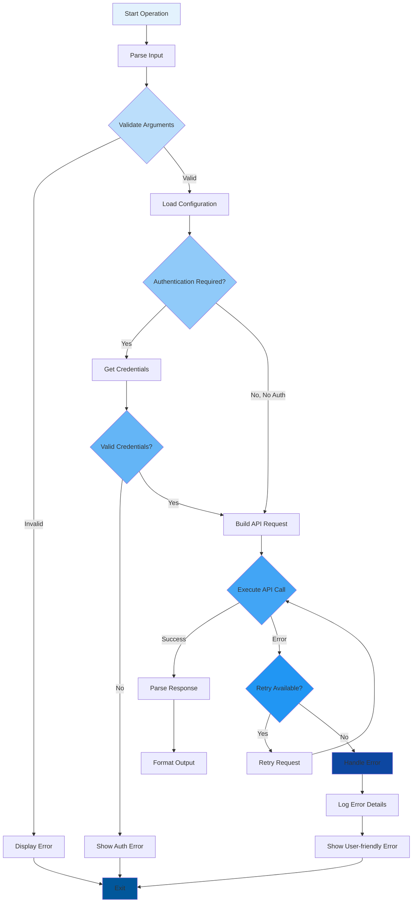

---

## All Diagrams Reference

| Diagram | Type | Purpose |
|---------|------|---------|
| 1 | Mind Map | Overall project structure |
| 2 | Flowchart | Architecture overview |
| 3 | Flowchart | CLI command flow |
| 4 | Flowchart | Pi extension flow |
| 5 | Sequence | Authentication flow |
| 6 | Flowchart | API request flow |
| 7 | Flowchart | Test execution flow |
| 8 | Flowchart | Development workflow |
| 9 | Graph | Component interaction |
| 10 | Flowchart | Deployment flow |
| 11 | Sequence | Issue management flow |
| 12 | Graph | Data storage architecture |
| 13 | Graph | Authentication methods |
| 14 | State Diagram | Extension lifecycle |
| 15 | Text Tree | Directory tree (ASCII) |
| 16 | ER Diagram | Data relationships |
| 17 | Sequence | Network request flow |
| 18 | Flowchart | Git workflow |
| 19 | Flowchart | Feature development pipeline |
| 20 | Flowchart | Error handling flow |
