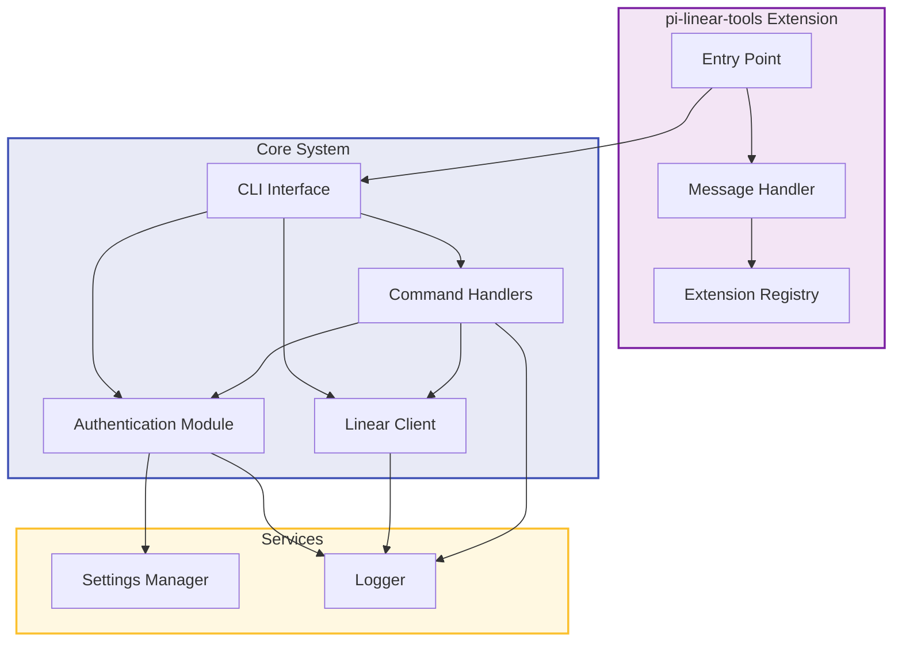
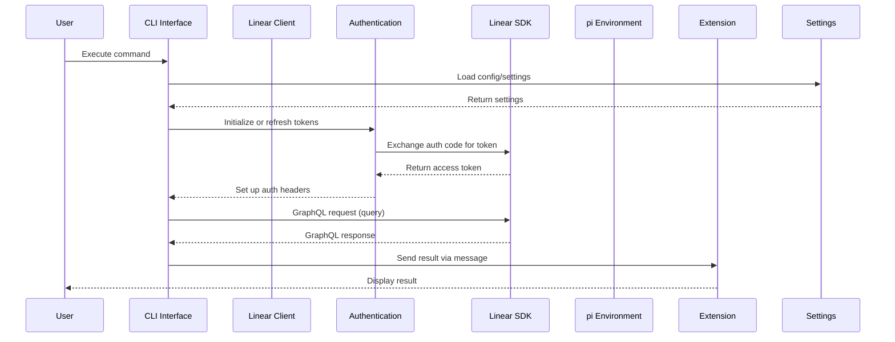
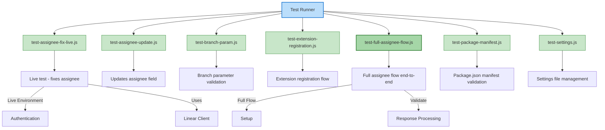
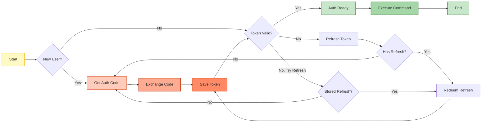
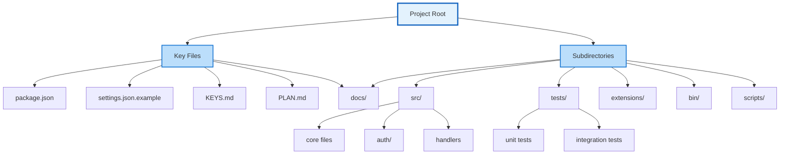
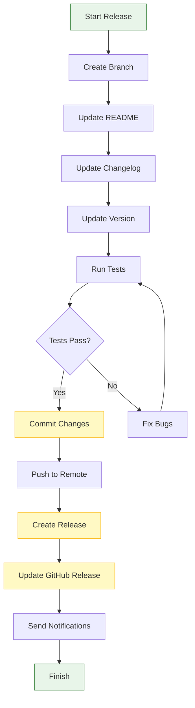
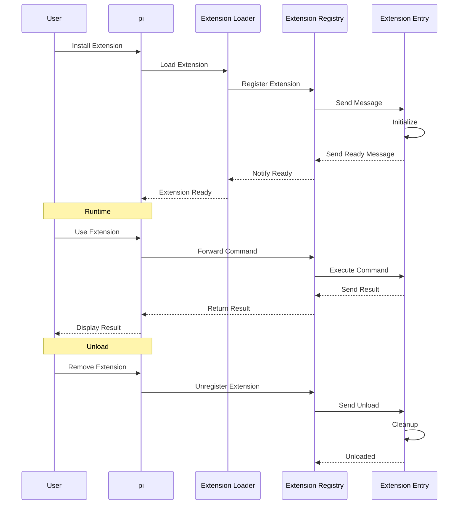
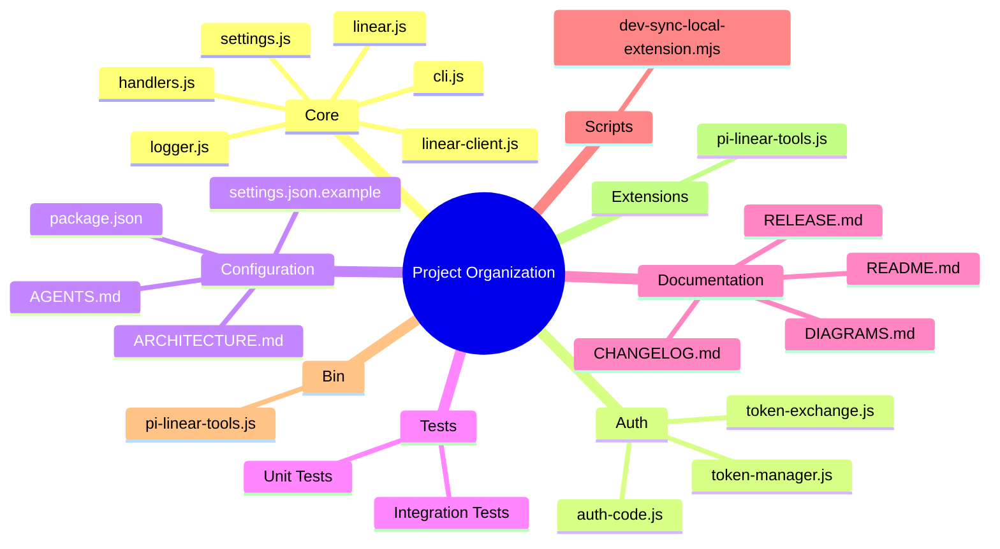
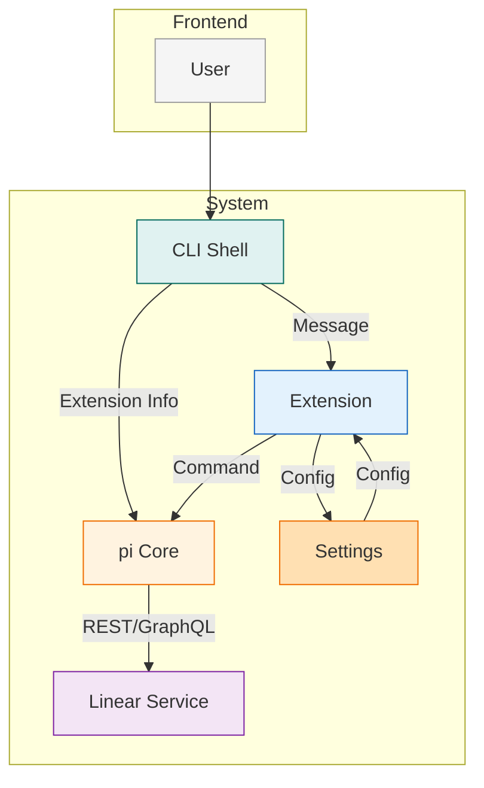

# Project Structure Mermaid Diagrams

This document contains multiple mermaid diagrams showing different aspects of the `pi-linear-tools` project structure.

## 1. Directory Structure (Tree View)

```mermaid
flowchart TD
    Root[Root]
    Root --> Docs[docs]
    Root --> Extensions[extensions]
    Root --> Scripts[scripts]
    Root --> Settings[Root Files]
    Root --> Src[src]
    Root --> Tests[tests]
    Root --> NodeModules[node_modules]
    Root --> Bin[bin]

    Docs --> GraphQL[linear-schema.graphql]

    Extensions --> ExtJS[pi-linear-tools.js]

    Scripts --> DevSync[dev-sync-local-extension.mjs]

    Settings --> AGENTS[AGENTS.md]
    Settings --> ARCHITECTURE[ARCHITECTURE.md]
    Settings --> DIAGRAMS[DIAGRAMS.md]
    Settings --> FUNCTIONALITY[FUNCTIONALITY.md]
    Settings --> OAUTH[OAUTH.md]
    Settings --> PLAN[PLAN.md]
    Settings --> POST[POST_RELEASE_CHECKLIST.md]
    Settings --> RELEASE[RELEASE.md]
    Settings --> README[README.md]

    Src --> Auth[auth]
    Src --> Cli[cli.js]
    Src --> Handlers[handlers.js]
    Src --> LinearClient[linear-client.js]
    Src --> LinearCore[linear.js]
    Src --> Logger[logger.js]
    Src --> SettingsJS[settings.js]

    Auth --> AuthCode[auth-code.js]
    Auth --> Token[token-manager.js]
    Auth --> Exchange[token-exchange.js]

    NodeModules --> Base64[base64-js]
    NodeModules --> BufferLib[buffer, bl]
    NodeModules --> GraphQL[ggraphql]
    NodeModules --> LinearSDK[@linear]

    Tests --> AssigneeFix[test-assignee-fix-live.js]
    Tests --> AssigneeUpdate[test-assignee-update.js]
    Tests --> BranchParam[test-branch-param.js]
    Tests --> ExtReg[test-extension-registration.js]
    Tests --> FullFlow[test-full-assignee-flow.js]
    Tests --> PackageManif[test-package-manifest.js]
    Tests --> SettingsTest[test-settings.js]

    Bin --> CLIEntrypoint[pi-linear-tools.js]

    Root -.-> Finished[finished/]

    style Root fill:#e1f5ff,stroke:#01579b,stroke-width:2px
    style Src fill:#e8f5e9,stroke:#2e7d32,stroke-width:1px
    style Tests fill:#fff3e0,stroke:#ef6c00,stroke-width:1px
```

## 2. Component Architecture Diagram



## 3. Data Flow Diagram



## 4. Extension Architecture Diagram

```mermaid
graph LR
    A[pi CLI] --> B[Extension Container]
    B --> C[Extension Entry Point]
    C --> D[Message Handler]
    D --> E[Command Router]
    E --> F{Command Type}
    F -->|Setup| G[Initialize Extension]
    F -->|Execute| H[Run Command]
    G --> I[Load Config]
    I --> J[Initialize Handlers]
    H --> K[Prepare Request]
    K --> L[Execute Linear Query]
    L --> M[Process Response]
    M --> N[Return Result]

    style A fill:#ffcc80,stroke:#ef6c00
    style B fill:#ffab91,stroke:#d84315
    style C fill:#ff8a65,stroke:#bf360c
    style D fill:#ff7043,stroke:#e64a19
    style E fill:#ff5722,stroke:#bf360c
    style F fill:#ef6c00,stroke:#e64a19
    style G fill:#f4511e,stroke:#bf360c
    style H fill:#d84315,stroke:#bf360c
    style I fill:#ffcc80
    style J fill:#ffab91
    style K fill:#ff8a65
    style L fill:#ff7043
    style M fill:#ff5722
    style N fill:#ef6c00
```



## 5. Module Dependency Graph

```mermaid
graph TB
    Subgraph Main
        CLI[cli.js]
        CLI_H[Handlers]
        CLILinear[linear.js]
        CLI_Settings[settings.js]
        CLI_Logger[logger.js]
    end

    Subgraph AuthModule
        AuthMain[auth/]
        AuthToken[token-manager.js]
        AuthCode[auth-code.js]
        AuthExchange[token-exchange.js]
    end

    Subgraph LinearClient
        LinearClient[linear-client.js]
    end

    CLI --> CLI_H
    CLI --> CLILinear
    CLI --> CLI_Settings
    CLI --> CLI_Logger
    CLI --> LinearClient

    CLI_H --> CLILinear
    CLI_Settings --> CLI_Logger
    AuthMain --> AuthToken
    AuthMain --> AuthCode
    AuthMain --> AuthExchange

    LinearClient --> CLILinear

    CLI --> bin[bin/pi-linear-tools.js]
    CLI --> scripts[scripts/dev-sync-local-extension.mjs]
    CLI --> tests[tests/]

    style Main fill:#e3f2fd,stroke:#1565c0,stroke-width:2px
    style AuthModule fill:#fce4ec,stroke:#c2185b,stroke-width:2px
    style LinearClient fill:#e8f5e9,stroke:#2e7d32,stroke-width:2px
    style bin fill:#fff3e0,stroke:#ef6c00,stroke-width:2px
    style scripts fill:#fff3e0,stroke:#ef6c00,stroke-width:2px
    style tests fill:#f3e5f5,stroke:#7b1fa2,stroke-width:2px
```

## 6. Test Structure Diagram



## 7. Authentication Flow Diagram



## 8. Project Configuration Hierarchy



## 9. Release Workflow Diagram



## 10. Extension Lifecycle Diagram



## 11. File Organization by Purpose



## 12. Component Interaction Matrix



---

**Usage:** These diagrams can be rendered by any mermaid-compatible viewer. Copy the diagram code blocks into your markdown files or mermaid editor.
