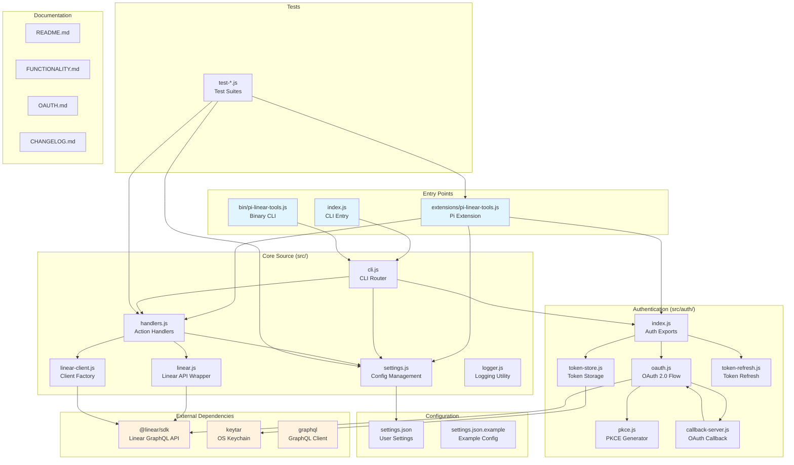
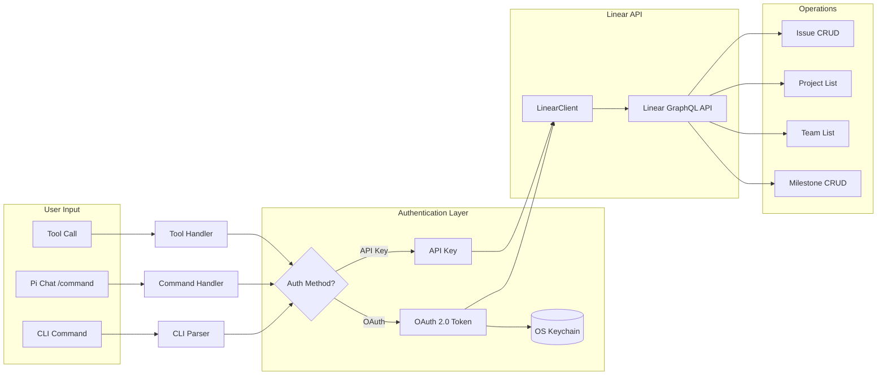
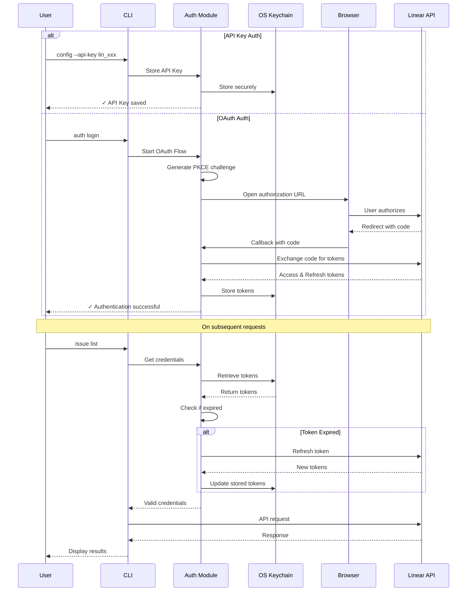
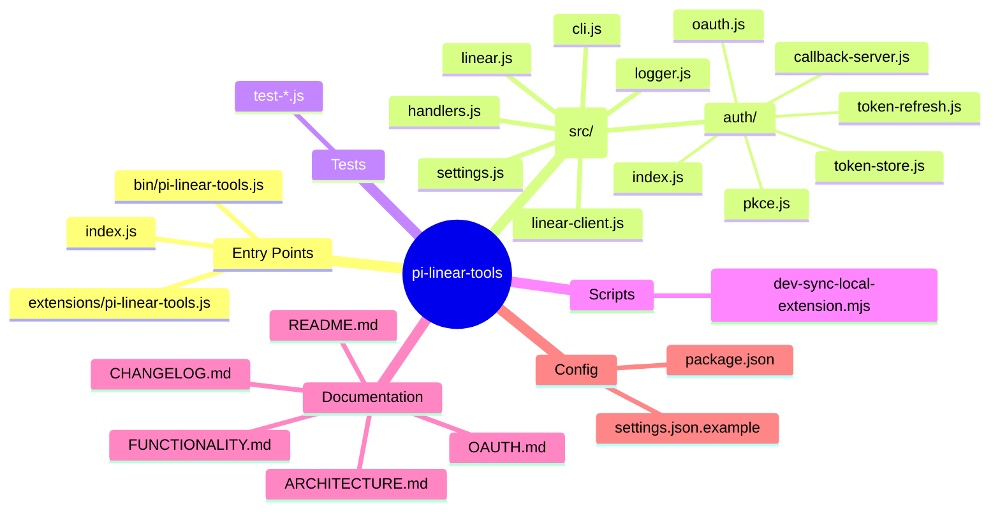
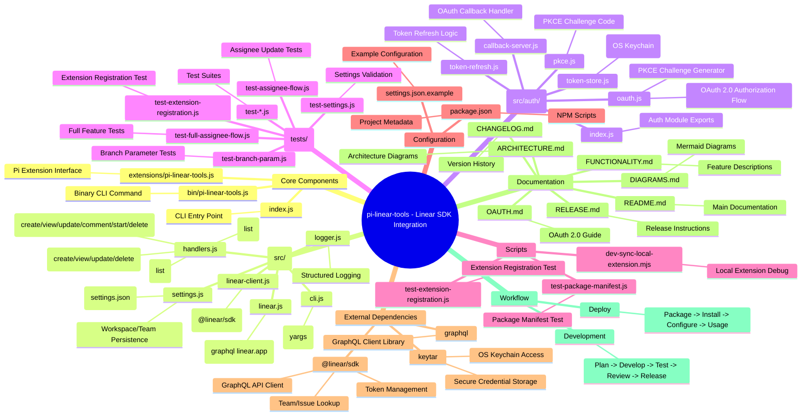
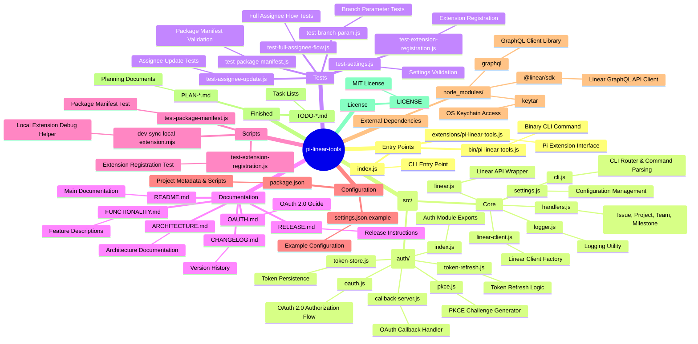
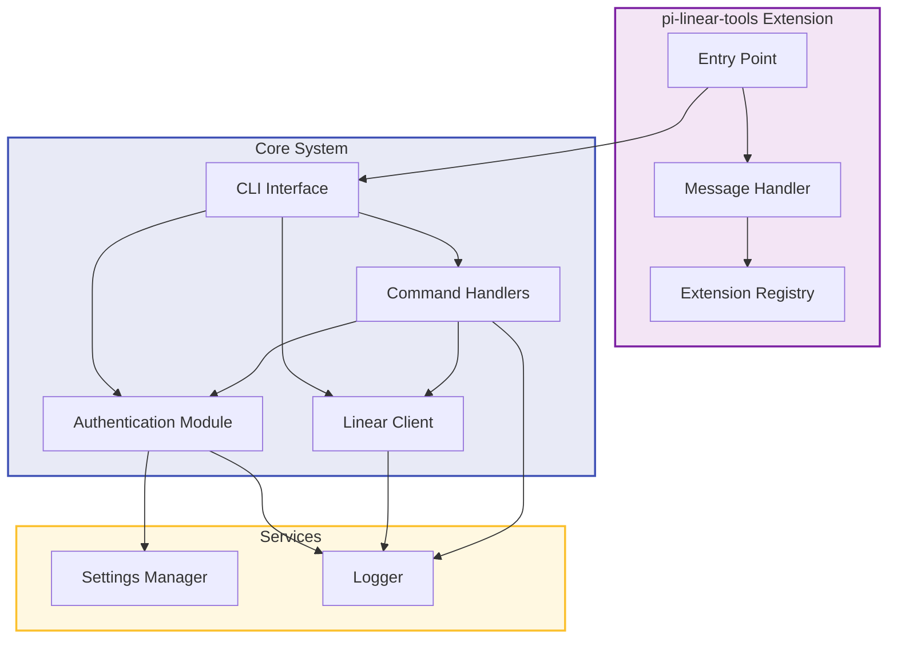
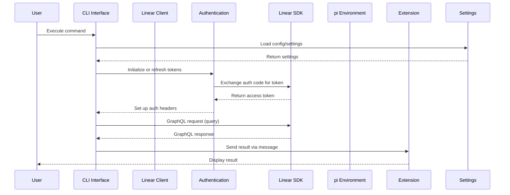

<filetree>
Project Structure:
├── bin
│   └── pi-linear-tools.js
├── docs
│   ├── ARCHITECTURE.md
│   ├── BUG_RATE_LITMIT_HIT.md
│   ├── DIAGRAMS.md
│   ├── FUNCTIONALITY.md
│   ├── OAUTH.md
│   ├── POST_RELEASE_CHECKLIST.md
│   ├── PR1_SYNC_DOC_CHECK_RUN_FIRST_SYNC_FOLLOWUP.md
│   ├── PROJECT_STRUCTURE_MERMAID.md
│   ├── RELEASE.md
│   ├── RELEASE_NOTES_v0.1.0.md
│   ├── RELEASE_NOTES_v0.2.0.md
│   ├── RELEASE_NOTES_v0.3.0.md
│   ├── RELEASE_NOTES_v0.4.1.md
│   └── RELEASE_NOTES_v0.4.2.md
├── extensions
│   └── pi-linear-tools.js
├── src
│   ├── auth
│   ├── cli.js
│   ├── error-hints.js
│   ├── handlers.js
│   ├── linear-client.js
│   ├── linear.js
│   ├── logger.js
│   ├── settings.js
│   ├── shared.js
│   └── sync-doc.js
├── tests
│   ├── test-api-usage-caching.js
│   ├── test-assignee-fix-live.js
│   ├── test-assignee-update.js
│   ├── test-branch-param.js
│   ├── test-extension-registration.js
│   ├── test-full-assignee-flow.js
│   ├── test-issue-activity.js
│   ├── test-package-manifest.js
│   ├── test-project-crud.js
│   ├── test-project-lifecycle.js
│   ├── test-rate-limit-fallback-update.js
│   ├── test-settings.js
│   ├── test-sync-doc.js
│   └── test-team-filter.js
├── AGENTS.md
├── AVAILABLE_TOOLS_SNIPPET.md
├── COMPARISON_TO_MCP.md
├── PR1.md
├── PR1_comment_1.md
├── PR1_comment_2.md
├── index.js
└── package.json

</filetree>

<source_code>
AGENTS.md
```
# Project-specific agent instructions

- Run `npm test` with `tail` to keep output shorter (for example: `npm test | tail -n 15`).

## Linear GraphQL API Schema

Use the official GraphQL schema as reference when working with Linear SDK/API:
- **Local copy:** `docs/linear-schema.graphql`
- **Source:** https://raw.githubusercontent.com/linear/linear/refs/heads/main/packages/sdk/src/schema.graphql

## Live extension testing (install/remove + restart)

Important behavior observed in practice:
- `/reload` updates already-loaded extension code changes.
- `/reload` does **not** reliably apply extension source add/remove.
- After `pi remove ...` or `pi install ...`, fully restart pi (close and reopen) before validation.

Use this order when reinstalling locally:

1. List installed extensions:
   - `pi list`
2. Remove existing `pi-linear-tools` source(s):
   - `pi remove <source>`
3. Install local extension from current working directory:
   - `pi install .`
4. Restart pi (close and reopen session).
5. Run `/reload` (optional but recommended after restart).
6. Re-run live tool checks.
```

AVAILABLE_TOOLS_SNIPPET.md
```
# Handoff: Check `Available tools` Prompt Snippets in `pi-linear-tools`

## Why this handoff exists
A similar issue was found in another pi extension project: the tool worked and was registered correctly, but it did **not** appear in pi's default system prompt under **Available tools**.

The root cause there was simple:

- pi includes custom extension tools in the textual **Available tools** summary only when the tool definition has a `promptSnippet`
- optional tool-specific guidance can also be added with `promptGuidelines`
- without `promptSnippet`, a custom tool is still callable, but it may be omitted from the short prompt summary

## What to check in this project
In `../pi-linear-tools/index.js`, these tools are registered:

- `linear_issue`
- `linear_project`
- `linear_team`
- `linear_milestone` (conditional)

Check whether each of these registrations includes:

- `promptSnippet`
- optionally `promptGuidelines`

At the moment, the registrations define `name`, `label`, `description`, `parameters`, `renderResult`, and `execute`, but they should be reviewed specifically for prompt metadata.

## Expected behavior
If `pi-linear-tools` wants its tools to show up consistently in pi's default **Available tools** prompt section, each tool should define a concise `promptSnippet`.

Example intent:

- `linear_issue` → one-line summary of issue operations
- `linear_project` → one-line summary of project listing
- `linear_team` → one-line summary of team listing
- `linear_milestone` → one-line summary of milestone operations

## Suggested implementation
For each `pi.registerTool({...})` call, add something like:

```js
promptSnippet: 'Interact with Linear issues (list, view, create, update, comment, start, delete)',
promptGuidelines: [
  'Use linear_issue for Linear issue listing, lookup, creation, updates, comments, and start actions.',
],
```

And equivalent snippets for:

- `linear_project`
- `linear_team`
- `linear_milestone`

Keep snippets short because they are meant for the prompt summary, not full documentation.

## Where to validate
### Code
- `index.js`

### Tests
- `tests/test-extension-registration.js`

Add assertions that registered tools expose the expected `promptSnippet` values.

## What to verify manually
1. Install/reload the extension in pi.
2. Confirm the relevant tools appear in the default prompt's **Available tools** section.
3. Confirm the milestone tool behavior still respects its existing conditional registration rules.
4. Confirm no behavior changes beyond prompt visibility/documentation.

## Important note about conditional tools
`linear_milestone` is only registered in some auth configurations.
If you add prompt metadata there, make sure tests still cover both cases:

- milestone tool hidden when OAuth is used without API key
- milestone tool present when API key auth is available

## Relevant pi behavior
pi extension docs state that:

- `promptSnippet` opts a custom tool into a one-line entry in **Available tools**
- if omitted, custom tools may be left out of that section
- `promptGuidelines` adds tool-specific bullets to the default **Guidelines** section while the tool is active

## Recommended outcome
Make tool listing consistent by explicitly defining `promptSnippet` for every user-facing tool in `pi-linear-tools`, then add regression coverage in `tests/test-extension-registration.js`.
```

COMPARISON_TO_MCP.md
```
# Linear Tools in Pi Agent

This document lists all Linear tools available in the Pi coding agent with their complete parameter specifications.

---

## Issues

### linear_list_issues

List issues in your Linear workspace. For my issues, use "me" as the assignee. Use "null" for no assignee.

**Parameters:**
```json
{
  "limit": number,              // Max results (default: 50, max: 250)
  "cursor": string,             // Next page cursor
  "orderBy": "createdAt" | "updatedAt",  // Sort order (default: "updatedAt")
  "query": string,              // Search issue title or description
  "team": string,               // Team name or ID
  "state": string,              // State type, name, or ID
  "cycle": string,              // Cycle name, number, or ID
  "label": string,              // Label name or ID
  "assignee": string | null,    // User ID, name, email, or "me"
  "delegate": string,           // Agent name or ID
  "project": string,            // Project name, ID, or slug
  "priority": number,           // 0=None, 1=Urgent, 2=High, 3=Normal, 4=Low
  "parentId": string,           // Parent issue ID (e.g., "LIN-123")
  "createdAt": string,         // ISO-8601 date/duration (e.g., "-P1D")
  "updatedAt": string,         // ISO-8601 date/duration (e.g., "-P1D")
  "includeArchived": boolean   // Include archived items (default: true)
}
```

---

### linear_get_issue

Retrieve detailed information about an issue by ID, including attachments and git branch name.

**Parameters:**
```json
{
  "id": string,                 // *REQUIRED* Issue ID or identifier (e.g., "LIN-123")
  "includeRelations": boolean,  // Include blocking/related/duplicate relations (default: false)
  "includeCustomerNeeds": boolean  // Include associated customer needs (default: false)
}
```

---

### linear_save_issue

Create or update a Linear issue. If `id` is provided, updates the existing issue; otherwise creates a new one. When creating, `title` and `team` are required.

**Parameters:**
```json
{
  "id": string,                 // Issue ID or identifier (e.g., "LIN-123") - if provided, updates existing
  "title": string,              // *REQUIRED when creating* Issue title
  "description": string,        // Content as Markdown
  "team": string,               // *REQUIRED when creating* Team name or ID
  "cycle": string,              // Cycle name, number, or ID
  "milestone": string,          // Milestone name or ID
  "priority": number,           // 0=None, 1=Urgent, 2=High, 3=Normal, 4=Low
  "project": string,            // Project name, ID, or slug
  "state": string,              // State type, name, or ID
  "assignee": string | null,   // User ID, name, email, or "me". Null to remove
  "delegate": string | null,   // Agent name or ID. Null to remove
  "labels": string[],           // Label names or IDs
  "dueDate": string,           // Due date (ISO format)
  "parentId": string | null,   // Parent issue ID (e.g., "LIN-123"). Null to remove
  "estimate": number,           // Issue estimate value
  "links": {                   // Link attachments to add (append-only)
    "url": string,
    "title": string
  }[],
  "blocks": string[],           // Issue IDs/identifiers this blocks (append-only)
  "blockedBy": string[],       // Issue IDs/identifiers blocking this (append-only)
  "relatedTo": string[],       // Related issue IDs/identifiers (append-only)
  "duplicateOf": string | null // Duplicate of issue ID/identifier. Null to remove
}
```

---

## Issue Comments

### linear_list_comments

List comments for a specific Linear issue.

**Parameters:**
```json
{
  "limit": number,              // Max results (default: 50, max: 250)
  "cursor": string,             // Next page cursor
  "orderBy": "createdAt" | "updatedAt",  // Sort order (default: "updatedAt")
  "issueId": string             // *REQUIRED* Issue ID or identifier (e.g., "LIN-123")
}
```

---

### linear_save_comment

Create or update a comment on a Linear issue. If `id` is provided, updates the existing comment; otherwise creates a new one. When creating, `issueId` and `body` are required.

**Parameters:**
```json
{
  "id": string,                 // Comment ID - if provided, updates existing
  "issueId": string,            // *REQUIRED when creating* Issue ID (e.g., "LIN-123")
  "parentId": string,           // Parent comment ID (for replies, only when creating)
  "body": string                // *REQUIRED* Content as Markdown
}
```

---

### linear_delete_comment

Delete a comment from a Linear issue.

**Parameters:**
```json
{
  "id": string                  // *REQUIRED* Comment ID
}
```

---

## Issue Status & Labels

### linear_list_issue_statuses

List available issue statuses in a Linear team.

**Parameters:**
```json
{
  "team": string                // *REQUIRED* Team name or ID
}
```

---

### linear_get_issue_status

Retrieve detailed information about an issue status in Linear by name or ID.

**Parameters:**
```json
{
  "id": string,                 // *REQUIRED* Status ID
  "name": string,               // *REQUIRED* Status name
  "team": string                // *REQUIRED* Team name or ID
}
```

---

### linear_list_issue_labels

List available issue labels in a Linear workspace or team.

**Parameters:**
```json
{
  "limit": number,              // Max results (default: 50, max: 250)
  "cursor": string,             // Next page cursor
  "orderBy": "createdAt" | "updatedAt",  // Sort order (default: "updatedAt")
  "name": string,               // Filter by name
  "team": string                // Team name or ID
}
```

---

### linear_create_issue_label

Create a new Linear issue label.

**Parameters:**
```json
{
  "name": string,               // *REQUIRED* Label name
  "description": string,         // Label description
  "color": string,              // Hex color code
  "teamId": string,             // Team UUID (omit for workspace label)
  "parent": string,             // Parent label group name
  "isGroup": boolean            // Is label group (default: false)
}
```

---

## Attachments

### linear_create_attachment

Create a new attachment on a specific Linear issue by uploading base64-encoded content.

**Parameters:**
```json
{
  "issue": string,              // *REQUIRED* Issue ID or identifier (e.g., "LIN-123")
  "base64Content": string,      // *REQUIRED* Base64-encoded file content to upload
  "filename": string,           // *REQUIRED* Filename (e.g., "screenshot.png")
  "contentType": string,        // *REQUIRED* MIME type (e.g., "image/png", "application/pdf")
  "title": string,              // Optional title for the attachment
  "subtitle": string            // Optional subtitle for the attachment
}
```

---

### linear_get_attachment

Retrieve an attachment's content by ID.

**Parameters:**
```json
{
  "id": string                  // *REQUIRED* Attachment ID
}
```

---

### linear_delete_attachment

Delete an attachment by ID.

**Parameters:**
```json
{
  "id": string                  // *REQUIRED* Attachment ID
}
```

---

## Projects & Milestones

### linear_list_projects

List projects in your Linear workspace.

**Parameters:**
```json
{
  "limit": number,              // Max results (default: 50, max: 250)
  "cursor": string,             // Next page cursor
  "orderBy": "createdAt" | "updatedAt",  // Sort order (default: "updatedAt")
  "query": string,              // Search project name
  "state": string,              // State type, name, or ID
  "initiative": string,         // Initiative name or ID
  "team": string,               // Team name or ID
  "member": string,             // User ID, name, email, or "me"
  "label": string,              // Label name or ID
  "createdAt": string,          // ISO-8601 date/duration (e.g., "-P1D")
  "updatedAt": string,          // ISO-8601 date/duration (e.g., "-P1D")
  "includeMilestones": boolean, // Include milestones (default: false)
  "includeMembers": boolean,    // Include project members (default: false)
  "includeArchived": boolean    // Include archived items (default: false)
}
```

---

### linear_get_project

Retrieve details of a specific project in Linear.

**Parameters:**
```json
{
[TRUNCATED]
```

PR1.md
```
# Code Review: PR #1 - Add project updates, issue activity, and doc sync workflows

## PR Details

- **URL:** https://github.com/fink-andreas/pi-linear-tools/pull/1
- **Author:** austinm911 (Austin)
- **Branch:** `codex/project-crud`
- **State:** DRAFT
- **Commits:** 13 commits

## Context

This PR adds three major features to the pi-linear-tools extension:
1. Project updates support (new `linear_project_update` tool)
2. Issue activity history viewing
3. Bidirectional sync-doc feature for syncing local files with Linear

## Key Files Changed

| Category | Files | Stats |
|----------|-------|-------|
| Core implementation | `src/handlers.js`, `src/linear.js`, `src/sync-doc.js` | +1,826 lines |
| CLI | `src/cli.js` | +706 lines |
| Extension | `extensions/pi-linear-tools.js` | +185 lines |
| Tests | 6 new/modified test files | +1,252 lines |
| Docs | `README.md` | +134 lines |
| Entry point | `index.js` | -1,020 lines |

---

# Source Code Diff

## 1. src/handlers.js (key additions)

```javascript
// New imports for project operations
import {
  fetchProjectDetails,
  fetchIssueActivity,
  formatIssueActivityAsMarkdown,
  createProject,
  updateProject,
  deleteProject,
  archiveProject,
  unarchiveProject,
  fetchProjectUpdates,
  fetchProjectUpdateDetails,
  createProjectUpdate,
  updateProjectUpdate,
  archiveProjectUpdate,
  unarchiveProjectUpdate,
} from './linear.js';

// Issue activity handler
export async function executeIssueActivity(client, params) {
  const issue = ensureNonEmpty(params.issue, 'issue');
  const activityData = await fetchIssueActivity(client, issue, {
    limit: params.limit,
    includeArchived: params.includeArchived === true,
  });
  const markdown = formatIssueActivityAsMarkdown(activityData, {
    limit: params.limit,
  });

  return {
    content: [{ type: 'text', text: markdown }],
    details: {
      issueId: activityData.issue.id,
      identifier: activityData.issue.identifier,
      title: activityData.issue.title,
      activityCount: activityData.activity.length,
      url: activityData.issue.url,
    },
  };
}

// Project CRUD handlers
export async function executeProjectView(client, params) { /* ... */ }
export async function executeProjectCreate(client, params) { /* ... */ }
export async function executeProjectUpdate(client, params) { /* ... */ }
export async function executeProjectDelete(client, params) { /* ... */ }
export async function executeProjectArchive(client, params) { /* ... */ }
export async function executeProjectUnarchive(client, params) { /* ... */ }

// Project update handlers
export async function executeProjectUpdateList(client, params) { /* ... */ }
export async function executeProjectUpdateView(client, params) { /* ... */ }
export async function executeProjectUpdateCreate(client, params) { /* ... */ }
export async function executeProjectUpdateUpdate(client, params) { /* ... */ }
export async function executeProjectUpdateArchive(client, params) { /* ... */ }
export async function executeProjectUpdateUnarchive(client, params) { /* ... */ }
```

---

## 2. src/sync-doc.js (new file - key excerpts)

```javascript
// Constants
const CONFIG_DIRNAME = '.linear-tools';
const CONFIG_FILENAME = 'config.json';
const STATE_FILENAME = 'sync-state.json';

// Managed block markers
export function buildSyncMarkers(marker) {
  return {
    start: `<!-- linear-tools:sync-start ${marker} -->`,
    end: `<!-- linear-tools:sync-end ${marker} -->`,
  };
}

// Core function: upsert managed content into existing field
export function upsertManagedContent(currentValue, marker, incomingContent) {
  const currentText = normalizeNewlines(currentValue);
  const nextBody = normalizeNewlines(incomingContent).trimEnd();
  const { start, end } = buildSyncMarkers(marker);
  const managedBlock = nextBody
    ? `${start}\n\n${nextBody}\n\n${end}`
    : `${start}\n\n${end}`;

  // Find existing markers
  const startIndex = currentText.indexOf(start);
  const endIndex = currentText.indexOf(end);

  if (startIndex === -1 && endIndex === -1) {
    // No existing block - append
    const trimmedCurrent = currentText.trimEnd();
    if (!trimmedCurrent) {
      return managedBlock;
    }
    return `${trimmedCurrent}\n\n${managedBlock}`;
  }

  // Validate balanced markers
  if (startIndex === -1 || endIndex === -1 || endIndex < startIndex) {
    throw new Error(`Unbalanced sync markers for marker "${marker}"`);
  }

  // Check for multiple blocks (error)
  const secondStartIndex = currentText.indexOf(start, startIndex + start.length);
  const secondEndIndex = currentText.indexOf(end, endIndex + end.length);
  if (secondStartIndex !== -1 || secondEndIndex !== -1) {
    throw new Error(`Multiple sync marker blocks found for marker "${marker}"`);
  }

  // Replace managed block, preserving before/after content
  const before = currentText.slice(0, startIndex).trimEnd();
  const after = currentText.slice(endIndex + end.length).trimStart();

  if (before && after) {
    return `${before}\n\n${managedBlock}\n\n${after}`;
  }
  // ... other cases
}

// Extract managed segments
export function extractManagedSegments(currentValue, marker) {
  const currentText = normalizeNewlines(currentValue);
  const { start, end } = buildSyncMarkers(marker);
  // Returns { hasManagedBlock, before, managed, after }
}

// Hash-based change detection
function buildHashes(currentSegments, sourceContent, auxiliaryContent, metadataPayload) {
  return {
    sourceHash: sha256(sourceContent),
    beforeHash: sha256(currentSegments.before),
    afterHash: sha256(currentSegments.after),
    auxiliaryHash: sha256(auxiliaryContent || ''),
    metadataHash: sha256(serializeHashPayload(metadataPayload)),
  };
}

function shouldSkipManagedUpdate(previousState, currentSegments, hashes) {
  return currentSegments.hasManagedBlock
    && previousState.sourceHash === hashes.sourceHash
    && previousState.beforeHash === hashes.beforeHash
    && previousState.afterHash === hashes.afterHash
    && (previousState.auxiliaryHash || sha256('')) === hashes.auxiliaryHash
    && (previousState.metadataHash || sha256('{}')) === hashes.metadataHash;
}

// Run field target (sync to project/issue field)
async function runFieldTarget(client, target, loaded, { cwd, mode, inlineTarget }) {
  const remoteEntity = await getRemoteFieldEntity(client, target);
  const sourceContent = normalizeNewlines(await readFile(target.file, 'utf8')).trimEnd();
  const statePath = inlineTarget ? getFallbackStatePath(cwd) : loaded.statePath;
  const state = await loadSyncState(statePath);
  const previousState = state.targets[target.name] || {};
  
  // ... cleanup markers, document index, change detection
  // ... returns result with changed flag and entity info
}

// Run document target (sync to Linear document)
async function runDocumentTarget(client, target, loaded, context) {
  const sourceContent = normalizeNewlines(await readFile(target.file, 'utf8')).trimEnd();
  // ... fetch/create/update Linear document
  // ... returns result with documentUrl, documentTitle
}

// Public API
export async function listSyncDocTargets(options = {}) { /* ... */ }
export async function runAllSyncDocs(client, options = {}) { /* ... */ }
export async function runSyncDoc(client, options = {}) { /* ... */ }
export async function initSyncDocConfig(options = {}) { /* ... */ }
export function explainSyncDocSetup() { /* returns guidance string */ }
```

---

## 3. extensions/pi-linear-tools.js (tool registrations)

```javascript
// linear_issue tool - added 'activity' action
pi.registerTool({
  name: 'linear_issue',
  parameters: {
    properties: {
      action: {
        enum: ['list', 'view', 'activity', 'create', 'update', 'comment', 'start', 'delete'],
      },
      includeArchived: {
        type: 'boolean',
        description: 'Include archived resources when listing activity or project updates',
      },
      // ... other params
    },
  },
  async execute(_toolCallId, params) {
    switch (params.action) {
      case 'activity':
        return await executeIssueActivity(client, params);
      // ... other cases
    }
  },
});

// linear_project tool - extended with CRUD + archive
pi.registerTool({
  name: 'linear_project',
  description: 'Interact with Linear projects. Actions: list, view, create, update, delete, archive, unarchive',
  parameters: {
    properties: {
      action: {
        enum: ['list', 'view', 'create', 'update', 'delete', 'archive', 'unarchive'],
      },
      project: { description: 'Project name or ID (for view, update, delete)' },
[TRUNCATED]
```

PR1_comment_1.md
```
`sync-doc` can miss drift when someone edits inside the managed block.

In `src/sync-doc.js`, `buildHashes()` and `shouldSkipManagedUpdate()` only compare:
- source file hash
- content before the managed block
- content after the managed block
- auxiliary/meta hashes

But they never hash the actual managed content (`currentSegments.managed`). Because of that, if someone manually edits text inside:

```md
<!-- linear-tools:sync-start X -->
...
<!-- linear-tools:sync-end X -->
```

a later sync can incorrectly conclude that nothing changed.

Relevant code:
- `src/sync-doc.js:657-723`
- used from `src/sync-doc.js:769-775`
- used from `src/sync-doc.js:880-885`

I reproduced this with a quick script:
1. Run `runSyncDoc()` once so state is written.
2. Manually modify the remote content inside the managed block.
3. Run `runSyncDoc()` again.
4. It returns `changed: false`, and the manual edit remains in Linear.

That means the core hash-based change detection is not robust enough for one of the main edge cases this feature needs to handle.

Suggested fix: include a hash of `currentSegments.managed` in the stored state / comparison logic, or directly compare the current managed block to the expected managed block before deciding to skip.
```

PR1_comment_2.md
```
I found two related `sync-doc` correctness issues.

## 1. Related targets are matched by raw config string instead of resolved project identity

In `src/sync-doc.js`, both `getDocumentIndexEntries()` and `getAutomaticCleanupMarkers()` associate targets using:

```js
normalizeRefKey(target.project) === normalizeRefKey(projectTarget.project)
```

Relevant code:
- `src/sync-doc.js:611-632`
- `src/sync-doc.js:683-704`

This means valid references to the *same* project stop matching if one target uses a project name and another uses a UUID or URL.

Example:
- overview target: `project: "Census Data"`
- document target: `project: "11111111-1111-4111-8111-111111111111"`

Both are valid everywhere else, but here they are treated as different projects, so:
- the overview index omits the document
- automatic cleanup misses old sibling markers

I reproduced this and got:

```md
## Linked docs

_No linked documents yet._
```

even though the document had been created successfully.

Suggested fix: compare resolved project/issue IDs, not the raw config strings.

## 2. `sync-doc check` can disagree with the actual `run`

`runAllSyncDocs()` correctly processes document targets before field targets. But in check mode, `runDocumentTarget()` returns before updating state:
- `src/sync-doc.js:924-932`

Later, `runFieldTarget()` builds the document index only from persisted state:

```js
const entries = getDocumentIndexEntries(state, loaded.targets, target);
```

Relevant code:
- `src/sync-doc.js:740-760`
- `src/sync-doc.js:799-806`
- `src/sync-doc.js:924-932`

So a batch `sync-doc check` can evaluate documents first, but the subsequent project field check still does not see their newly discovered `documentUrl` / `documentTitle`.

I reproduced this by running:
1. `runAllSyncDocs(..., { mode: 'check' })`
2. `runAllSyncDocs(..., { mode: 'run' })`

The project overview target produced a different `afterHash` between check and run, because the real run included the document link in the index while check did not.

That makes `sync-doc check` unreliable for CI / drift reporting.

Suggested fix: carry forward in-memory document results during a batch check/run instead of relying only on the previously saved state file.
```

index.js
```
export { default } from './extensions/pi-linear-tools.js';
```

package.json
```
{
  "name": "@fink-andreas/pi-linear-tools",
  "version": "0.4.2",
  "description": "Pi extension with Linear SDK tools and configuration commands",
  "type": "module",
  "engines": {
    "node": ">=18.0.0"
  },
  "main": "index.js",
  "bin": {
    "pi-linear-tools": "bin/pi-linear-tools.js"
  },
  "files": [
    "bin/",
    "src/",
    "extensions/",
    "index.js",
    "README.md",
    "CHANGELOG.md",
    "RELEASE.md",
    "POST_RELEASE_CHECKLIST.md",
    "FUNCTIONALITY.md",
    "settings.json.example"
  ],
  "publishConfig": {
    "access": "public"
  },
  "scripts": {
    "start": "node index.js",
    "test": "node tests/test-package-manifest.js && node tests/test-extension-registration.js && node tests/test-settings.js && node tests/test-api-usage-caching.js && node tests/test-assignee-update.js && node tests/test-rate-limit-fallback-update.js && node tests/test-full-assignee-flow.js && node tests/test-branch-param.js && node tests/test-team-filter.js && node tests/test-project-crud.js && node tests/test-project-lifecycle.js && node tests/test-sync-doc.js && node tests/test-issue-activity.js",
    "dev:sync-local-extension": "node scripts/dev-sync-local-extension.mjs",
    "release:check": "npm test && npm pack --dry-run"
  },
  "keywords": [
    "linear",
    "pi",
    "pi-package",
    "tools",
    "sdk"
  ],
  "pi": {
    "extensions": [
      "./index.js"
    ]
  },
  "license": "MIT",
  "repository": {
    "type": "git",
    "url": "https://github.com/fink-andreas/pi-linear-tools.git"
  },
  "dependencies": {
    "@linear/sdk": "^75.0.0",
    "@github/keytar": "^7.10.6"
  }
}
```

bin/pi-linear-tools.js
```
#!/usr/bin/env node

import { runCli } from '../src/cli.js';

runCli().catch((error) => {
  console.error('pi-linear-tools CLI error:', error?.message || error);
  process.exit(1);
});
```

docs/ARCHITECTURE.md
```
# pi-linear-tools Architecture

## Repository Structure Diagram



## Data Flow Diagram



## Component Diagram

```mermaid
graph TB
    subgraph "Pi Extension Interface"
        CMD1[/linear-tools-config]
        CMD2[/linear-tools-help]
        CMD3[/linear-tools-reload]
        TOOL1[linear_issue]
        TOOL2[linear_project]
        TOOL3[linear_team]
        TOOL4[linear_milestone]
    end

    subgraph "CLI Interface"
        CLI_AUTH[auth login/logout/status]
        CLI_CONFIG[config]
        CLI_ISSUE[issue list/view/create/update/comment/start/delete]
        CLI_PROJECT[project list]
        CLI_TEAM[team list]
        CLI_MILESTONE[milestone list/view/create/update/delete]
    end

    subgraph "Core Handlers"
        H_LIST[executeIssueList]
        H_VIEW[executeIssueView]
        H_CREATE[executeIssueCreate]
        H_UPDATE[executeIssueUpdate]
        H_COMMENT[executeIssueComment]
        H_START[executeIssueStart]
        H_DELETE[executeIssueDelete]
        H_PROJ[executeProjectList]
        H_TEAM[executeTeamList]
        H_MLIST[executeMilestoneList]
        H_MVIEW[executeMilestoneView]
        H_MCREATE[executeMilestoneCreate]
        H_MUPDATE[executeMilestoneUpdate]
        H_MDELETE[executeMilestoneDelete]
    end

    CMD1 --> CONFIG[Config Handler]
    TOOL1 --> ISSUE_H[Issue Dispatcher]
    TOOL2 --> H_PROJ
    TOOL3 --> H_TEAM
    TOOL4 --> MILESTONE_H[Milestone Dispatcher]

    CLI_ISSUE --> ISSUE_H
    CLI_MILESTONE --> MILESTONE_H

    ISSUE_H --> H_LIST
    ISSUE_H --> H_VIEW
    ISSUE_H --> H_CREATE
    ISSUE_H --> H_UPDATE
    ISSUE_H --> H_COMMENT
    ISSUE_H --> H_START
    ISSUE_H --> H_DELETE

    MILESTONE_H --> H_MLIST
    MILESTONE_H --> H_MVIEW
    MILESTONE_H --> H_MCREATE
    MILESTONE_H --> H_MUPDATE
    MILESTONE_H --> H_MDELETE
```

## Authentication Flow



## File Tree Overview


```

docs/BUG_RATE_LITMIT_HIT.md
```
# Rate limiting

Calls to our GraphQL API are rate limited to provide equitable access to the API for everyone and to prevent abuse. We are going to be evolving these limits as we gather more information, and encourage your feedback. Any changes to limits will be announced in our Slack community [API announcements channel](https://linearcustomers.slack.com/archives/CN61HRZ9T).

We use the [leaky bucket](https://en.wikipedia.org/wiki/Leaky_bucket) algorithm for our rate limiters, which means that your tokens are refilled with a constant rate of `LIMIT_AMOUNT / LIMIT_PERIOD`.

> [!NOTE]
> If you temporarily require higher limits, you can request them by contacting Linear support where we'll review them on a case by case basis.

## Avoiding hitting limits

These are best practices for using our APIs that will, in most cases, avoid hitting any rate limits.

### Avoid polling

One thing that we especially discourage is polling the API to fetch updates. If you need to know when data updates in Linear, you should use our [Webhook](https://linear.app/developers/webhooks) functionality.

### Avoid fetching unneeded data

Avoid fetching data you don't need by using our [filtering](https://linear.app/developers/filtering) functionality. This way you can drill down on specific records only and avoid pagination in some cases.

Keep in mind that by default our [pagination](https://linear.app/developers/pagination) returns up to 50 records. When querying for children this can quickly multiply the requested complexity. Consider specifying the amount of records you want returned.

### Order data

In certain cases where you do need to fetch all data, we suggest sorting it by the updated timestamp instead of when it was created. This way you can get the most recently changed data first, and avoid paginating through the entire dataset.

### Write custom, specific queries

This applies especially if you're using our SDK. If you're fetching lots of different entities or dependencies, or have specific data needs, it's always recommended to write your own custom GraphQL queries and use filters to narrow down the data as much as possible.

## API request limits

We limit the amount of requests you make to our GraphQL API. To make it easier to keep track and avoid going over the limits, there are 3 HTTP response headers we send back on each request.

HTTP Header | Description
--- | ---
`X-RateLimit-Requests-Limit` | The maximum number of API requests you're permitted to make per hour.
`X-RateLimit-Requests-Remaining` | The number of API requests remaining in the current rate limit window.
`X-RateLimit-Requests-Reset` | The time at which the current rate limit window resets in [UTC epoch milliseconds](https://en.wikipedia.org/wiki/Unix_time).

When authenticated using an API key you can make up to **5,000 requests per hour**. Requests are associated with the authenticated user, which means all requests by the same user share the same quota even when using different API keys.

When making unauthenticated requests, you are limited to **60 requests per hour**. These requests are associated with the originating IP address instead of the user making the request.

Authentication | Limit | per | Period
--- | --- | --- | ---
API key | 5,000 | User | 1 hour
OAuth App | 5,000 | User (or App User) | 1 hour
Unauthenticated | 60 | IP Address | 1 hour

### Query- and mutation- specific request limits

Some queries and mutations have individual request rate limits that are lower than the global request limit. When one of these limits is hit, the Linear API will send the same response as described in [Handling rate limited errors](https://linear.app/developers/rate-limiting#handling-rate-limit-errors). The window for each endpoint can be different, and is described in the response body. We will also send these extra headers:

HTTP Header | Description
--- | ---
`X-RateLimit-Endpoint-Requests-Limit` | The maximum number of API requests you're permitted to make to this endpoint in a rate limit window.
`X-RateLimit-Endpoint-Requests-Remaining` | The number of API requests remaining in the current rate limit window.
`X-RateLimit-Endpoint-Requests-Reset` | The time at which the current rate limit window resets in [UTC epoch milliseconds](https://en.wikipedia.org/wiki/Unix_time).
`X-RateLimit-Endpoint-Name` | The name of the endpoint that was rate limited.

### Complexity limits

In order to protect our system from queries that are too complex and resource intensive, we calculate the complexity of each query, based on the amount of requested data.

To make it easier to keep track and avoid going over the limits, there are 4 HTTP response headers we send back on each request.

HTTP Header | Description
--- | ---
`X-Complexity` | The complexity of the query.
`X-RateLimit-Complexity-Limit` | The maximum number of API complexity points you're permitted to request per hour.
`X-RateLimit-Complexity-Remaining` | The number of points of API request complexity remaining in the current rate limit window.
`X-RateLimit-Complexity-Reset` | The time at which the current rate limit window resets in [UTC epoch milliseconds](https://en.wikipedia.org/wiki/Unix_time).

Requests authenticated using an API key can request up to **250,000 points per hour**. Requests are associated with the authenticated user, which means all requests by the same user share the same quota even when using different API keys.

Unauthenticated requests are limited to **10,000 points per hour**. These requests are associated with the originating IP address instead of the user making the request.

Authentication | Limit | Per | Period
--- | --- | --- | ---
[TRUNCATED]
```

docs/DIAGRAMS.md
```
# pi-linear-tools Project Structure

## 📊 Project Overview - Mermaid Mind Map





---

## 2. Architecture - Flowchart

```mermaid
flowchart TB
    subgraph User_Interaction["User Interaction"]
        U1[CLI Command<br/>pi-linear-tools issue list]
        U2[Pi Chat /command<br/>/linear-tools-config]
        U3[Tool Call<br/>linear_issue list]
    end

    subgraph Entry_Points["Entry Points"]
        A[index.js<br/>CLI Entry]
        B[bin/pi-linear-tools.js<br/>Binary CLI]
        C[extensions/pi-linear-tools.js<br/>Pi Extension]
    end

    subgraph Core_Source["Core Source"]
        D[cli.js<br/>CLI Router]
        E[handlers.js<br/>Action Handlers]
        F[linear.js<br/>Linear API Wrapper]
        G[linear-client.js<br/>Client Factory]
        H[settings.js<br/>Config Management]
        I[logger.js<br/>Logging Utility]
    end

    subgraph Auth_Layer["Authentication Layer"]
        J[auth/index.js<br/>Auth Module]
        K[oauth.js<br/>OAuth Flow]
        L[pkce.js<br/>PKCE]
        M[token-store.js<br/>Token Storage]
        N[token-refresh.js<br/>Token Refresh]
        O[callback-server.js<br/>Callback Handler]
    end

    subgraph External["External Dependencies"]
        P[@linear/sdk<br/>Linear SDK]
        Q[keytar<br/>OS Keychain]
        R[graphql<br/>GraphQL]
    end

    subgraph Configuration["Configuration"]
        S[settings.json<br/>User Settings]
        T[settings.json.example<br/>Example Config]
    end

    subgraph Output["Output"]
        R1[CLI Output]
        R2[Pi Chat Output]
        R3[Tool Results]
    end

    U1 --> A
    U2 --> C
    U3 --> C

    A --> D
    B --> D
    C --> E
    C --> H
    C --> J

    D --> E
    D --> H
    D --> J

    E --> F
    E --> G
    E --> H
    E --> I

    J --> K
    J --> M
    J --> N
    K --> L
    K --> O
    K --> P
    M --> Q

    F --> P
    G --> P

    H --> S

    E --> R1
    D --> R1
    C --> R2
    J --> R3

    style User_Interaction fill:#ffebee
    style Entry_Points fill:#e3f2fd
    style Core_Source fill:#e8f5e9
    style Auth_Layer fill:#fff3e0
    style External fill:#f3e5f5
    style Configuration fill:#fce4ec
    style Output fill:#e0f7fa
```

---

## 3. CLI Command Flow

```mermaid
flowchart LR
    subgraph Start["Start"]
        A[User Command<br/>pi-linear-tools issue list]
    end

    subgraph Parse["Parse Input"]
        B[Argument Parser<br/>yargs]
        C[Validate Arguments]
    end

    subgraph Route["Route Command"]
        D[Command Router<br/>cli.js]
        E[Match Command to Handler]
    end

    subgraph Auth["Authentication Check"]
        F{Auth Required?}
        G[Get Credentials<br/>from Settings/Env]
        H[Store in Session]
    end

    subgraph Execute["Execute Handler"]
        I[Initialize Client<br/>linear-client.js]
        J[Call API<br/>linear.js]
        K[Format Output<br/>format.js]
    end

    subgraph Output["Output Results"]
        L[Display to Terminal]
    end

    Start --> Parse
    Parse --> Route
    Route --> Auth
    Auth --> Execute
    Execute --> Output

    style Start fill:#e1f5fe
[TRUNCATED]
```

docs/FUNCTIONALITY.md
```
# pi-linear-tools Functionality

## Scope

`pi-linear-tools` provides Linear SDK functionality as a pi extension package.

Included:
- extension configuration command (`/linear-tools-config`)
- issue/project/milestone tools powered by `@linear/sdk`
- issue start flow with optional git branch creation/switch
- settings persistence for API key/default team/project team mapping

Excluded:
- daemon runtime
- polling loop
- systemd service installation/control
- tmux/process session management
- RPC process lifecycle management

## Core modules

- `src/linear-client.js`: Linear SDK client factory
- `src/linear.js`: issue/project/milestone operations and formatting helpers
- `src/settings.js`: settings defaults/validation/load/save
- `src/logger.js`: structured logging
- `extensions/pi-linear-tools.js`: command and tool registration
- `src/cli.js`: optional local CLI for settings operations

## Tool behavior notes

- `LINEAR_API_KEY` is resolved from env first, then settings
- `PI_LINEAR_TOOLS_USAGE_SUMMARY=true` adds per-command API usage diagnostics to tool output (`details.apiUsage` and a markdown summary line)
- in-memory request-reduction caches are used for resolver-style data:
  - viewer: 30s TTL
  - projects list: 60s TTL
  - teams list: 60s TTL
  - team workflow states: 60s TTL (per team)
- issue list payloads are **not** cached; issue listing still fetches fresh issues from Linear
- caches are per running process and auth context; `/reload` / restart resets in-memory cache state
- project references may be project name or project ID
- issue references may be identifier (`ABC-123`) or Linear issue ID
- default team resolution order for issue creation:
  1. explicit `team` parameter
  2. project-level configured team
  3. global `defaultTeam`
- `linear_issue` `start` action:
  - uses Linear branch name if available
  - can create/switch git branch via `pi.exec("git", ...)`

## Settings schema

```json
{
  "schemaVersion": 1,
  "linearApiKey": null,
  "defaultTeam": null,
  "projects": {
    "<linear-project-id>": {
      "scope": {
        "team": "ENG"
      }
    }
  }
}
```
```

docs/OAUTH.md
```
**

# Research Report: Implementation Architecture for Linear OAuth 2.0 Integration within Node.js CLI

## 1. Executive Summary

The integration of OAuth 2.0 within the pi-linear-tools Node.js/TypeScript Command Line Interface (CLI) application requires a robust, security-first architectural approach. Because a distributed CLI application operates in environments beyond the developer's control, it cannot securely store a static client secret. Consequently, it must operate as an OAuth 2.0 "public client" and utilize specific cryptographic flows to ensure secure authentication without compromising credentials.

Based on an exhaustive analysis of official Linear documentation, Request for Comments (RFC) standards, and secondary cybersecurity analyses, the following primary directives outline the optimal integration strategy:

- Mandatory PKCE Implementation: The Proof Key for Code Exchange (PKCE) extension is strictly required for public clients.1 The pi-linear-tools CLI must omit the client_secret parameter entirely during token exchange and instead rely on dynamically generated cryptographic challenges (code_challenge and code_verifier) utilizing the S256 hashing method.1
    
- Ephemeral Localhost Callback Strategy: Official Linear documentation does not support the OAuth 2.0 Device Authorization Grant (RFC 8628) commonly used in headless devices.1 Consequently, the CLI must instantiate a temporary, short-lived HTTP server bound to the local loopback interface (localhost) to capture the authorization callback from the system's default web browser.1
    
- Strict Port Registration and Collision Avoidance: Linear requires precise URI matching for callbacks and does not officially document support for wildcard loopback ports (e.g., http://localhost:*) as suggested by RFC 8252.6 The application must register specific, fixed ports (e.g., 3000, 3001) in the Linear console and implement fallback binding logic if the primary port is occupied.10
    
- Strict Token Expiration and the 2025 Mandate: For OAuth2 applications created after October 1, 2025, refresh tokens are permanently enabled by default. Access tokens feature a strict 24-hour expiration lifecycle, deprecating the legacy 10-year static token model. Applications created prior to this date have until April 1, 2026, to migrate.1
    
- Refresh Token Rotation Mechanics: Linear actively rotates refresh tokens. Upon every successful token refresh request, the previous access and refresh tokens are immediately invalidated. The application must implement single-flight concurrency locking to prevent race conditions across parallel CLI processes that would trigger invalid_grant errors.13
    
- OS-Level Secure Credential Storage: Storing access or refresh tokens in plaintext configuration files (e.g., ~/.pi-linear-tools/credentials.json) introduces critical security vulnerabilities. The CLI must utilize the operating system's native secure keychain (macOS Keychain, Windows Credential Manager, or Linux Secret Service) via secure libraries.14
    
- Granular Scope Minimization: The application must adhere to the principle of least privilege. The broad write or admin scopes must be avoided in favor of highly targeted GraphQL scopes such as issues:create or comments:create.1
    
- Cryptographic State Validation: To mitigate Cross-Site Request Forgery (CSRF) during the browser-to-CLI handoff, a high-entropy, cryptographically secure state parameter must be generated, stored in local memory, and rigorously validated upon receiving the callback.1
    
- Multi-Workspace Contexts: Linear ties authentication directly to a specific workspace. The inclusion of the prompt=consent parameter in the authorization URL is highly recommended, as it forces the consent screen to appear and allows users to explicitly select their target workspace upon re-authentication.1
    
- Resilient Rate Limit Handling: Linear enforces strict API rate limits (5,000 requests per hour or 2,000,000 GraphQL complexity points per hour for OAuth apps).19 The CLI networking layer must actively intercept 429 Too Many Requests HTTP responses and implement exponential backoff algorithms derived from Retry-After headers to ensure stability.20
    

## 2. Linear OAuth Fundamentals

A successful and compliant implementation within pi-linear-tools requires a comprehensive understanding of how Linear has adapted the OAuth 2.0 framework, particularly regarding public client constraints, token lifecycle models updated in late 2025, and GraphQL integration.

### 2.1 Protocol Version and Supported Grant Types

Linear’s public API authentication architecture is built entirely on the OAuth 2.0 framework.1 The Linear platform exposes a GraphQL API which accepts OAuth 2.0 tokens via the standard HTTP Authorization: Bearer <token> header mechanism.7

For a distributed application like a CLI tool, the required grant type is the Authorization Code flow with PKCE. Standard Authorization Code flows (which rely on a statically embedded client_secret to authenticate the application to the authorization server) are fundamentally insecure for distributed binaries where secrets can be easily reverse-engineered from the compiled artifact.3

Linear officially supports three distinct authentication pathways, only one of which is suitable for standard CLI development:

  

|   |   |   |   |
|---|---|---|---|
|Authentication Method|Protocol Mechanism|Target Audience / Use Case|Applicability to pi-linear-tools|
|Personal API Keys|Static token header|Internal developer scripts, single-user automation.|Low. Unsuitable for distributing the CLI to external end-users.7|
|OAuth 2.0 (User Actor)|Authorization Code + PKCE|Third-party applications operating on behalf of a specific user.|Primary. This is the mandated flow for pi-linear-tools.1|
|OAuth 2.0 (App Actor)|Client Credentials Grant|Server-to-server communication where the application acts independently.|Low. Requires confidential server environments to hold a client secret safely.12|

### 2.2 Endpoint Architecture

Linear provides three primary REST endpoints to manage the OAuth lifecycle, operating alongside the primary GraphQL data endpoint 1:

  

|   |   |   |   |
|---|---|---|---|
|Endpoint Role|URL|HTTP Method|Architectural Purpose|
|Authorization|https://linear.app/oauth/authorize|GET|Renders the visual consent screen to the user and redirects the browser back to the callback URI with an authorization code.|
[TRUNCATED]
```

docs/POST_RELEASE_CHECKLIST.md
```
# Post-release verification checklist

## Registry and install checks

```bash
npm view @fink-andreas/pi-linear-tools version
npm install -g @fink-andreas/pi-linear-tools
pi-linear-tools --help
```

## pi package route smoke test

```bash
pi install git:github.com/fink-andreas/pi-linear-tools
# then enable extension resource and run
/linear-tools-help
```

## Basic command smoke test

```bash
pi-linear-tools project list
pi-linear-tools team list
```

## Closeout

- Capture any regressions as follow-up Linear issues
- Post release summary to INN-234
- Mark milestone complete
```

docs/PR1_SYNC_DOC_CHECK_RUN_FIRST_SYNC_FOLLOWUP.md
```
# Follow-up: `sync-doc check` vs `sync-doc run` mismatch on first document creation

## Summary
There is still a correctness gap in the `sync-doc` workflow when a batch contains:
- a `projectField` target that maintains a document index, and
- one or more `document` targets that do not exist yet in Linear.

In that case, `sync-doc check` and `sync-doc run` can compute different final project-field content for the same source files.

## Why this happens
`runAllSyncDocs()` executes document targets before field targets, which is the right ordering.

However, on the first sync of a document target:
- `check` mode does **not** create the document
- therefore there is no new Linear document URL yet
- the in-memory state for that target still has `documentUrl: null`
- later, when the project overview target builds its managed document index, it renders a plain-text entry instead of a link

During a real `run`:
- the document gets created first
- the new `documentId`, `documentTitle`, and `documentUrl` become available
- the later overview/index target includes a markdown link

That means the overview target's computed `afterHash` differs between `check` and `run` on the initial sync.

## Reproduction shape
Minimal config:

```json
{
  "syncDocs": {
    "targets": [
      {
        "name": "overview",
        "file": "README.md",
        "project": "Example Project",
        "field": "content",
        "marker": "overview",
        "documentIndexMarker": "doc-links"
      },
      {
        "name": "provider-doc",
        "targetType": "document",
        "file": "docs/provider.md",
        "project": "Example Project",
        "title": "Provider Doc",
        "marker": "provider-doc"
      }
    ]
  }
}
```

Observed behavior:
1. `sync-doc check` computes an overview body whose linked-doc section contains plain text for the not-yet-created document.
2. `sync-doc run` creates the document and computes an overview body whose linked-doc section contains a real markdown link.
3. The overview target therefore produces different hashes in `check` vs `run`.

## Impact
This makes `sync-doc check` an unreliable preview for CI or drift detection on the first sync of newly added document targets.

Specifically, users may see:
- `check` reporting one pending change shape
- `run` applying a different result
- hash comparisons or dry-run expectations that do not line up with the actual write path

## Likely fix directions
A future fix should make batch `check` capable of predicting the same document index that `run` would produce.

Possible approaches:
- carry forward synthetic/in-memory document creation results during `check`
- precompute a deterministic placeholder result for new documents that matches what `run` will later use
- split planning from execution so index-building can reference a full batch execution model instead of only persisted state

## Notes
This is separate from the already-fixed drift detection and resolved-identity matching issues.
It only affects the initial creation path for document targets that are referenced by a project-field document index.
```

docs/PROJECT_STRUCTURE_MERMAID.md
```
# Project Structure Mermaid Diagrams

This document contains multiple mermaid diagrams showing different aspects of the `pi-linear-tools` project structure.

## 1. Directory Structure (Tree View)

```mermaid
flowchart TD
    Root[Root]
    Root --> Docs[docs]
    Root --> Extensions[extensions]
    Root --> Scripts[scripts]
    Root --> Settings[Root Files]
    Root --> Src[src]
    Root --> Tests[tests]
    Root --> NodeModules[node_modules]
    Root --> Bin[bin]

    Docs --> GraphQL[linear-schema.graphql]

    Extensions --> ExtJS[pi-linear-tools.js]

    Scripts --> DevSync[dev-sync-local-extension.mjs]

    Settings --> AGENTS[AGENTS.md]
    Settings --> ARCHITECTURE[ARCHITECTURE.md]
    Settings --> DIAGRAMS[DIAGRAMS.md]
    Settings --> FUNCTIONALITY[FUNCTIONALITY.md]
    Settings --> OAUTH[OAUTH.md]
    Settings --> PLAN[PLAN.md]
    Settings --> POST[POST_RELEASE_CHECKLIST.md]
    Settings --> RELEASE[RELEASE.md]
    Settings --> README[README.md]

    Src --> Auth[auth]
    Src --> Cli[cli.js]
    Src --> Handlers[handlers.js]
    Src --> LinearClient[linear-client.js]
    Src --> LinearCore[linear.js]
    Src --> Logger[logger.js]
    Src --> SettingsJS[settings.js]

    Auth --> AuthCode[auth-code.js]
    Auth --> Token[token-manager.js]
    Auth --> Exchange[token-exchange.js]

    NodeModules --> Base64[base64-js]
    NodeModules --> BufferLib[buffer, bl]
    NodeModules --> GraphQL[ggraphql]
    NodeModules --> LinearSDK[@linear]

    Tests --> AssigneeFix[test-assignee-fix-live.js]
    Tests --> AssigneeUpdate[test-assignee-update.js]
    Tests --> BranchParam[test-branch-param.js]
    Tests --> ExtReg[test-extension-registration.js]
    Tests --> FullFlow[test-full-assignee-flow.js]
    Tests --> PackageManif[test-package-manifest.js]
    Tests --> SettingsTest[test-settings.js]

    Bin --> CLIEntrypoint[pi-linear-tools.js]

    Root -.-> Finished[finished/]

    style Root fill:#e1f5ff,stroke:#01579b,stroke-width:2px
    style Src fill:#e8f5e9,stroke:#2e7d32,stroke-width:1px
    style Tests fill:#fff3e0,stroke:#ef6c00,stroke-width:1px
```

## 2. Component Architecture Diagram



## 3. Data Flow Diagram



## 4. Extension Architecture Diagram

```mermaid
graph LR
    A[pi CLI] --> B[Extension Container]
    B --> C[Extension Entry Point]
    C --> D[Message Handler]
    D --> E[Command Router]
    E --> F{Command Type}
    F -->|Setup| G[Initialize Extension]
    F -->|Execute| H[Run Command]
    G --> I[Load Config]
    I --> J[Initialize Handlers]
    H --> K[Prepare Request]
    K --> L[Execute Linear Query]
    L --> M[Process Response]
    M --> N[Return Result]

    style A fill:#ffcc80,stroke:#ef6c00
    style B fill:#ffab91,stroke:#d84315
    style C fill:#ff8a65,stroke:#bf360c
    style D fill:#ff7043,stroke:#e64a19
    style E fill:#ff5722,stroke:#bf360c
    style F fill:#ef6c00,stroke:#e64a19
    style G fill:#f4511e,stroke:#bf360c
    style H fill:#d84315,stroke:#bf360c
    style I fill:#ffcc80
    style J fill:#ffab91
    style K fill:#ff8a65
    style L fill:#ff7043
    style M fill:#ff5722
    style N fill:#ef6c00
```



## 5. Module Dependency Graph

```mermaid
graph TB
    Subgraph Main
        CLI[cli.js]
        CLI_H[Handlers]
        CLILinear[linear.js]
        CLI_Settings[settings.js]
        CLI_Logger[logger.js]
    end

    Subgraph AuthModule
        AuthMain[auth/]
        AuthToken[token-manager.js]
        AuthCode[auth-code.js]
        AuthExchange[token-exchange.js]
    end

    Subgraph LinearClient
        LinearClient[linear-client.js]
    end

    CLI --> CLI_H
    CLI --> CLILinear
    CLI --> CLI_Settings
    CLI --> CLI_Logger
    CLI --> LinearClient

    CLI_H --> CLILinear
    CLI_Settings --> CLI_Logger
    AuthMain --> AuthToken
    AuthMain --> AuthCode
    AuthMain --> AuthExchange

    LinearClient --> CLILinear

    CLI --> bin[bin/pi-linear-tools.js]
    CLI --> scripts[scripts/dev-sync-local-extension.mjs]
    CLI --> tests[tests/]

    style Main fill:#e3f2fd,stroke:#1565c0,stroke-width:2px
    style AuthModule fill:#fce4ec,stroke:#c2185b,stroke-width:2px
    style LinearClient fill:#e8f5e9,stroke:#2e7d32,stroke-width:2px
    style bin fill:#fff3e0,stroke:#ef6c00,stroke-width:2px
    style scripts fill:#fff3e0,stroke:#ef6c00,stroke-width:2px
    style tests fill:#f3e5f5,stroke:#7b1fa2,stroke-width:2px
```

## 6. Test Structure Diagram

```mermaid
flowchart TD
    TestRunner[Test Runner]

    Test1[test-assignee-fix-live.js]
    Test2[test-assignee-update.js]
    Test3[test-branch-param.js]
    Test4[test-extension-registration.js]
    Test5[test-full-assignee-flow.js]
    Test6[test-package-manifest.js]
    Test7[test-settings.js]

    Test1 --> Test1Desc[Live test - fixes assignee]
    Test2 --> Test2Desc[Updates assignee field]
    Test3 --> Test3Desc[Branch parameter validation]
    Test4 --> Test4Desc[Extension registration flow]
    Test5 --> Test5Desc[Full assignee flow end-to-end]
    Test6 --> Test6Desc[Package.json manifest validation]
    Test7 --> Test7Desc[Settings file management]

    TestRunner --> Test1
    TestRunner --> Test2
    TestRunner --> Test3
    TestRunner --> Test4
    TestRunner --> Test5
    TestRunner --> Test6
    TestRunner --> Test7

    Test1Desc -->|Live Environment| Auth[Authentication]
    Test1Desc -->|Uses| Linear[Linear Client]
    Test5Desc -->|Full Flow| Setup[Setup]
[TRUNCATED]
```

docs/RELEASE.md
```
# Release Runbook

## npm publish (`v0.1.0`)

1. Ensure clean working tree
   ```bash
   git status
   ```
2. Run pre-publish checks
   ```bash
   npm run release:check
   ```
3. Verify npm authentication
   ```bash
   npm whoami
   ```
4. Publish package
   ```bash
   npm publish --access public
   ```
5. Verify published version
   ```bash
   npm view @fink-andreas/pi-linear-tools version
   ```

## Post-publish quick validation

```bash
npm install -g @fink-andreas/pi-linear-tools
pi-linear-tools --help
```

## GitHub release

```bash
git tag v0.1.0
git push origin v0.1.0
```

Create release notes from `RELEASE_NOTES_v0.1.0.md`:

```bash
gh release create v0.1.0 --title "v0.1.0" --notes-file RELEASE_NOTES_v0.1.0.md
```

Verify release:

```bash
gh release view v0.1.0
```
```

docs/RELEASE_NOTES_v0.1.0.md
```
# v0.1.0

Initial public release of `@fink-andreas/pi-linear-tools`.

## Highlights
- Linear issue/project/team/milestone tools for pi
- Extension commands for configuration/help
- Local CLI for direct command-based workflows
- Assignee and milestone update handling validated by tests

## Install
```bash
npm install -g @fink-andreas/pi-linear-tools
```

## Validation
```bash
pi-linear-tools --help
```
```

docs/RELEASE_NOTES_v0.2.0.md
```
# Release Notes v0.2.0

## Overview

This release adds OAuth 2.0 authentication support and Markdown rendering for tool outputs.

## New Features

### OAuth 2.0 Authentication (INN-242)
- **PKCE-based OAuth flow**: Secure OAuth 2.0 with PKCE (Proof Key for Code Exchange)
- **Automatic token refresh**: Tokens are refreshed automatically before expiry
- **Fallback storage**: When keychain is unavailable, tokens are stored in a secure local file
- **Seamless UX**: Clear guidance for authentication setup and token management

### Markdown Rendering (INN-241)
- **Rich output**: Tool outputs now render Markdown with proper formatting
- **Terminal-aware**: Lines are truncated to terminal width to prevent overflow
- **Clean display**: Proper handling of headers, lists, and code blocks

## Improvements

- **Milestone usability**: Improved list/delete operations for follow-up actions
- **Pi integration fixes**: Resolved import issues for pi-tui and pi-coding-agent when installed from npm or source
- **Better error handling**: Clear error messages for OAuth scope issues

## Installation

```bash
pi install @fink-andreas/pi-linear-tools
```

Or update existing installation:

```bash
pi remove @fink-andreas/pi-linear-tools
pi install @fink-andreas/pi-linear-tools
```

## Links

- **npm**: https://www.npmjs.com/package/@fink-andreas/pi-linear-tools
- **GitHub**: https://github.com/fink-andreas/pi-linear-tools
```

docs/RELEASE_NOTES_v0.3.0.md
```
# Release v0.3.0

**Rate limit optimization and crash prevention release.**

## Bug Fixes
- Fixed rate limit crashes by eliminating N+1 API queries (root cause)
- Added global rate limit tracking to prevent repeated API calls
- Added comprehensive error handling to prevent extension crashes

## Performance
- Replaced SDK lazy-loading with optimized GraphQL queries
- API requests per issue listing: ~251 → 1
- Listings before hitting rate limit: ~50 → ~5000

## Improvements
- Reduced default pagination limit (50 → 20) to reduce API load
- Better user-friendly error messages for rate limit errors
- Rate limit pre-check before making API calls

---

**npm package:** `@fink-andreas/pi-linear-tools`  
**git tag:** `v0.3.0`
```

docs/RELEASE_NOTES_v0.4.1.md
```
# Release v0.4.1

**Windows compatibility fix.**

## Bug Fixes
- Fixed project name extraction on Windows using `path.basename()` instead of `split('/').pop()`

---

**npm package:** `@fink-andreas/pi-linear-tools`  
**git tag:** `v0.4.1`
```

docs/RELEASE_NOTES_v0.4.2.md
```
# Release v0.4.2

**Rate-limit resilience + API usage diagnostics improvements.**

## Highlights
- Improved `linear_issue update` behavior when Linear rate limits occur after successful mutation
- Added in-memory caching for common resolver calls to reduce request volume
- Added optional per-command API usage summary in tool output

## Bug Fixes
- Fallback response for post-update refresh rate-limit failures (avoids false operation failure)
- Correct per-command usage delta accounting in diagnostics

## Performance / API Usage
- Viewer cache: 30s
- Projects cache: 60s
- Teams cache: 60s
- Team workflow states cache: 60s (per team)
- Direct ID lookup fast-paths for project/team resolution

## Diagnostics
- `PI_LINEAR_TOOLS_USAGE_SUMMARY=true` adds:
  - markdown summary line in tool output
  - `details.apiUsage` payload for integrations
- Debug logs include request delta per tool action

## Notes
- Issue list payloads remain uncached (fresh data from Linear on each list call)

---

**npm package:** `@fink-andreas/pi-linear-tools`  
**git tag:** `v0.4.2`
```

extensions/pi-linear-tools.js
```
import { loadSettings, saveSettings } from '../src/settings.js';
import { createLinearClient, checkAndClearRateLimit, markRateLimited, getClientRequestMetrics } from '../src/linear-client.js';
import { setQuietMode, debug } from '../src/logger.js';
import {
  resolveProjectRef,
  fetchTeams,
  fetchWorkspaces,
} from '../src/linear.js';
import { isPiCodingAgentRoot, findPiCodingAgentRoot, importFromPiRoot, parseArgs, readFlag } from '../src/shared.js';

async function importPiCodingAgent() {
  try {
    return await import('@mariozechner/pi-coding-agent');
  } catch {
    return importFromPiRoot('dist/index.js');
  }
}

async function importPiTui() {
  try {
    return await import('@mariozechner/pi-tui');
  } catch {
    // pi-tui is a dependency of pi-coding-agent and may be nested under it
    return importFromPiRoot('node_modules/@mariozechner/pi-tui/dist/index.js');
  }
}

// Optional imports for markdown rendering (provided by pi runtime)
let Markdown = null;
let Text = null;
let getMarkdownTheme = null;

try {
  const piTui = await importPiTui();
  Markdown = piTui?.Markdown || null;
  Text = piTui?.Text || null;
} catch {
  // ignore
}

try {
  const piCodingAgent = await importPiCodingAgent();
  getMarkdownTheme = piCodingAgent?.getMarkdownTheme || null;
} catch {
  // ignore
}

import {
  executeIssueList,
  executeIssueView,
  executeIssueActivity,
  executeIssueCreate,
  executeIssueUpdate,
  executeIssueComment,
  executeIssueStart,
  executeIssueDelete,
  executeProjectList,
  executeProjectView,
  executeProjectCreate,
  executeProjectUpdate,
  executeProjectDelete,
  executeProjectArchive,
  executeProjectUnarchive,
  executeProjectUpdateList,
  executeProjectUpdateView,
  executeProjectUpdateCreate,
  executeProjectUpdateUpdate,
  executeProjectUpdateArchive,
  executeProjectUpdateUnarchive,
  executeTeamList,
  executeMilestoneList,
  executeMilestoneView,
  executeMilestoneCreate,
  executeMilestoneUpdate,
  executeMilestoneDelete,
} from '../src/handlers.js';
import { authenticate, getAccessToken, logout } from '../src/auth/index.js';
import { withMilestoneScopeHint } from '../src/error-hints.js';

let cachedApiKey = null;
const INCLUDE_USAGE_SUMMARY = String(process.env.PI_LINEAR_TOOLS_USAGE_SUMMARY || '').toLowerCase() === 'true';

async function getLinearAuth() {
  const envKey = process.env.LINEAR_API_KEY;
  if (envKey && envKey.trim()) {
    return { apiKey: envKey.trim() };
  }

  const settings = await loadSettings();
  const authMethod = settings.authMethod || 'api-key';

  if (authMethod === 'oauth') {
    const accessToken = await getAccessToken();
    if (accessToken) {
      return { accessToken };
    }
  }

  if (cachedApiKey) {
    return { apiKey: cachedApiKey };
  }

  const apiKey = settings.apiKey || settings.linearApiKey;
  if (apiKey && apiKey.trim()) {
    cachedApiKey = apiKey.trim();
    return { apiKey: cachedApiKey };
  }

  const fallbackAccessToken = await getAccessToken();
  if (fallbackAccessToken) {
    return { accessToken: fallbackAccessToken };
  }

  throw new Error(
    'No Linear authentication configured. Use /linear-tools-config --api-key <key> or run `pi-linear-tools auth login` in CLI.'
  );
}

async function createAuthenticatedClient() {
  return createLinearClient(await getLinearAuth());
}

async function withRequestUsageLogging(client, toolName, action, operation) {
  const before = getClientRequestMetrics(client);

  try {
    const result = await operation();
    const after = getClientRequestMetrics(client);

    const usageDelta = {
      tool: toolName,
      action,
      requestsDelta: after.total - before.total,
      successDelta: after.success - before.success,
      failedDelta: after.failed - before.failed,
      rateLimitedDelta: after.rateLimited - before.rateLimited,
      summary: `Linear API usage: ${after.total - before.total} req (${after.success - before.success} ok, ${after.failed - before.failed} failed, ${after.rateLimited - before.rateLimited} rate-limited)`,
    };

    debug('[pi-linear-tools] API usage per command', usageDelta);

    if (!INCLUDE_USAGE_SUMMARY || !result || typeof result !== 'object') {
      return result;
    }

    const details = (result.details && typeof result.details === 'object') ? result.details : {};
    const content = Array.isArray(result.content)
      ? result.content.map((item, idx) => {
        if (idx !== 0 || item?.type !== 'text' || typeof item.text !== 'string') return item;
        return {
          ...item,
          text: `${item.text}\n\n_${usageDelta.summary}_`,
        };
      })
      : result.content;

    return {
      ...result,
      content,
      details: {
        ...details,
        apiUsage: usageDelta,
      },
    };
  } catch (error) {
    const after = getClientRequestMetrics(client);

    debug('[pi-linear-tools] API usage per command (error)', {
      tool: toolName,
      action,
      requestsDelta: after.total - before.total,
      successDelta: after.success - before.success,
      failedDelta: after.failed - before.failed,
      rateLimitedDelta: after.rateLimited - before.rateLimited,
      error: String(error?.message || error || 'unknown'),
    });

    throw error;
  }
}

async function resolveDefaultTeam(projectId) {
  const settings = await loadSettings();

  if (projectId && settings.projects?.[projectId]?.scope?.team) {
    return settings.projects[projectId].scope.team;
  }

  return settings.defaultTeam || null;
}

async function runGit(pi, args) {
  if (typeof pi.exec !== 'function') {
    throw new Error('pi.exec is unavailable in this runtime; cannot run git operations');
  }

  const result = await pi.exec('git', args);
  if (result?.code !== 0) {
    const stderr = String(result?.stderr || '').trim();
    throw new Error(`git ${args.join(' ')} failed${stderr ? `: ${stderr}` : ''}`);
  }
  return result;
}

async function gitBranchExists(pi, branchName) {
  if (typeof pi.exec !== 'function') return false;
  const result = await pi.exec('git', ['rev-parse', '--verify', branchName]);
  return result?.code === 0;
}

async function startGitBranchForIssue(pi, branchName, fromRef = 'HEAD', onBranchExists = 'switch') {
  const exists = await gitBranchExists(pi, branchName);

  if (!exists) {
    await runGit(pi, ['checkout', '-b', branchName, fromRef || 'HEAD']);
    return { action: 'created', branchName };
  }

  if (onBranchExists === 'suffix') {
    let suffix = 1;
    let nextName = `${branchName}-${suffix}`;

    // eslint-disable-next-line no-await-in-loop
    while (await gitBranchExists(pi, nextName)) {
      suffix += 1;
      nextName = `${branchName}-${suffix}`;
    }

    await runGit(pi, ['checkout', '-b', nextName, fromRef || 'HEAD']);
    return { action: 'created-suffix', branchName: nextName };
  }

  await runGit(pi, ['checkout', branchName]);
  return { action: 'switched', branchName };
}

async function runInteractiveConfigFlow(ctx, pi) {
  const settings = await loadSettings();
  const previousAuthMethod = settings.authMethod || 'api-key';
  const envKey = process.env.LINEAR_API_KEY?.trim();

  let client;
  let apiKey = settings.apiKey?.trim() || settings.linearApiKey?.trim() || null;
  let accessToken = null;

  setQuietMode(true);
  try {
    accessToken = await getAccessToken();
  } finally {
    setQuietMode(false);
  }

  const hasWorkingAuth = !!(envKey || apiKey || accessToken);

  if (hasWorkingAuth) {
    const source = envKey ? 'environment API key' : (accessToken ? 'OAuth token' : 'stored API key');
    const logoutSelection = await ctx.ui.select(
      `Existing authentication detected (${source}). Logout and re-authenticate?`,
      ['No', 'Yes']
    );

    if (!logoutSelection) {
      ctx.ui.notify('Configuration cancelled', 'warning');
      return;
    }

    if (logoutSelection === 'Yes') {
      setQuietMode(true);
      try {
        await logout();
      } finally {
        setQuietMode(false);
      }

      settings.apiKey = null;
      if (Object.prototype.hasOwnProperty.call(settings, 'linearApiKey')) {
        delete settings.linearApiKey;
      }
      cachedApiKey = null;
      accessToken = null;
      apiKey = null;

      await saveSettings(settings);
      ctx.ui.notify('Stored authentication cleared.', 'info');

      if (envKey) {
        ctx.ui.notify('LINEAR_API_KEY is still set in environment and cannot be removed by this command.', 'warning');
      }
    } else {
      if (envKey) {
        client = createLinearClient(envKey);
      } else if (accessToken) {
        settings.authMethod = 'oauth';
        client = createLinearClient({ accessToken });
      } else if (apiKey) {
[TRUNCATED]
```

src/cli.js
```
import { loadSettings, saveSettings } from './settings.js';
import { createLinearClient } from './linear-client.js';
import { resolveProjectRef } from './linear.js';
import {
  explainSyncDocSetup,
  initSyncDocConfig,
  listSyncDocTargets,
  runAllSyncDocs,
  runSyncDoc,
} from './sync-doc.js';
import {
  authenticate,
  logout,
  getAuthStatus,
  isAuthenticated,
  getAccessToken,
} from './auth/index.js';
import {
  executeIssueList,
  executeIssueView,
  executeIssueActivity,
  executeIssueCreate,
  executeIssueUpdate,
  executeIssueComment,
  executeIssueStart,
  executeIssueDelete,
  executeProjectList,
  executeProjectView,
  executeProjectCreate,
  executeProjectUpdate,
  executeProjectDelete,
  executeProjectArchive,
  executeProjectUnarchive,
  executeProjectUpdateList,
  executeProjectUpdateView,
  executeProjectUpdateCreate,
  executeProjectUpdateUpdate,
  executeProjectUpdateArchive,
  executeProjectUpdateUnarchive,
  executeTeamList,
  executeMilestoneList,
  executeMilestoneView,
  executeMilestoneCreate,
  executeMilestoneUpdate,
  executeMilestoneDelete,
} from './handlers.js';
import { withMilestoneScopeHint } from './error-hints.js';

// ===== ARGUMENT PARSING =====

function readFlag(args, flag) {
  const idx = args.indexOf(flag);
  if (idx >= 0 && idx + 1 < args.length) {
    return args[idx + 1];
  }
  return undefined;
}

function readMultiFlag(args, flag) {
  const values = [];
  for (let i = 0; i < args.length; i += 1) {
    if (args[i] === flag && i + 1 < args.length) {
      values.push(args[i + 1]);
    }
  }
  return values;
}

function hasFlag(args, flag) {
  return args.includes(flag);
}

function parseArrayValue(value) {
  if (!value) return undefined;
  // Support comma-separated values
  return value.split(',').map((v) => v.trim()).filter(Boolean);
}

function parseNumber(value) {
  if (value === undefined || value === null) return undefined;
  const parsed = Number.parseInt(value, 10);
  return Number.isNaN(parsed) ? undefined : parsed;
}

function parseBoolean(value) {
  if (value === 'true' || value === '1') return true;
  if (value === 'false' || value === '0') return false;
  return undefined;
}

// ===== AUTH RESOLUTION =====

let cachedApiKey = null;

async function getLinearAuth() {
  const envKey = process.env.LINEAR_API_KEY;
  if (envKey && envKey.trim()) {
    return { apiKey: envKey.trim() };
  }

  const settings = await loadSettings();
  const authMethod = settings.authMethod || 'api-key';

  if (authMethod === 'oauth') {
    const accessToken = await getAccessToken();
    if (accessToken) {
      return { accessToken };
    }
  }

  if (cachedApiKey) {
    return { apiKey: cachedApiKey };
  }

  const apiKey = settings.apiKey || settings.linearApiKey;
  if (apiKey && apiKey.trim()) {
    cachedApiKey = apiKey.trim();
    return { apiKey: cachedApiKey };
  }

  const fallbackAccessToken = await getAccessToken();
  if (fallbackAccessToken) {
    return { accessToken: fallbackAccessToken };
  }

  throw new Error(
    'No Linear authentication configured. Run: pi-linear-tools auth login or pi-linear-tools config --api-key <key>'
  );
}

async function createAuthenticatedClient() {
  return createLinearClient(await getLinearAuth());
}

async function resolveDefaultTeam(projectId) {
  const settings = await loadSettings();

  if (projectId && settings.projects?.[projectId]?.scope?.team) {
    return settings.projects[projectId].scope.team;
  }

  return settings.defaultTeam || null;
}

// ===== HELP OUTPUT =====

function printHelp() {
  console.log(`pi-linear-tools - Linear CLI

Usage:
  pi-linear-tools <command> [options]

Commands:
  issue <action> [options]      Manage issues, comments, and issue activity/history
  project <action> [options]    Manage projects and project metadata
  project-update <action> [options]  Manage project updates (Linear Updates tab entries)
  sync-doc [action] [options]   Sync local markdown into Linear fields
  team <action> [options]       Manage teams
  milestone <action> [options]  Manage milestones

Other commands:
  help                          Show this help message
  auth <action>                 Manage authentication (OAuth 2.0)
  config                        Show current configuration
  config --api-key <key>        Set Linear API key (legacy)
  config --default-team <key>   Set default team

Auth Actions:
  login    Authenticate with Linear via OAuth 2.0
  logout   Clear stored authentication tokens
  status   Show current authentication status

Issue Actions:
  list [--project X] [--states X,Y] [--assignee me|all] [--team X] [--limit N]
  view <issue> [--no-comments]
  activity <issue> [--limit N] [--include-archived true|false]
  create --title X [--team X] [--project X] [--description X] [--priority 0-4] [--assignee me|ID]
  update <issue> [--title X] [--description X] [--state X] [--priority 0-4]
         [--assignee me|ID] [--milestone X] [--sub-issue-of X]
  comment <issue> --body X
  start <issue> [--from-ref X] [--on-branch-exists switch|suffix]
  delete <issue>

Project Actions:
  list
  view <project>
  create --name X --teams ENG,OPS [--description X] [--lead me|ID] [--priority 0-4] [--target-date YYYY-MM-DD]
  update <project> [--name X] [--description X] [--teams X,Y] [--lead me|none|ID] [--target-date YYYY-MM-DD]
  delete <project>
  archive <project>
  unarchive <project>

Project Update Actions:
  list --project X [--limit N] [--include-archived true|false]
  view <project-update-id>
  create --project X [--body X] [--health onTrack|atRisk|offTrack]
  update <project-update-id> [--body X] [--health onTrack|atRisk|offTrack]
  archive <project-update-id>
  unarchive <project-update-id>

Team Actions:
  list

Milestone Actions:
  list [--project X]
  view <milestone-id>
  create --project X --name X [--description X] [--target-date YYYY-MM-DD] [--status X]
  update <milestone-id> [--name X] [--description X] [--target-date X] [--status X]
  delete <milestone-id>

Sync Doc Actions:
  init [--cwd X] [--project X] [--file X]
  explain
  list [--config X]
  run [--target X] [--config X]
  check [--target X] [--config X]
  run --file X --project X [--field content|description] [--marker X]
  run --file X --issue X [--field description] [--marker X]

Command Notes:
  issue update changes issue fields; issue activity reads the Activity timeline.
  project update changes project fields; project-update manages Updates tab entries.
  project-update maps to Linear project updates in the Updates tab.
  sync-doc init scaffolds .linear-tools/config.json in the target folder.
  sync-doc run/check defaults to all configured targets in .linear-tools/config.json.
  sync-doc --target X narrows the operation to one configured target.

More Help:
  pi-linear-tools issue --help
  pi-linear-tools project --help
  pi-linear-tools project-update --help
  pi-linear-tools sync-doc --help
  pi-linear-tools milestone --help

Reference Conventions:
  issues           issue key (ENG-123) or issue ID
  projects         project name or project ID
  project-updates  project update ID
  milestones       milestone ID

Common Flags:
  --project     Project name or ID
  --team        Team key (e.g., ENG)
  --assignee    "me" or assignee ID
  --priority    Priority 0-4 (0=None, 1=Urgent, 2=High, 3=Medium, 4=Low)
  --state       State name or ID
  --limit       Max results (default: 50)

Examples:
  pi-linear-tools auth login
  pi-linear-tools auth status
  pi-linear-tools issue update ENG-123 --state "In Progress" --assignee me
  pi-linear-tools issue comment ENG-123 --body "Blocked on API review"
  pi-linear-tools issue activity ENG-123 --limit 20
  pi-linear-tools project view "Roadmap Refresh"
[TRUNCATED]
```

src/error-hints.js
```
/**
 * Error hint utilities
 *
 * Provides helpful hints for common error scenarios.
 */

/**
 * Wraps errors related to milestone operations with helpful scope hints
 *
 * @param {Error} error - The error to wrap
 * @returns {Error} The original error or a new error with additional hint
 */
export function withMilestoneScopeHint(error) {
  const message = String(error?.message || error || 'Unknown error');

  if (/invalid scope/i.test(message) && /write/i.test(message)) {
    return new Error(
      `${message}\nHint: Milestone create/update/delete require Linear write scope. ` +
      `Use API key auth for milestone management: /linear-tools-config --api-key <key>`
    );
  }

  return error;
}
```

src/handlers.js
```
/**
 * Shared handlers for Linear tools
 *
 * These handlers are used by both the pi extension and CLI.
 * All handlers are pure functions that accept a LinearClient and parameters.
 */

import path from 'path';
import {
  prepareIssueStart,
  setIssueState,
  addIssueComment,
  updateIssue,
  createIssue,
  fetchProjects,
  fetchProjectDetails,
  fetchTeams,
  resolveProjectRef,
  resolveTeamRef,
  getTeamWorkflowStates,
  fetchIssueDetails,
  fetchIssueActivity,
  formatIssueAsMarkdown,
  formatIssueActivityAsMarkdown,
  fetchIssuesByProject,
  fetchProjectMilestones,
  fetchMilestoneDetails,
  createProjectMilestone,
  updateProjectMilestone,
  deleteProjectMilestone,
  createProject,
  updateProject,
  deleteProject,
  archiveProject,
  unarchiveProject,
  fetchProjectUpdates,
  fetchProjectUpdateDetails,
  createProjectUpdate,
  updateProjectUpdate,
  archiveProjectUpdate,
  unarchiveProjectUpdate,
  deleteIssue,
  withHandlerErrorHandling,
  getViewer,
} from './linear.js';
import { debug } from './logger.js';

function toTextResult(text, details = {}) {
  return {
    content: [{ type: 'text', text }],
    details,
  };
}

function ensureNonEmpty(value, fieldName) {
  const text = String(value || '').trim();
  if (!text) throw new Error(`Missing required field: ${fieldName}`);
  return text;
}

function parseRefList(value) {
  if (value === undefined || value === null) return [];
  if (Array.isArray(value)) {
    return value.map((item) => String(item || '').trim()).filter(Boolean);
  }
  return String(value)
    .split(',')
    .map((item) => item.trim())
    .filter(Boolean);
}

// ===== GIT OPERATIONS (for issue start) =====

/**
 * Run a git command using child_process
 * @param {string[]} args - Git arguments
 * @returns {Promise<{code: number, stdout: string, stderr: string}>}
 */
async function runGitCommand(args) {
  const { spawn } = await import('child_process');
  return new Promise((resolve, reject) => {
    const proc = spawn('git', args, { stdio: ['ignore', 'pipe', 'pipe'] });
    let stdout = '';
    let stderr = '';
    proc.stdout.on('data', (data) => { stdout += data; });
    proc.stderr.on('data', (data) => { stderr += data; });
    proc.on('close', (code) => {
      resolve({ code: code ?? 1, stdout, stderr });
    });
    proc.on('error', (err) => {
      reject(err);
    });
  });
}

/**
 * Check if a git branch exists
 * @param {string} branchName - Branch name to check
 * @returns {Promise<boolean>}
 */
async function gitBranchExists(branchName) {
  try {
    const result = await runGitCommand(['rev-parse', '--verify', branchName]);
    return result.code === 0;
  } catch {
    return false;
  }
}

/**
 * Start a git branch for an issue
 * @param {string} branchName - Desired branch name
 * @param {string} fromRef - Git ref to branch from
 * @param {string} onBranchExists - Action when branch exists: 'switch' or 'suffix'
 * @returns {Promise<{action: string, branchName: string}>}
 */
async function startGitBranch(branchName, fromRef = 'HEAD', onBranchExists = 'switch') {
  const exists = await gitBranchExists(branchName);

  if (!exists) {
    const result = await runGitCommand(['checkout', '-b', branchName, fromRef || 'HEAD']);
    if (result.code !== 0) {
      const stderr = result.stderr.trim();
      throw new Error(`git checkout -b failed${stderr ? `: ${stderr}` : ''}`);
    }
    return { action: 'created', branchName };
  }

  if (onBranchExists === 'suffix') {
    let suffix = 1;
    let nextName = `${branchName}-${suffix}`;

    // eslint-disable-next-line no-await-in-loop
    while (await gitBranchExists(nextName)) {
      suffix += 1;
      nextName = `${branchName}-${suffix}`;
    }

    const result = await runGitCommand(['checkout', '-b', nextName, fromRef || 'HEAD']);
    if (result.code !== 0) {
      const stderr = result.stderr.trim();
      throw new Error(`git checkout -b failed${stderr ? `: ${stderr}` : ''}`);
    }
    return { action: 'created-suffix', branchName: nextName };
  }

  const result = await runGitCommand(['checkout', branchName]);
  if (result.code !== 0) {
    const stderr = result.stderr.trim();
    throw new Error(`git checkout failed${stderr ? `: ${stderr}` : ''}`);
  }
  return { action: 'switched', branchName };
}

// ===== ISSUE HANDLERS =====

/**
 * List issues in a project
 * @param {LinearClient} client - Linear SDK client
 * @param {Object} params - Parameters
 * @param {string} [params.project] - Project name or ID
 * @param {string[]} [params.states] - State names to filter by
 * @param {string} [params.assignee] - "me" or "all" for assignee filtering
 * @param {string} [params.team] - Team key or ID to filter by
 * @param {number} [params.limit] - Maximum results (default: 20)
 * @returns {Promise<{content: Array, details: Object}>}
 */
export async function executeIssueList(client, params) {
  return withHandlerErrorHandling(async () => {
    let projectRef = params.project;
    if (!projectRef) {
      projectRef = path.basename(process.cwd());
    }

    const resolved = await resolveProjectRef(client, projectRef);

    let assigneeId = null;
    if (params.assignee === 'me') {
      const viewer = await getViewer(client);
      assigneeId = viewer.id;
    }

    // Resolve team if provided
    let teamId = null;
    if (params.team) {
      const team = await resolveTeamRef(client, params.team);
      teamId = team.id;
    }

    const { issues, truncated } = await fetchIssuesByProject(client, resolved.id, params.states || null, {
      assigneeId,
      teamId,
      limit: params.limit || 20,
    });

    if (issues.length === 0) {
      return toTextResult(`No issues found in project "${resolved.name}"`, {
        projectId: resolved.id,
        projectName: resolved.name,
        issueCount: 0,
      });
    }

    const lines = [`## Issues in project "${resolved.name}" (${issues.length}${truncated ? '+' : ''})\n`];

    for (const issue of issues) {
      const stateLabel = issue.state?.name || 'Unknown';
      const assigneeLabel = issue.assignee?.displayName || 'Unassigned';
      const priorityLabel = issue.priority !== undefined && issue.priority !== null
        ? ['None', 'Urgent', 'High', 'Medium', 'Low'][issue.priority] || `P${issue.priority}`
        : null;

      const metaParts = [`[${stateLabel}]`, `@${assigneeLabel}`];
      if (priorityLabel) metaParts.push(priorityLabel);

      lines.push(`- **${issue.identifier}**: ${issue.title} _${metaParts.join(' ')}_`);
    }

    if (truncated) {
      lines.push('\n_Results may be truncated. Use limit parameter to fetch more._');
    }

    return toTextResult(lines.join('\n'), {
      projectId: resolved.id,
      projectName: resolved.name,
      issueCount: issues.length,
      truncated,
    });
  }, 'executeIssueList');
}

/**
 * View issue details
 */
export async function executeIssueView(client, params) {
  const issue = ensureNonEmpty(params.issue, 'issue');
  const includeComments = params.includeComments !== false;

  const issueData = await fetchIssueDetails(client, issue, { includeComments });
  const markdown = formatIssueAsMarkdown(issueData, { includeComments });

  return {
    content: [{ type: 'text', text: markdown }],
    details: {
      issueId: issueData.id,
      identifier: issueData.identifier,
      title: issueData.title,
      state: issueData.state,
      url: issueData.url,
    },
  };
}

export async function executeIssueActivity(client, params) {
  const issue = ensureNonEmpty(params.issue, 'issue');
  const activityData = await fetchIssueActivity(client, issue, {
    limit: params.limit,
    includeArchived: params.includeArchived === true,
  });
  const markdown = formatIssueActivityAsMarkdown(activityData, {
    limit: params.limit,
  });

  return {
    content: [{ type: 'text', text: markdown }],
    details: {
      issueId: activityData.issue.id,
      identifier: activityData.issue.identifier,
      title: activityData.issue.title,
      activityCount: activityData.activity.length,
      url: activityData.issue.url,
    },
  };
}

/**
 * Create a new issue
 */
export async function executeIssueCreate(client, params, options = {}) {
  const { resolveDefaultTeam } = options;

  const title = ensureNonEmpty(params.title, 'title');

  let projectRef = params.project;
[TRUNCATED]
```

src/linear-client.js
```
/**
 * Linear SDK client factory
 *
 * Creates a configured LinearClient instance for interacting with Linear API.
 * Supports both API key and OAuth token authentication.
 */

import { LinearClient } from '@linear/sdk';
import { debug, warn, info } from './logger.js';

/** @type {Function|null} Test-only client factory override */
let _testClientFactory = null;

/** @type {Map<string, {remaining: number, resetAt: number}>} Per-client rate limit tracking */
const rateLimitTracker = new Map();

/** @type {Map<string, {total: number, success: number, failed: number, rateLimited: number, windowStart: number, lastSummaryAt: number}>} */
const requestMetrics = new Map();

/** Track globally if we've detected a rate limit error */
let globalRateLimited = false;
let globalRateLimitResetAt = null;

const REQUEST_SUMMARY_INTERVAL = 50;
const REQUEST_SUMMARY_MIN_MS = 15000;

function getTrackerKey(apiKey) {
  return apiKey || 'default';
}

function getTrackerKeyFromClient(client) {
  return client?.__piLinearTrackerKey || client?.apiKey || 'default';
}

function getRequestMetric(trackerKey) {
  let metric = requestMetrics.get(trackerKey);
  if (!metric) {
    metric = {
      total: 0,
      success: 0,
      failed: 0,
      rateLimited: 0,
      windowStart: Date.now(),
      lastSummaryAt: 0,
    };
    requestMetrics.set(trackerKey, metric);
  }
  return metric;
}

function maybeLogRequestSummary(trackerKey) {
  const metric = requestMetrics.get(trackerKey);
  const tracker = rateLimitTracker.get(trackerKey);
  if (!metric || !tracker) return;

  const now = Date.now();
  const shouldLogByCount = metric.total % REQUEST_SUMMARY_INTERVAL === 0;
  const shouldLogByTime = now - metric.lastSummaryAt >= REQUEST_SUMMARY_MIN_MS;

  if (!shouldLogByCount && !shouldLogByTime) return;

  metric.lastSummaryAt = now;
  const used = Math.max(0, 5000 - (tracker.remaining ?? 5000));

  info('[pi-linear-tools] Linear API usage summary', {
    trackerKey,
    requestsTotal: metric.total,
    requestsSuccess: metric.success,
    requestsFailed: metric.failed,
    requestsRateLimited: metric.rateLimited,
    requestsRemaining: tracker.remaining,
    requestsUsed: used,
    resetAt: tracker.resetAt,
    resetTime: tracker.resetAt ? new Date(tracker.resetAt).toLocaleTimeString() : null,
  });
}

function extractOperationName(query) {
  if (!query || typeof query !== 'string') return 'unknown';
  const compact = query.replace(/\s+/g, ' ').trim();
  const match = compact.match(/^(query|mutation)\s+([a-zA-Z0-9_]+)/i);
  return match?.[2] || 'anonymous';
}

/**
 * Clear rate limit state if the window has expired
 * @returns {{isRateLimited: boolean, resetAt: Date|null}}
 */
export function checkAndClearRateLimit() {
  if (!globalRateLimited || !globalRateLimitResetAt) {
    return { isRateLimited: false, resetAt: null };
  }

  // Check if rate limit window has passed
  if (Date.now() >= globalRateLimitResetAt) {
    globalRateLimited = false;
    globalRateLimitResetAt = null;
    return { isRateLimited: false, resetAt: null };
  }

  return { isRateLimited: true, resetAt: new Date(globalRateLimitResetAt) };
}

/**
 * @deprecated Use checkAndClearRateLimit() instead
 * @returns {{isRateLimited: boolean, resetAt: Date|null}}
 */
export function isGloballyRateLimited() {
  return checkAndClearRateLimit();
}

/**
 * Mark that we've hit the rate limit
 * @param {number} resetAt - Reset timestamp in milliseconds
 */
export function markRateLimited(resetAt) {
  globalRateLimited = true;
  globalRateLimitResetAt = resetAt;
  warn('[pi-linear-tools] Rate limit hit - will skip API calls until reset', {
    resetAt: new Date(resetAt).toLocaleTimeString(),
  });
}

/**
 * Extract rate limit info from SDK client response
 * The Linear SDK stores response metadata on the client after requests
 * @param {LinearClient} client - Linear SDK client
 * @returns {{remaining: number|null, resetAt: number|null, resetTime: string|null}}
 */
export function getClientRateLimit(client) {
  const trackerData = rateLimitTracker.get(getTrackerKeyFromClient(client));
  if (trackerData) {
    return {
      remaining: trackerData.remaining,
      resetAt: trackerData.resetAt,
      resetTime: trackerData.resetAt ? new Date(trackerData.resetAt).toLocaleTimeString() : null,
    };
  }

  return { remaining: null, resetAt: null, resetTime: null };
}

/**
 * Expose per-client request counters for diagnostics
 */
export function getClientRequestMetrics(client) {
  const key = getTrackerKeyFromClient(client);
  const metric = requestMetrics.get(key);
  if (!metric) {
    return {
      total: 0,
      success: 0,
      failed: 0,
      rateLimited: 0,
      windowStart: null,
    };
  }

  return {
    total: metric.total,
    success: metric.success,
    failed: metric.failed,
    rateLimited: metric.rateLimited,
    windowStart: metric.windowStart,
  };
}

/**
 * Check and warn about low rate limit for a client
 * Call this after making API requests to check if limits are getting low
 * @param {LinearClient} client - Linear SDK client
 * @returns {boolean} True if warning was issued
 */
export function checkAndWarnRateLimit(client) {
  const { remaining, resetTime } = getClientRateLimit(client);

  if (remaining !== null && remaining <= 500) {
    const usagePercent = Math.round(((5000 - remaining) / 5000) * 100);
    warn(`Linear API rate limit running low: ${remaining} requests remaining (~${usagePercent}% used). Resets at ${resetTime}`, {
      remaining,
      resetTime,
      usagePercent,
    });
    return true;
  }

  return false;
}

/**
 * Create a Linear SDK client with rate limit tracking
 *
 * Supports two authentication methods:
 * 1. API Key: Pass as string or { apiKey: '...' }
 * 2. OAuth Token: Pass as { accessToken: '...' }
 *
 * @param {string|object} auth - Authentication credential
 * @param {string} [auth.apiKey] - Linear API key (for API key auth)
 * @param {string} [auth.accessToken] - OAuth access token (for OAuth auth)
 * @returns {LinearClient} Configured Linear client
 */
export function createLinearClient(auth) {
  // Allow test override
  if (_testClientFactory) {
    return _testClientFactory(auth);
  }

  let clientConfig;
  let apiKey = null;

  // Handle different input formats
  if (typeof auth === 'string') {
    clientConfig = { apiKey: auth };
    apiKey = auth;
  } else if (typeof auth === 'object' && auth !== null) {
    if (auth.accessToken) {
      clientConfig = { apiKey: auth.accessToken };
      apiKey = auth.accessToken;
      debug('Creating Linear client with OAuth access token');
    } else if (auth.apiKey) {
      clientConfig = { apiKey: auth.apiKey };
      apiKey = auth.apiKey;
      debug('Creating Linear client with API key');
    } else {
      throw new Error('Auth object must contain either apiKey or accessToken');
    }
  } else {
    throw new Error('Invalid auth parameter: must be a string (API key) or an object with apiKey or accessToken');
  }

  const client = new LinearClient(clientConfig);

  const trackerKey = getTrackerKey(apiKey);
  client.__piLinearTrackerKey = trackerKey;
  if (!rateLimitTracker.has(trackerKey)) {
    rateLimitTracker.set(trackerKey, { remaining: 5000, resetAt: Date.now() + 3600000 });
  }
  getRequestMetric(trackerKey);

  // Wrap internal rawRequest to capture request counts + rate limit metadata
  const originalRawRequest = client.client.rawRequest.bind(client.client);
  client.client.rawRequest = async function wrappedRawRequest(query, variables, requestHeaders) {
    const metric = getRequestMetric(trackerKey);
    metric.total += 1;

    debug('[pi-linear-tools] Linear request', {
      trackerKey,
      requestNumber: metric.total,
      operation: extractOperationName(query),
    });

    try {
      const response = await originalRawRequest(query, variables, requestHeaders);
      metric.success += 1;

      if (response.headers) {
        const remaining = response.headers.get('X-RateLimit-Requests-Remaining');
        const resetAt = response.headers.get('X-RateLimit-Requests-Reset');

        const tracker = rateLimitTracker.get(trackerKey);
        if (tracker && remaining !== null) {
          tracker.remaining = parseInt(remaining, 10);
        }
        if (tracker && resetAt !== null) {
          tracker.resetAt = parseInt(resetAt, 10);
        }
      }

[TRUNCATED]
```

src/linear.js
```
/**
 * Linear SDK API wrapper
 *
 * Provides high-level functions for interacting with Linear API via @linear/sdk.
 * All functions receive a LinearClient instance as the first parameter.
 */

import { warn, info, debug } from './logger.js';

const CACHE_TTL_MS = {
  viewer: 30_000,
  projects: 60_000,
  teams: 60_000,
  teamStates: 60_000,
};

const viewerCache = new Map();
const projectsCache = new Map();
const teamsCache = new Map();
const teamStatesCache = new Map();

function getClientCacheKey(client) {
  return client?.apiKey || 'default';
}

function getCache(map, key) {
  const entry = map.get(key);
  if (!entry) return null;
  if (Date.now() > entry.expiresAt) {
    map.delete(key);
    return null;
  }
  return entry.value;
}

function setCache(map, key, value, ttlMs) {
  map.set(key, {
    value,
    expiresAt: Date.now() + ttlMs,
  });
}

// ===== OPTIMIZED GRAPHQL QUERIES =====
// These queries fetch relations upfront to avoid N+1 API calls

/**
 * Optimized GraphQL query to fetch issues with all relations in a single request
 * This reduces API calls from ~251 (N+1) to 1 per query
 */
const ISSUES_WITH_RELATIONS_QUERY = `
  query IssuesWithRelations($first: Int, $filter: IssueFilter) {
    issues(first: $first, filter: $filter) {
      nodes {
        id
        identifier
        title
        description
        url
        branchName
        priority
        state {
          id
          name
          type
        }
        team {
          id
          key
          name
        }
        project {
          id
          name
        }
        projectMilestone {
          id
          name
        }
        assignee {
          id
          name
          displayName
        }
      }
      pageInfo {
        hasNextPage
        endCursor
      }
    }
  }
`;

const PROJECT_DETAILS_QUERY = `
  query ProjectDetails($id: String!, $milestoneLimit: Int!) {
    project(id: $id) {
      id
      name
      description
      content
      color
      icon
      priority
      progress
      health
      startDate
      targetDate
      slugId
      url
      archivedAt
      completedAt
      canceledAt
      status {
        id
        name
        type
        color
      }
      lead {
        id
        name
        displayName
      }
      teams {
        nodes {
          id
          key
          name
        }
      }
      projectMilestones(first: $milestoneLimit) {
        nodes {
          id
          name
          status
          progress
          targetDate
        }
      }
    }
  }
`;

const PROJECTS_LOOKUP_QUERY = `
  query ProjectsLookup($includeArchived: Boolean!) {
    projects(first: 250, includeArchived: $includeArchived) {
      nodes {
        id
        name
        slugId
        archivedAt
      }
    }
  }
`;

const PROJECT_CREATE_MUTATION = `
  mutation ProjectCreate($input: ProjectCreateInput!) {
    projectCreate(input: $input) {
      success
      project {
        id
        name
      }
    }
  }
`;

const PROJECT_UPDATE_MUTATION = `
  mutation ProjectUpdate($id: String!, $input: ProjectUpdateInput!) {
    projectUpdate(id: $id, input: $input) {
      success
      project {
        id
        name
      }
    }
  }
`;

const PROJECT_DELETE_MUTATION = `
  mutation ProjectDelete($id: String!) {
    projectDelete(id: $id) {
      success
      entity {
        id
        name
      }
    }
  }
`;

const PROJECT_ARCHIVE_MUTATION = `
  mutation ProjectArchive($id: String!) {
    projectArchiveResult: projectDelete(id: $id) {
      success
      entity {
        id
        name
      }
    }
  }
`;

const PROJECT_UNARCHIVE_MUTATION = `
  mutation ProjectUnarchive($id: String!) {
    projectUnarchive(id: $id) {
      success
      entity {
        id
        name
      }
    }
  }
`;

const PROJECT_UPDATES_BY_PROJECT_QUERY = `
  query ProjectUpdatesByProject($id: String!, $first: Int!, $includeArchived: Boolean!) {
    project(id: $id) {
      id
      name
      projectUpdates(first: $first, includeArchived: $includeArchived) {
        nodes {
          id
          body
          health
          createdAt
          updatedAt
          archivedAt
          url
          slugId
          isDiffHidden
          isStale
          user {
            id
            name
            displayName
          }
        }
      }
    }
  }
`;

const PROJECT_UPDATE_DETAILS_QUERY = `
  query ProjectUpdateDetails($id: String!) {
    projectUpdate(id: $id) {
      id
      body
      health
      createdAt
      updatedAt
      archivedAt
      editedAt
      url
      slugId
      isDiffHidden
      isStale
      project {
        id
        name
      }
      user {
        id
        name
        displayName
      }
    }
  }
`;

const PROJECT_UPDATE_CREATE_MUTATION = `
  mutation ProjectUpdateCreate($input: ProjectUpdateCreateInput!) {
    projectUpdateCreate(input: $input) {
      success
      projectUpdate {
        id
      }
    }
  }
`;

const PROJECT_UPDATE_UPDATE_MUTATION = `
  mutation ProjectUpdateUpdate($id: String!, $input: ProjectUpdateUpdateInput!) {
    projectUpdateUpdate(id: $id, input: $input) {
      success
      projectUpdate {
        id
      }
    }
  }
`;

const PROJECT_UPDATE_ARCHIVE_MUTATION = `
  mutation ProjectUpdateArchive($id: String!) {
    projectUpdateArchive(id: $id) {
      success
      entity {
        id
      }
    }
  }
`;

const PROJECT_UPDATE_UNARCHIVE_MUTATION = `
  mutation ProjectUpdateUnarchive($id: String!) {
    projectUpdateUnarchive(id: $id) {
      success
      entity {
        id
      }
    }
  }
`;

const DOCUMENT_DETAILS_QUERY = `
  query DocumentDetails($id: String!) {
    document(id: $id) {
      id
      title
      content
      icon
      color
      slugId
      url
      archivedAt
      createdAt
      updatedAt
      project {
        id
        name
      }
      issue {
        id
        identifier
        title
      }
    }
  }
`;

const DOCUMENT_CREATE_MUTATION = `
  mutation DocumentCreate($input: DocumentCreateInput!) {
    documentCreate(input: $input) {
      success
      document {
        id
      }
    }
  }
`;

const DOCUMENT_UPDATE_MUTATION = `
  mutation DocumentUpdate($id: String!, $input: DocumentUpdateInput!) {
    documentUpdate(id: $id, input: $input) {
      success
      document {
        id
      }
    }
  }
`;

const ISSUE_ACTIVITY_QUERY = `
  query IssueActivity($id: String!, $first: Int!, $includeArchived: Boolean!) {
    issue(id: $id) {
      id
      identifier
      title
      url
      history(first: $first, includeArchived: $includeArchived) {
        nodes {
          id
          createdAt
          updatedAt
          archived
          archivedAt
          autoArchived
          autoClosed
          trashed
          updatedDescription
          fromTitle
          toTitle
          fromPriority
          toPriority
          fromState {
            id
            name
          }
          toState {
            id
            name
          }
          fromAssignee {
            id
            name
            displayName
          }
          toAssignee {
            id
            name
            displayName
          }
          fromProject {
            id
            name
          }
          toProject {
            id
            name
          }
          fromProjectMilestone {
            id
            name
          }
          toProjectMilestone {
            id
            name
          }
          addedLabels {
            id
            name
          }
          removedLabels {
            id
            name
          }
          relationChanges {
            identifier
            type
          }
          attachment {
            id
            title
            url
          }
          actor {
            id
            name
            displayName
          }
        }
      }
    }
  }
`;

/**
 * Execute an optimized GraphQL query using rawRequest
 * Falls back to SDK method if rawRequest is not available (e.g., in tests)
 * @param {LinearClient} client - Linear SDK client
 * @param {string} query - GraphQL query string
 * @param {Object} variables - Query variables
 * @returns {Promise<{data: Object, headers: Headers}>}
 */
async function executeOptimizedQuery(client, query, variables) {
  // Try rawRequest first (preferred - more efficient)
  if (typeof client.rawRequest === 'function') {
    const response = await client.rawRequest(query, variables);
    return {
      data: response.data,
      headers: response.headers,
    };
  }

  // Fallback to SDK method for testing/compatibility
  if (typeof client.client?.rawRequest === 'function') {
    const response = await client.client.rawRequest(query, variables);
    return {
      data: response.data,
      headers: response.headers,
    };
  }

  // Fallback: use SDK's issues() method (less efficient but always available)
  warn('executeOptimizedQuery: rawRequest not available, falling back to SDK method');
  const filter = variables.filter || {};
  const result = await client.issues({
    first: variables.first,
    filter,
  });

  return {
    data: {
      issues: {
        nodes: result.nodes || [],
        pageInfo: result.pageInfo || { hasNextPage: false },
      },
    },
    headers: new Headers(),
  };
}

async function executeGraphQL(client, query, variables = {}) {
  const rawRequest =
    (typeof client.client?.rawRequest === 'function' ? client.client.rawRequest.bind(client.client) : null) ||
    (typeof client.rawRequest === 'function' ? client.rawRequest.bind(client) : null);

  if (!rawRequest) {
    throw new Error('GraphQL rawRequest is unavailable on this Linear client');
  }

  const response = await rawRequest(query, variables);
  updateRateLimitState(response);
  checkRateLimitWarning();
  return response.data;
}

/**
 * Transform raw GraphQL issue data to plain object format
 * Used by optimized queries to avoid SDK lazy loading
 */
function transformRawIssue(rawIssue) {
  if (!rawIssue) return null;

  return {
    id: rawIssue.id,
    identifier: rawIssue.identifier,
    title: rawIssue.title,
    description: rawIssue.description,
    url: rawIssue.url,
    branchName: rawIssue.branchName,
[TRUNCATED]
```

src/logger.js
```
/**
 * Structured logging module (file-first, TUI-safe)
 */

import { mkdirSync, appendFileSync } from 'node:fs';
import { dirname, join } from 'node:path';

const LOG_LEVELS = ['debug', 'info', 'warn', 'error'];
let currentLevel = process.env.LOG_LEVEL || 'info';
let quietMode = false;

const LOG_TO_CONSOLE = String(process.env.PI_LINEAR_TOOLS_LOG_TO_CONSOLE || '').toLowerCase() === 'true';
const DEFAULT_LOG_FILE = process.env.PI_LINEAR_TOOLS_LOG_FILE
  || join(process.env.HOME || process.cwd(), '.config', 'pi-linear-tools', 'pi-linear-tools.log');

let logFileReady = false;
let logFilePath = DEFAULT_LOG_FILE;

function ensureLogFileReady() {
  if (logFileReady) return;
  try {
    mkdirSync(dirname(logFilePath), { recursive: true });
  } catch {
    // ignore; fallback handled in writeLogLine
  }
  logFileReady = true;
}

function writeLogLine(line, isError = false) {
  try {
    ensureLogFileReady();
    appendFileSync(logFilePath, `${line}\n`, { encoding: 'utf8' });
  } catch {
    // Last-resort fallback is disabled by default to protect TUI.
    // Only print when explicitly opted in.
    if (LOG_TO_CONSOLE) {
      if (isError) console.error(line);
      else console.log(line);
    }
  }

  if (LOG_TO_CONSOLE) {
    if (isError) console.error(line);
    else console.log(line);
  }
}

/**
 * Enable quiet mode (suppress info/debug/warn, keep only errors)
 */
export function setQuietMode(quiet) {
  quietMode = quiet;
}

/**
 * Check if a log level should be displayed
 */
function shouldLog(level) {
  if (quietMode && level !== 'error') return false;
  const currentIndex = LOG_LEVELS.indexOf(currentLevel);
  const levelIndex = LOG_LEVELS.indexOf(level);
  return levelIndex >= currentIndex;
}

/**
 * Format timestamp
 */
function getTimestamp() {
  return new Date().toISOString();
}

/**
 * Mask sensitive values in logs
 */
function maskValue(key, value) {
  const sensitiveKeys = ['apiKey', 'token', 'password', 'secret', 'LINEAR_API_KEY'];
  if (sensitiveKeys.some((sk) => key.toLowerCase().includes(sk.toLowerCase()))) {
    return '***masked***';
  }
  return value;
}

/**
 * Format log entry
 */
function formatLog(level, message, data = {}) {
  const timestamp = getTimestamp();
  const entry = {
    timestamp,
    level: level.toUpperCase(),
    message,
    ...data,
  };
  return JSON.stringify(entry);
}

/**
 * Log at debug level
 */
export function debug(message, data = {}) {
  if (shouldLog('debug')) {
    writeLogLine(formatLog('debug', message, data));
  }
}

/**
 * Log at info level
 */
export function info(message, data = {}) {
  if (shouldLog('info')) {
    writeLogLine(formatLog('info', message, data));
  }
}

/**
 * Log at warn level
 */
export function warn(message, data = {}) {
  if (shouldLog('warn')) {
    writeLogLine(formatLog('warn', message, data));
  }
}

/**
 * Log at error level
 */
export function error(message, data = {}) {
  if (shouldLog('error')) {
    writeLogLine(formatLog('error', message, data), true);
  }
}

/**
 * Print startup banner
 */
export function printBanner() {
  info('pi-linear-tools startup');
}

/**
 * Log configuration summary (with secrets masked)
 */
export function logConfig(config) {
  info('Configuration loaded', {
    ...Object.fromEntries(
      Object.entries(config).map(([key, value]) => [key, maskValue(key, value)]),
    ),
  });
}

/**
 * Set log level
 */
export function setLogLevel(level) {
  if (LOG_LEVELS.includes(level)) {
    currentLevel = level;
    info(`Log level set to: ${level}`);
  } else {
    warn(`Invalid log level: ${level}. Using: ${currentLevel}`);
  }
}

/**
 * Expose active log file path for diagnostics/tests
 */
export function getLogFilePath() {
  return logFilePath;
}
```

src/settings.js
```
/**
 * Settings loader for pi-linear-tools
 * Reads configuration from ~/.pi/agent/extensions/pi-linear-tools/settings.json
 */

import { mkdir, readFile, writeFile } from 'node:fs/promises';
import { existsSync } from 'node:fs';
import { dirname, join } from 'node:path';
import { debug, warn, error as logError } from './logger.js';
import { OAUTH_CLIENT_ID } from './auth/constants.js';

export function getDefaultSettings() {
  return {
    schemaVersion: 2,
    authMethod: 'api-key', // 'api-key' or 'oauth'
    apiKey: null, // Legacy API key (migrated from linearApiKey)
    oauth: {
      clientId: OAUTH_CLIENT_ID,
      redirectUri: 'http://localhost:34711/callback',
    },
    defaultTeam: null,
    defaultWorkspace: null,
    projects: {},
  };
}

function migrateSettings(settings) {
  const migrated = { ...(settings || {}) };

  // Set default schema version if not set
  if (migrated.schemaVersion === undefined) {
    migrated.schemaVersion = 1;
  }

  // Migration from schema version 1 to 2
  if (migrated.schemaVersion === 1) {
    debug('Migrating settings from schema version 1 to 2');

    // Migrate linearApiKey to apiKey
    if (migrated.linearApiKey !== undefined) {
      migrated.apiKey = migrated.linearApiKey;
      delete migrated.linearApiKey;
    } else {
      migrated.apiKey = null;
    }

    // Set default auth method
    migrated.authMethod = 'api-key';

    // Add OAuth config
    if (!migrated.oauth || typeof migrated.oauth !== 'object') {
      migrated.oauth = {
        clientId: OAUTH_CLIENT_ID,
        redirectUri: 'http://localhost:34711/callback',
      };
    }

    // Update schema version
    migrated.schemaVersion = 2;

    debug('Settings migration to version 2 complete');
  }

  // Ensure authMethod is set
  if (migrated.authMethod === undefined) {
    migrated.authMethod = 'api-key';
  }

  // Ensure apiKey is set (for backward compatibility)
  if (migrated.apiKey === undefined) {
    migrated.apiKey = null;
  }

  // Ensure oauth config exists
  if (!migrated.oauth || typeof migrated.oauth !== 'object') {
    migrated.oauth = {
      clientId: OAUTH_CLIENT_ID,
      redirectUri: 'http://localhost:34711/callback',
    };
  }

  // Ensure oauth has clientId and redirectUri
  if (migrated.oauth.clientId === undefined) {
    migrated.oauth.clientId = OAUTH_CLIENT_ID;
  }

  if (migrated.oauth.redirectUri === undefined) {
    migrated.oauth.redirectUri = 'http://localhost:34711/callback';
  }

  // Legacy: ensure linearApiKey is null (for validation)
  if (migrated.linearApiKey !== undefined) {
    delete migrated.linearApiKey;
  }

  if (migrated.defaultTeam === undefined) {
    migrated.defaultTeam = null;
  }

  if (migrated.defaultWorkspace === undefined) {
    migrated.defaultWorkspace = null;
  }

  // Remove deprecated debug_reload field
  if (Object.prototype.hasOwnProperty.call(migrated, 'debug_reload')) {
    delete migrated.debug_reload;
  }

  // Ensure projects is an object
  if (!migrated.projects || typeof migrated.projects !== 'object' || Array.isArray(migrated.projects)) {
    migrated.projects = {};
  }

  // Migrate project scopes
  for (const [projectId, cfg] of Object.entries(migrated.projects)) {
    if (!cfg || typeof cfg !== 'object' || Array.isArray(cfg)) {
      migrated.projects[projectId] = { scope: { team: null } };
      continue;
    }

    if (!cfg.scope || typeof cfg.scope !== 'object' || Array.isArray(cfg.scope)) {
      cfg.scope = { team: null };
      continue;
    }

    if (cfg.scope.team === undefined) {
      cfg.scope.team = null;
    }
  }

  return migrated;
}

export function validateSettings(settings) {
  const errors = [];

  if (!settings || typeof settings !== 'object') {
    return { valid: false, errors: ['Settings must be an object'] };
  }

  if (typeof settings.schemaVersion !== 'number' || settings.schemaVersion < 1) {
    errors.push('settings.schemaVersion must be a positive number');
  }

  // Validate authMethod
  if (settings.authMethod !== undefined && settings.authMethod !== null) {
    if (typeof settings.authMethod !== 'string') {
      errors.push('settings.authMethod must be a string');
    } else if (
!['api-key', 'oauth'].includes(settings.authMethod)
) {
      errors.push('settings.authMethod must be "api-key" or "oauth"');
    }
  }

  // Validate apiKey (for backward compatibility)
  if (settings.apiKey !== null && settings.apiKey !== undefined && typeof settings.apiKey !== 'string') {
    errors.push('settings.apiKey must be a string or null');
  }

  // Reject legacy linearApiKey field
  if (settings.linearApiKey !== undefined) {
    errors.push('settings.linearApiKey is deprecated. Use settings.apiKey instead.');
  }

  // Validate oauth config
  if (settings.oauth !== undefined && settings.oauth !== null) {
    if (typeof settings.oauth !== 'object' || Array.isArray(settings.oauth)) {
      errors.push('settings.oauth must be an object');
    } else {
      if (settings.oauth.clientId !== undefined && typeof settings.oauth.clientId !== 'string') {
        errors.push('settings.oauth.clientId must be a string');
      }
      if (settings.oauth.redirectUri !== undefined && typeof settings.oauth.redirectUri !== 'string') {
        errors.push('settings.oauth.redirectUri must be a string');
      }
    }
  }

  if (settings.defaultTeam !== null && settings.defaultTeam !== undefined && typeof settings.defaultTeam !== 'string') {
    errors.push('settings.defaultTeam must be a string or null');
  }

  if (settings.defaultWorkspace !== null && settings.defaultWorkspace !== undefined) {
    if (typeof settings.defaultWorkspace !== 'object' || Array.isArray(settings.defaultWorkspace)) {
      errors.push('settings.defaultWorkspace must be an object or null');
    } else {
      if (typeof settings.defaultWorkspace.id !== 'string' || !settings.defaultWorkspace.id.trim()) {
        errors.push('settings.defaultWorkspace.id must be a non-empty string');
      }
      if (typeof settings.defaultWorkspace.name !== 'string' || !settings.defaultWorkspace.name.trim()) {
        errors.push('settings.defaultWorkspace.name must be a non-empty string');
      }
    }
  }

  if (settings.projects !== undefined) {
    if (typeof settings.projects !== 'object' || settings.projects === null || Array.isArray(settings.projects)) {
      errors.push('settings.projects must be an object map keyed by Linear project id');
    } else {
      for (const [projectId, cfg] of Object.entries(settings.projects)) {
        if (!cfg || typeof cfg !== 'object' || Array.isArray(cfg)) {
          errors.push(`settings.projects.${projectId} must be an object`);
          continue;
        }

        if (!cfg.scope || typeof cfg.scope !== 'object' || Array.isArray(cfg.scope)) {
          errors.push(`settings.projects.${projectId}.scope must be an object`);
          continue;
        }

        if (cfg.scope.team !== undefined && cfg.scope.team !== null && typeof cfg.scope.team !== 'string') {
          errors.push(`settings.projects.${projectId}.scope.team must be a string or null`);
        }
      }
    }
  }

  return { valid: errors.length === 0, errors };
}

export function getSettingsPath() {
  const homeDir = process.env.HOME || process.env.USERPROFILE || '.';
  return join(homeDir, '.pi', 'agent', 'extensions', 'pi-linear-tools', 'settings.json');
}

export async function loadSettings() {
  const settingsPath = getSettingsPath();
  debug('Settings path', { path: settingsPath });

  if (!existsSync(settingsPath)) {
    debug('Settings file not found, using defaults', { path: settingsPath });
    return getDefaultSettings();
  }

  try {
    const content = await readFile(settingsPath, 'utf-8');
    const parsed = JSON.parse(content);
    const settings = migrateSettings(parsed);
    const validation = validateSettings(settings);

    if (!validation.valid) {
[TRUNCATED]
```

src/shared.js
```
/**
 * Shared utilities for pi-linear-tools entry points
 *
 * Common functions used by both CLI and extension entry points.
 */

import fs from 'node:fs';
import path from 'node:path';
import { pathToFileURL } from 'node:url';

/**
 * Check if a directory is a pi-coding-agent root
 * @param {string} dir - Directory path to check
 * @returns {boolean}
 */
export function isPiCodingAgentRoot(dir) {
  const pkgPath = path.join(dir, 'package.json');
  if (!fs.existsSync(pkgPath)) return false;
  try {
    const pkg = JSON.parse(fs.readFileSync(pkgPath, 'utf8'));
    return pkg?.name === '@mariozechner/pi-coding-agent';
  } catch {
    return false;
  }
}

/**
 * Find the pi-coding-agent root directory
 * @returns {string|null}
 */
export function findPiCodingAgentRoot() {
  const entry = process.argv?.[1];
  if (!entry) return null;

  // Method 1: walk up from argv1 (works when argv1 is .../pi-coding-agent/dist/cli.js)
  {
    let dir = path.dirname(entry);
    for (let i = 0; i < 20; i += 1) {
      if (isPiCodingAgentRoot(dir)) {
        return dir;
      }
      const parent = path.dirname(dir);
      if (parent === dir) break;
      dir = parent;
    }
  }

  // Method 2: npm global layout guess (works when argv1 is .../<prefix>/bin/pi)
  // <prefix>/bin/pi  ->  <prefix>/lib/node_modules/@mariozechner/pi-coding-agent
  {
    const binDir = path.dirname(entry);
    const prefix = path.resolve(binDir, '..');
    const candidate = path.join(prefix, 'lib', 'node_modules', '@mariozechner', 'pi-coding-agent');
    if (isPiCodingAgentRoot(candidate)) {
      return candidate;
    }
  }

  // Method 3: common global node_modules locations
  for (const candidate of [
    '/usr/local/lib/node_modules/@mariozechner/pi-coding-agent',
    '/usr/lib/node_modules/@mariozechner/pi-coding-agent',
  ]) {
    if (isPiCodingAgentRoot(candidate)) {
      return candidate;
    }
  }

  return null;
}

/**
 * Import from pi-coding-agent root
 * @param {string} relativePathFromPiRoot - Path relative to pi root
 * @returns {Promise<any>}
 */
export async function importFromPiRoot(relativePathFromPiRoot) {
  const piRoot = findPiCodingAgentRoot();

  if (!piRoot) throw new Error('Unable to locate @mariozechner/pi-coding-agent installation');

  const absPath = path.join(piRoot, relativePathFromPiRoot);
  return import(pathToFileURL(absPath).href);
}

/**
 * Parse command line arguments string into tokens
 * @param {string} argsString - Arguments string to parse
 * @returns {string[]}
 */
export function parseArgs(argsString) {
  if (!argsString || !argsString.trim()) return [];
  const tokens = argsString.match(/"[^"]*"|'[^']*'|\S+/g) || [];
  return tokens.map((t) => {
    if ((t.startsWith('"') && t.endsWith('"')) || (t.startsWith("'") && t.endsWith("'"))) {
      return t.slice(1, -1);
    }
    return t;
  });
}

/**
 * Read a flag value from command line arguments
 * @param {string[]} args - Parsed arguments
 * @param {string} flag - Flag name
 * @returns {string|undefined}
 */
export function readFlag(args, flag) {
  const idx = args.indexOf(flag);
  if (idx >= 0 && idx + 1 < args.length) return args[idx + 1];
  return undefined;
}
```

src/sync-doc.js
```
import { createHash } from 'node:crypto';
import { existsSync, statSync } from 'node:fs';
import { mkdir, readFile, writeFile } from 'node:fs/promises';
import { basename, dirname, extname, isAbsolute, join, relative, resolve } from 'node:path';

import {
  createDocument,
  fetchDocumentDetails,
  fetchProjectDetails,
  resolveIssue,
  resolveProjectRef,
  updateDocument,
  updateIssue,
  updateProject,
} from './linear.js';

const CONFIG_DIRNAME = '.linear-tools';
const CONFIG_FILENAME = 'config.json';
const STATE_FILENAME = 'sync-state.json';

function getHomeDir() {
  return process.env.HOME || process.env.USERPROFILE || '.';
}

function getConfigDisplayPath() {
  return `${CONFIG_DIRNAME}/${CONFIG_FILENAME}`;
}

function toPortablePath(value) {
  return String(value || '').replace(/\\/g, '/');
}

function normalizeNewlines(value) {
  return String(value || '').replace(/\r\n/g, '\n').replace(/\r/g, '\n');
}

function sha256(value) {
  return createHash('sha256').update(String(value || ''), 'utf8').digest('hex');
}

function isPathWithinBaseDir(baseDir, targetPath) {
  const relativePath = relative(resolve(baseDir), resolve(targetPath));
  return relativePath === '' || (!relativePath.startsWith('..') && !isAbsolute(relativePath));
}

function defaultDocumentTitleFromFile(filePath) {
  const baseName = basename(filePath, extname(filePath)).trim();
  return baseName || 'Document';
}

function normalizeRefKey(value) {
  return String(value || '').trim().toLowerCase();
}

function serializeHashPayload(value) {
  return JSON.stringify(value || {});
}

export function defaultMarkerFromFile(filePath) {
  const baseName = basename(filePath, extname(filePath)).trim();
  const sanitized = baseName.replace(/[^A-Za-z0-9._-]+/g, '-').replace(/^-+|-+$/g, '');
  return sanitized || 'sync';
}

export function buildSyncMarkers(marker) {
  return {
    start: `<!-- linear-tools:sync-start ${marker} -->`,
    end: `<!-- linear-tools:sync-end ${marker} -->`,
  };
}

export function upsertManagedContent(currentValue, marker, incomingContent) {
  const currentText = normalizeNewlines(currentValue);
  const nextBody = normalizeNewlines(incomingContent).trimEnd();
  const { start, end } = buildSyncMarkers(marker);
  const managedBlock = nextBody
    ? `${start}\n\n${nextBody}\n\n${end}`
    : `${start}\n\n${end}`;

  const startIndex = currentText.indexOf(start);
  const endIndex = currentText.indexOf(end);

  if (startIndex === -1 && endIndex === -1) {
    const trimmedCurrent = currentText.trimEnd();
    if (!trimmedCurrent) {
      return managedBlock;
    }
    return `${trimmedCurrent}\n\n${managedBlock}`;
  }

  if (startIndex === -1 || endIndex === -1 || endIndex < startIndex) {
    throw new Error(`Unbalanced sync markers for marker "${marker}"`);
  }

  const secondStartIndex = currentText.indexOf(start, startIndex + start.length);
  const secondEndIndex = currentText.indexOf(end, endIndex + end.length);
  if (secondStartIndex !== -1 || secondEndIndex !== -1) {
    throw new Error(`Multiple sync marker blocks found for marker "${marker}"`);
  }

  const before = currentText.slice(0, startIndex).trimEnd();
  const after = currentText.slice(endIndex + end.length).trimStart();

  if (before && after) {
    return `${before}\n\n${managedBlock}\n\n${after}`;
  }

  if (before) {
    return `${before}\n\n${managedBlock}`;
  }

  if (after) {
    return `${managedBlock}\n\n${after}`;
  }

  return managedBlock;
}

export function upsertManagedContentWithPosition(currentValue, marker, incomingContent, position = 'bottom') {
  if (position !== 'top') {
    return upsertManagedContent(currentValue, marker, incomingContent);
  }

  const currentText = normalizeNewlines(currentValue);
  const nextBody = normalizeNewlines(incomingContent).trimEnd();
  const { start, end } = buildSyncMarkers(marker);
  const managedBlock = nextBody
    ? `${start}\n\n${nextBody}\n\n${end}`
    : `${start}\n\n${end}`;

  const startIndex = currentText.indexOf(start);
  const endIndex = currentText.indexOf(end);

  if (startIndex === -1 && endIndex === -1) {
    const trimmedCurrent = currentText.trim();
    if (!trimmedCurrent) {
      return managedBlock;
    }
    return `${managedBlock}\n\n${trimmedCurrent}`;
  }

  if (startIndex === -1 || endIndex === -1 || endIndex < startIndex) {
    throw new Error(`Unbalanced sync markers for marker "${marker}"`);
  }

  const secondStartIndex = currentText.indexOf(start, startIndex + start.length);
  const secondEndIndex = currentText.indexOf(end, endIndex + end.length);
  if (secondStartIndex !== -1 || secondEndIndex !== -1) {
    throw new Error(`Multiple sync marker blocks found for marker "${marker}"`);
  }

  const before = currentText.slice(0, startIndex).trimEnd();
  const after = currentText.slice(endIndex + end.length).trimStart();
  const remainder = [before, after].filter(Boolean).join('\n\n');

  if (!remainder) {
    return managedBlock;
  }

  return `${managedBlock}\n\n${remainder}`;
}

export function extractManagedSegments(currentValue, marker) {
  const currentText = normalizeNewlines(currentValue);
  const { start, end } = buildSyncMarkers(marker);
  const startIndex = currentText.indexOf(start);
  const endIndex = currentText.indexOf(end);

  if (startIndex === -1 && endIndex === -1) {
    return {
      hasManagedBlock: false,
      before: currentText.trimEnd(),
      managed: '',
      after: '',
    };
  }

  if (startIndex === -1 || endIndex === -1 || endIndex < startIndex) {
    throw new Error(`Unbalanced sync markers for marker "${marker}"`);
  }

  const secondStartIndex = currentText.indexOf(start, startIndex + start.length);
  const secondEndIndex = currentText.indexOf(end, endIndex + end.length);
  if (secondStartIndex !== -1 || secondEndIndex !== -1) {
    throw new Error(`Multiple sync marker blocks found for marker "${marker}"`);
  }

  return {
    hasManagedBlock: true,
    before: currentText.slice(0, startIndex).trimEnd(),
    managed: currentText.slice(startIndex + start.length, endIndex).replace(/^\n+/, '').replace(/\n+$/, ''),
    after: currentText.slice(endIndex + end.length).trimStart(),
  };
}

export function removeManagedContent(currentValue, marker) {
  const currentText = normalizeNewlines(currentValue);
  const { start, end } = buildSyncMarkers(marker);
  const startIndex = currentText.indexOf(start);
  const endIndex = currentText.indexOf(end);

  if (startIndex === -1 && endIndex === -1) {
    return currentText;
  }

  if (startIndex === -1 || endIndex === -1 || endIndex < startIndex) {
    throw new Error(`Unbalanced sync markers for marker "${marker}"`);
  }

  const secondStartIndex = currentText.indexOf(start, startIndex + start.length);
  const secondEndIndex = currentText.indexOf(end, endIndex + end.length);
  if (secondStartIndex !== -1 || secondEndIndex !== -1) {
    throw new Error(`Multiple sync marker blocks found for marker "${marker}"`);
  }

  const before = currentText.slice(0, startIndex).trimEnd();
  const after = currentText.slice(endIndex + end.length).trimStart();

  if (before && after) {
    return `${before}\n\n${after}`;
  }

  if (before) {
    return before;
  }

  if (after) {
    return after;
  }

  return '';
}

function resolveConfigInputPath(configPath, cwd) {
  const resolvedPath = isAbsolute(configPath) ? resolve(configPath) : resolve(cwd, configPath);

  if (existsSync(resolvedPath) && statSync(resolvedPath).isDirectory()) {
    return join(resolvedPath, CONFIG_FILENAME);
  }

  if (basename(resolvedPath) === CONFIG_DIRNAME) {
    return join(resolvedPath, CONFIG_FILENAME);
  }

  return resolvedPath;
}

function findNearestConfigPath(startDir) {
  let currentDir = resolve(startDir || process.cwd());

  while (true) {
    const candidate = join(currentDir, CONFIG_DIRNAME, CONFIG_FILENAME);
    if (existsSync(candidate)) {
[TRUNCATED]
```

tests/test-api-usage-caching.js
```
/**
 * Tests for API usage reduction (caching + ID fast paths)
 */

import {
  fetchProjects,
  fetchTeams,
  fetchViewer,
  getTeamWorkflowStates,
  resolveProjectRef,
  resolveTeamRef,
} from '../src/linear.js';

async function run() {
  // Test 1: projects are cached
  {
    let projectsCalls = 0;
    const client = {
      apiKey: 'k1',
      projects: async () => {
        projectsCalls += 1;
        return { nodes: [{ id: 'p1', name: 'Project 1' }] };
      },
    };

    await fetchProjects(client);
    await fetchProjects(client);

    if (projectsCalls !== 1) {
      console.error('✗ projects cache failed, calls =', projectsCalls);
      process.exit(1);
    }
    console.log('✓ projects cache');
  }

  // Test 2: teams are cached
  {
    let teamsCalls = 0;
    const client = {
      apiKey: 'k2',
      teams: async () => {
        teamsCalls += 1;
        return { nodes: [{ id: 't1', key: 'ENG', name: 'Engineering' }] };
      },
    };

    await fetchTeams(client);
    await fetchTeams(client);

    if (teamsCalls !== 1) {
      console.error('✗ teams cache failed, calls =', teamsCalls);
      process.exit(1);
    }
    console.log('✓ teams cache');
  }

  // Test 3: viewer is cached
  {
    let viewerReads = 0;
    const client = { apiKey: 'k3' };
    Object.defineProperty(client, 'viewer', {
      get() {
        viewerReads += 1;
        return Promise.resolve({ id: 'u1', name: 'User', displayName: 'User' });
      },
    });

    await fetchViewer(client);
    await fetchViewer(client);

    if (viewerReads !== 1) {
      console.error('✗ viewer cache failed, reads =', viewerReads);
      process.exit(1);
    }
    console.log('✓ viewer cache');
  }

  // Test 4: team states are cached
  {
    let teamCalls = 0;
    let statesCalls = 0;
    const client = {
      apiKey: 'k4',
      team: async () => {
        teamCalls += 1;
        return {
          states: async () => {
            statesCalls += 1;
            return { nodes: [{ id: 's1', name: 'Backlog', type: 'backlog' }] };
          },
        };
      },
    };

    await getTeamWorkflowStates(client, 'team-1');
    await getTeamWorkflowStates(client, 'team-1');

    if (teamCalls !== 1 || statesCalls !== 1) {
      console.error('✗ team states cache failed', { teamCalls, statesCalls });
      process.exit(1);
    }
    console.log('✓ team states cache');
  }

  // Test 5: resolve project by ID uses direct lookup path
  {
    let projectCalls = 0;
    let projectsCalls = 0;
    const id = '12345678-1234-1234-1234-123456789abc';
    const client = {
      apiKey: 'k5',
      project: async (ref) => {
        projectCalls += 1;
        if (ref === id) return { id, name: 'Direct Project' };
        return null;
      },
      projects: async () => {
        projectsCalls += 1;
        return { nodes: [{ id, name: 'Project from list' }] };
      },
    };

    const p = await resolveProjectRef(client, id);
    if (p.id !== id || projectCalls !== 1 || projectsCalls !== 0) {
      console.error('✗ resolveProjectRef ID fast path failed', { p, projectCalls, projectsCalls });
      process.exit(1);
    }
    console.log('✓ resolveProjectRef ID fast path');
  }

  // Test 6: resolve team by ID uses direct lookup path
  {
    let teamCalls = 0;
    let teamsCalls = 0;
    const id = 'abcdef12-1234-1234-1234-abcdef123456';
    const client = {
      apiKey: 'k6',
      team: async (ref) => {
        teamCalls += 1;
        if (ref === id) return { id, key: 'ENG', name: 'Engineering' };
        return null;
      },
      teams: async () => {
        teamsCalls += 1;
        return { nodes: [{ id, key: 'ENG', name: 'Engineering' }] };
      },
    };

    const t = await resolveTeamRef(client, id);
    if (t.id !== id || teamCalls !== 1 || teamsCalls !== 0) {
      console.error('✗ resolveTeamRef ID fast path failed', { t, teamCalls, teamsCalls });
      process.exit(1);
    }
    console.log('✓ resolveTeamRef ID fast path');
  }

  console.log('\n✓ API usage caching tests passed');
}

run().catch((err) => {
  console.error('✗ test-api-usage-caching failed:', err?.message || err);
  process.exit(1);
});
```

tests/test-assignee-fix-live.js
```
#!/usr/bin/env node

/**
 * Test script to verify assignee fix works with real Linear API
 * This tests the actual functions used by the extension
 */

import { createLinearClient } from '../src/linear-client.js';
import { createIssue, updateIssue } from '../src/linear.js';

const apiKey = process.env.LINEAR_API_KEY;

if (!apiKey) {
  console.error('Error: LINEAR_API_KEY environment variable is not set');
  process.exit(1);
}

const client = createLinearClient(apiKey);

async function testAssigneeFix() {
  console.log('Testing assignee fix with live Linear API...\n');

  try {
    // Step 1: Get viewer ID (for "me")
    const viewer = await client.viewer;
    console.log(`Current user: ${viewer.displayName} (${viewer.id})\n`);

    // Step 2: Get teams
    const teams = await client.teams();
    const team = teams.nodes[0];

    if (!team) {
      console.error('Error: No teams found');
      process.exit(1);
    }

    console.log(`Using team: ${team.key} (${team.name})\n`);

    // Step 3: Create a new issue
    console.log('Step 1: Creating new issue...');
    const createResult = await createIssue(client, {
      teamId: team.id,
      title: 'Test issue for assignee fix',
      description: 'Testing if the assignee update works after the fix',
    });

    console.log(`✓ Created issue: ${createResult.identifier} - ${createResult.title}`);
    console.log(`  Assignee: ${createResult.assignee?.displayName || 'Unassigned'}\n`);

    // Step 4: Try to assign to "me"
    console.log('Step 2: Assigning issue to "me"...');
    const updateResult = await updateIssue(client, createResult.identifier, {
      assigneeId: viewer.id,
    });

    console.log(`✓ Updated issue: ${updateResult.issue.identifier}`);
    console.log(`  Changed fields: ${updateResult.changed.join(', ')}`);
    console.log(`  Assignee: ${updateResult.issue.assignee?.displayName || 'Unassigned'}\n`);

    // Verify the assignee was set
    if (updateResult.issue.assignee?.id === viewer.id) {
      console.log('✅ SUCCESS: Issue was assigned correctly to the current user!');
      console.log('\nTest completed successfully!');
    } else {
      console.log('❌ FAILED: Issue was not assigned correctly');
      console.log(`  Expected assignee ID: ${viewer.id}`);
      console.log(`  Actual assignee ID: ${updateResult.issue.assignee?.id || 'null'}`);
      process.exit(1);
    }

  } catch (err) {
    console.error('❌ Test failed:', err.message);
    if (err.stack) {
      console.error(err.stack);
    }
    process.exit(1);
  }
}

testAssigneeFix();
```

tests/test-assignee-update.js
```
/**
 * Test that assignee can be updated on an issue
 */

import { updateIssue } from '../src/linear.js';

// Mock the client
const mockClient = {
  viewer: { id: 'viewer-123' },
  issue: async (id) => ({
    id,
    identifier: 'TEST-123',
    title: 'Test Issue',
    update: async (input) => {
      if (input.assigneeId === 'viewer-123') {
        return {
          success: true,
          issue: {
            id,
            identifier: 'TEST-123',
            title: 'Test Issue',
            state: { id: 'state-1', name: 'Backlog', type: 'backlog' },
            assignee: { id: 'viewer-123', name: 'Test User', displayName: 'Test User' },
          },
        };
      }
      return {
        success: true,
        issue: {
          id,
          identifier: 'TEST-123',
          title: 'Test Issue',
          state: { id: 'state-1', name: 'Backlog', type: 'backlog' },
        },
      };
    },
  }),
  team: async () => ({}),
};

async function testAssigneeUpdate() {
  console.log('Testing assignee update...');

  // Test 1: Update with assigneeId
  try {
    const result = await updateIssue(mockClient, 'TEST-123', {
      assigneeId: 'viewer-123',
    });

    if (result.changed.includes('assigneeId')) {
      console.log('✓ Test 1 passed: assigneeId can be updated');
    } else {
      console.log('✗ Test 1 failed: assigneeId not in changed fields');
      process.exit(1);
    }
  } catch (err) {
    console.log('✗ Test 1 failed:', err.message);
    process.exit(1);
  }

  // Test 2: Update without assigneeId (should work for other fields)
  try {
    const result = await updateIssue(mockClient, 'TEST-123', {
      title: 'Updated Title',
    });

    if (result.changed.includes('title')) {
      console.log('✓ Test 2 passed: title can be updated without assignee');
    } else {
      console.log('✗ Test 2 failed: title not in changed fields');
      process.exit(1);
    }
  } catch (err) {
    console.log('✗ Test 2 failed:', err.message);
    process.exit(1);
  }

  // Test 3: Update with both assigneeId and title
  try {
    const result = await updateIssue(mockClient, 'TEST-123', {
      title: 'Updated Title',
      assigneeId: 'viewer-123',
    });

    if (result.changed.includes('title') && result.changed.includes('assigneeId')) {
      console.log('✓ Test 3 passed: both title and assigneeId can be updated');
    } else {
      console.log('✗ Test 3 failed: not all fields in changed fields');
      console.log('  Changed fields:', result.changed);
      process.exit(1);
    }
  } catch (err) {
    console.log('✗ Test 3 failed:', err.message);
    process.exit(1);
  }

  // Test 4: Update with no fields should throw error
  try {
    await updateIssue(mockClient, 'TEST-123', {});
    console.log('✗ Test 4 failed: should have thrown error for no update fields');
    process.exit(1);
  } catch (err) {
    if (err.message === 'No update fields provided') {
      console.log('✓ Test 4 passed: error thrown for no update fields');
    } else {
      console.log('✗ Test 4 failed: wrong error message:', err.message);
      process.exit(1);
    }
  }

  console.log('\nAll tests passed!');
}

testAssigneeUpdate().catch((err) => {
  console.error('Test error:', err);
  process.exit(1);
});
```

tests/test-branch-param.js
```
/**
 * Test to verify branch handling in executeIssueStart
 * 
 * The branch parameter has been removed - we always use Linear's
 * suggested branchName to ensure local branches match what Linear expects
 * for PR auto-linking and workflow automation.
 */

import { executeIssueStart } from '../src/handlers.js';

// Mock LinearClient
const mockTeam = {
  id: 'team-id',
  key: 'TEST',
  name: 'Test Team',
  states: async () => ({
    nodes: [
      { id: 'state-1', name: 'Backlog', type: 'unstarted' },
      { id: 'state-2', name: 'In Progress', type: 'started' },
    ],
  }),
};

const mockClient = {
  issue: async (id) => ({
    id: 'test-issue-id',
    identifier: 'TEST-123',
    title: 'Test Issue',
    branchName: 'default/test-branch-name',
    team: mockTeam,
    state: { id: 'state-1', name: 'Backlog', type: 'unstarted' },
    update: async () => ({ success: true, issue: { id: 'test-issue-id' } }),
  }),
  team: async () => mockTeam,
};

// Test 1: Default branch name from Linear should always be used
async function testDefaultBranch() {
  console.log('Test 1: Linear\'s branchName is always used');
  
  let capturedBranchName = null;
  
  const options = {
    gitExecutor: async (branchName, fromRef, onBranchExists) => {
      capturedBranchName = branchName;
      return { action: 'created', branchName };
    },
  };
  
  const params = {
    issue: 'TEST-123',
    // No branch parameter - it has been removed
  };
  
  try {
    await executeIssueStart(mockClient, params, options);
    
    if (capturedBranchName === 'default/test-branch-name') {
      console.log('  ✓ PASS: Linear\'s branchName was used:', capturedBranchName);
      return true;
    } else {
      console.log('  ✗ FAIL: Expected "default/test-branch-name" but got:', capturedBranchName);
      return false;
    }
  } catch (error) {
    console.log('  ✗ FAIL: Error:', error.message);
    return false;
  }
}

// Test 2: fromRef parameter should be passed through
async function testFromRef() {
  console.log('Test 2: fromRef parameter is passed through');
  
  let capturedFromRef = null;
  
  const options = {
    gitExecutor: async (branchName, fromRef, onBranchExists) => {
      capturedFromRef = fromRef;
      return { action: 'created', branchName };
    },
  };
  
  const params = {
    issue: 'TEST-123',
    fromRef: 'main',
  };
  
  try {
    await executeIssueStart(mockClient, params, options);
    
    if (capturedFromRef === 'main') {
      console.log('  ✓ PASS: fromRef was passed:', capturedFromRef);
      return true;
    } else {
      console.log('  ✗ FAIL: Expected "main" but got:', capturedFromRef);
      return false;
    }
  } catch (error) {
    console.log('  ✗ FAIL: Error:', error.message);
    return false;
  }
}

// Test 3: onBranchExists parameter should be passed through
async function testOnBranchExists() {
  console.log('Test 3: onBranchExists parameter is passed through');
  
  let capturedOnBranchExists = null;
  
  const options = {
    gitExecutor: async (branchName, fromRef, onBranchExists) => {
      capturedOnBranchExists = onBranchExists;
      return { action: 'created', branchName };
    },
  };
  
  const params = {
    issue: 'TEST-123',
    onBranchExists: 'suffix',
  };
  
  try {
    await executeIssueStart(mockClient, params, options);
    
    if (capturedOnBranchExists === 'suffix') {
      console.log('  ✓ PASS: onBranchExists was passed:', capturedOnBranchExists);
      return true;
    } else {
      console.log('  ✗ FAIL: Expected "suffix" but got:', capturedOnBranchExists);
      return false;
    }
  } catch (error) {
    console.log('  ✗ FAIL: Error:', error.message);
    return false;
  }
}

// Run all tests
async function runTests() {
  console.log('=== Branch Parameter Tests (branch param removed) ===\n');
  
  const results = [
    await testDefaultBranch(),
    await testFromRef(),
    await testOnBranchExists(),
  ];
  
  console.log('\n=== Summary ===');
  const passed = results.filter(Boolean).length;
  const total = results.length;
  console.log(`${passed}/${total} tests passed`);
  
  if (passed === total) {
    console.log('\n✓ All tests passed!');
    process.exit(0);
  } else {
    console.log('\n✗ Some tests failed');
    process.exit(1);
  }
}

runTests().catch((error) => {
  console.error('Test runner error:', error);
  process.exit(1);
});
```

tests/test-extension-registration.js
```
#!/usr/bin/env node

import assert from 'node:assert/strict';
import { mkdtemp, readFile } from 'node:fs/promises';
import { tmpdir } from 'node:os';
import { join } from 'node:path';

import extension from '../extensions/pi-linear-tools.js';
import { getSettingsPath, loadSettings, saveSettings } from '../src/settings.js';
import { setTestClientFactory, resetTestClientFactory } from '../src/linear-client.js';
import { storeTokens, getTokens } from '../src/auth/token-store.js';

function createMockPi(execImpl = null) {
  const commands = new Map();
  const tools = new Map();
  const sentMessages = [];
  const sentUserMessages = [];

  return {
    commands,
    tools,
    sentMessages,
    sentUserMessages,
    registerCommand(name, definition) {
      commands.set(name, definition);
    },
    registerTool(definition) {
      tools.set(definition.name, definition);
    },
    sendMessage(message) {
      sentMessages.push(message);
    },
    sendUserMessage(message, options) {
      sentUserMessages.push({ message, options });
    },
    async exec(command, args) {
      if (!execImpl) return { code: 0, stdout: '', stderr: '' };
      return execImpl(command, args);
    },
  };
}

async function withTempHome(fn) {
  const tempHome = await mkdtemp(join(tmpdir(), 'pi-linear-tools-test-home-'));
  const prevHome = process.env.HOME;
  process.env.HOME = tempHome;
  try {
    await fn(tempHome);
  } finally {
    process.env.HOME = prevHome;
  }
}

async function setAuthSettings(overrides = {}) {
  const current = await loadSettings();
  await saveSettings({ ...current, ...overrides });
}

async function testRegistrationIncludesMilestoneWithDefaultApiKeyMode() {
  await withTempHome(async () => {
    const pi = createMockPi();
    await extension(pi);

    assert.ok(pi.commands.has('linear-tools-config'));
    assert.ok(pi.commands.has('linear-tools-help'));
    assert.ok(pi.commands.has('linear-tools-reload'));

    assert.ok(pi.tools.has('linear_issue'));
    assert.ok(pi.tools.has('linear_project'));
    assert.ok(pi.tools.has('linear_project_update'));
    assert.ok(pi.tools.has('linear_team'));
    assert.ok(pi.tools.has('linear_milestone'));
    assert.ok(!pi.tools.has('linear_reload_runtime'));

    const issueTool = pi.tools.get('linear_issue');
    assert.ok(issueTool);
    assert.ok(issueTool.parameters.properties.action.enum.includes('activity'));
  });
}

async function testRegistrationHidesMilestoneForOAuthWithoutApiKey() {
  const prevApi = process.env.LINEAR_API_KEY;
  delete process.env.LINEAR_API_KEY;

  try {
    await withTempHome(async () => {
      await setAuthSettings({ authMethod: 'oauth', apiKey: null });

      const pi = createMockPi();
      await extension(pi);

      assert.ok(pi.tools.has('linear_issue'));
      assert.ok(pi.tools.has('linear_project'));
      assert.ok(pi.tools.has('linear_project_update'));
      assert.ok(pi.tools.has('linear_team'));
      assert.ok(!pi.tools.has('linear_milestone'));
    });
  } finally {
    process.env.LINEAR_API_KEY = prevApi;
  }
}

async function testRegistrationShowsMilestoneWhenOAuthHasApiKeyOverride() {
  const prevApi = process.env.LINEAR_API_KEY;
  process.env.LINEAR_API_KEY = 'lin_env_override';

  try {
    await withTempHome(async () => {
      await setAuthSettings({ authMethod: 'oauth', apiKey: null });

      const pi = createMockPi();
      await extension(pi);

      assert.ok(pi.tools.has('linear_milestone'));
    });
  } finally {
    process.env.LINEAR_API_KEY = prevApi;
  }
}

async function testConfigSavesApiKey() {
  await withTempHome(async () => {
    const pi = createMockPi();
    await extension(pi);

    const config = pi.commands.get('linear-tools-config').handler;
    await config('--api-key lin_test_123', { hasUI: false });

    const settings = JSON.parse(await readFile(getSettingsPath(), 'utf-8'));
    // After migration, linearApiKey is migrated to apiKey
    assert.equal(settings.apiKey, 'lin_test_123');
  });
}

async function testConfigSavesDefaultTeam() {
  await withTempHome(async () => {
    const pi = createMockPi();
    await extension(pi);

    const config = pi.commands.get('linear-tools-config').handler;
    await config('--default-team ENG', { hasUI: false });

    const settings = JSON.parse(await readFile(getSettingsPath(), 'utf-8'));
    assert.equal(settings.defaultTeam, 'ENG');
  });
}

async function testIssueToolRequiresApiKey() {
  const prev = process.env.LINEAR_API_KEY;
  delete process.env.LINEAR_API_KEY;

  try {
    await withTempHome(async () => {
      const pi = createMockPi();
      await extension(pi);

      const issueTool = pi.tools.get('linear_issue');
      await assert.rejects(
        () => issueTool.execute('call-1', { action: 'list', project: 'demo' }),
        /No Linear authentication configured|LINEAR_API_KEY not set/
      );
    });
  } finally {
    process.env.LINEAR_API_KEY = prev;
  }
}

async function testIssueToolListUsesSdkWrapper() {
  const prev = process.env.LINEAR_API_KEY;
  process.env.LINEAR_API_KEY = 'lin_test';

  try {
    const mockClient = {
      viewer: Promise.resolve({ id: 'u1', name: 'Tester', displayName: 'Tester' }),
      projects: async () => ({
        nodes: [{ id: 'p1', name: 'demo' }],
      }),
      issues: async () => ({
        nodes: [
          {
            id: 'i1',
            identifier: 'DEM-1',
            title: 'Test issue',
            priority: 2,
            state: Promise.resolve({ id: 's1', name: 'Todo', type: 'unstarted' }),
            team: Promise.resolve({ id: 't1', key: 'ENG', name: 'ENG' }),
            project: Promise.resolve({ id: 'p1', name: 'demo' }),
            assignee: Promise.resolve({ id: 'u1', name: 'Tester', displayName: 'Tester' }),
          },
        ],
        pageInfo: { hasNextPage: false },
      }),
    };

    setTestClientFactory(() => mockClient);

    const pi = createMockPi();
    await extension(pi);

    const issueTool = pi.tools.get('linear_issue');
    const result = await issueTool.execute('call-2', { action: 'list', project: 'demo' });

    assert.match(result.content[0].text, /Issues in project/);
    assert.match(result.content[0].text, /DEM-1/);
  } finally {
    resetTestClientFactory();
    process.env.LINEAR_API_KEY = prev;
  }
}

async function testMilestoneListIncludesIds() {
  const prev = process.env.LINEAR_API_KEY;
  process.env.LINEAR_API_KEY = 'lin_test';

  try {
    const mockProject = { id: 'p1', name: 'demo' };
    const mockClient = {
      projects: async () => ({
        nodes: [mockProject],
      }),
      project: async (projectId) => {
        if (projectId !== 'p1') return null;
        return {
          id: 'p1',
          name: 'demo',
          projectMilestones: async () => ({
            nodes: [
              {
                id: 'm1',
                name: 'Release v0.2.0',
                description: 'Prepare and ship release',
                progress: 25,
                order: 1,
                targetDate: '2026-06-30',
                status: 'planned',
                project: Promise.resolve(mockProject),
              },
            ],
          }),
        };
      },
    };

    setTestClientFactory(() => mockClient);

    const pi = createMockPi();
    await extension(pi);

    const milestoneTool = pi.tools.get('linear_milestone');
    const result = await milestoneTool.execute('call-m1', { action: 'list', project: 'demo' });

    assert.match(result.content[0].text, /Release v0\.2\.0/);
    assert.match(result.content[0].text, /`m1`/);
  } finally {
    resetTestClientFactory();
    process.env.LINEAR_API_KEY = prev;
  }
}

async function testMilestoneDeleteIncludesName() {
  const prev = process.env.LINEAR_API_KEY;
  process.env.LINEAR_API_KEY = 'lin_test';

  try {
    const mockClient = {
      projectMilestone: async (milestoneId) => {
        if (milestoneId !== 'm1') return null;
        return { id: 'm1', name: 'Release v0.2.0' };
      },
      deleteProjectMilestone: async (milestoneId) => ({ success: milestoneId === 'm1' }),
    };

    setTestClientFactory(() => mockClient);

    const pi = createMockPi();
    await extension(pi);

    const milestoneTool = pi.tools.get('linear_milestone');
    const result = await milestoneTool.execute('call-m2', { action: 'delete', milestone: 'm1' });

[TRUNCATED]
```

tests/test-full-assignee-flow.js
```
#!/usr/bin/env node

/**
 * Full integration test for assignee fix
 * Simulates the complete flow from tool parameter to Linear API call
 */

import { updateIssue } from '../src/linear.js';

// Mock client that simulates Linear SDK behavior
const createMockClient = () => {
  const viewer = { id: 'viewer-123', name: 'Test User', displayName: 'Test User' };
  const issues = new Map();

  const createMockIssue = (id) => ({
    id,
    identifier: 'TEST-123',
    title: 'Test Issue',
    description: 'Test description',
    state: { id: 'state-1', name: 'Backlog', type: 'backlog' },
    team: { id: 'team-1', key: 'TEST', name: 'Test Team' },
    assignee: null,
    project: null,
    projectMilestone: null,
    priority: null,
    url: 'https://linear.app/test/TEST-123/test-issue',
    branchName: 'test/test-issue',
    // Update method
    update: async (input) => {
      const issue = issues.get(id) || createMockIssue(id);

      // Apply updates
      if (input.title !== undefined) issue.title = input.title;
      if (input.description !== undefined) issue.description = input.description;
      if (input.priority !== undefined) issue.priority = input.priority;
      if (input.stateId !== undefined) {
        issue.state = { id: input.stateId, name: 'In Progress', type: 'started' };
      }
      if (input.assigneeId !== undefined) {
        issue.assignee = input.assigneeId === viewer.id
          ? viewer
          : { id: input.assigneeId, name: 'Other User', displayName: 'Other User' };
      }
      if (input.projectMilestoneId !== undefined) {
        issue.projectMilestone = input.projectMilestoneId
          ? { id: input.projectMilestoneId, name: 'Sprint Milestone' }
          : null;
      }

      issues.set(id, issue);

      return {
        success: true,
        issue: issue,
      };
    },
  });

  return {
    viewer,
    createIssueRelation: async () => ({ success: true }),
    // Mock issue lookup
    issue: async (id) => {
      if (issues.has(id)) {
        return issues.get(id);
      }
      // Create and return a fresh mock issue
      const freshIssue = createMockIssue(id);
      issues.set(id, freshIssue);
      return freshIssue;
    },
  };
};

// Simulate the executeIssueUpdate function from the extension
async function executeIssueUpdate(client, params) {
  const issue = String(params.issue || '').trim();
  if (!issue) {
    throw new Error('Missing required field: issue');
  }

  const updatePatch = {
    title: params.title,
    description: params.description,
    priority: params.priority,
    state: params.state,
    milestone: params.milestone,
    projectMilestoneId: params.projectMilestoneId,
    subIssueOf: params.subIssueOf,
    parentOf: params.parentOf,
    blockedBy: params.blockedBy,
    blocking: params.blocking,
    relatedTo: params.relatedTo,
    duplicateOf: params.duplicateOf,
  };

  // Handle assignee parameter - THIS IS THE KEY PART OF THE FIX
  if (params.assignee === 'me') {
    const viewer = await client.viewer;
    updatePatch.assigneeId = viewer.id;
  } else if (params.assignee) {
    updatePatch.assigneeId = params.assignee;
  }

  const result = await updateIssue(client, issue, updatePatch);

  const friendlyChanges = result.changed.map((field) => {
    if (field === 'stateId') return 'state';
    if (field === 'assigneeId') return 'assignee';
    if (field === 'projectMilestoneId') return 'milestone';
    return field;
  });

  const changeSummaryParts = [];

  if (friendlyChanges.includes('state') && result.issue?.state?.name) {
    changeSummaryParts.push(`state: ${result.issue.state.name}`);
  }

  if (friendlyChanges.includes('assignee')) {
    const assigneeLabel = result.issue?.assignee?.displayName || 'Unassigned';
    changeSummaryParts.push(`assignee: ${assigneeLabel}`);
  }

  if (friendlyChanges.includes('milestone')) {
    const milestoneLabel = result.issue?.projectMilestone?.name || 'None';
    changeSummaryParts.push(`milestone: ${milestoneLabel}`);
  }

  for (const field of friendlyChanges) {
    if (field !== 'state' && field !== 'assignee' && field !== 'milestone') changeSummaryParts.push(field);
  }

  const suffix = changeSummaryParts.length > 0
    ? ` (${changeSummaryParts.join(', ')})`
    : '';

  return {
    text: `Updated issue ${result.issue.identifier}${suffix}`,
    issue: result.issue,
    changed: friendlyChanges,
  };
}

async function runTests() {
  console.log('Testing full assignee fix flow...\n');
  console.log('=' .repeat(60));

  const client = createMockClient();
  const viewer = await client.viewer;

  console.log(`\nCurrent user: ${viewer.displayName} (${viewer.id})\n`);

  let testsPassed = 0;
  let testsFailed = 0;

  // Test 1: Assign issue to "me"
  console.log('Test 1: Assign issue to "me"');
  console.log('-'.repeat(40));
  try {
    const result = await executeIssueUpdate(client, {
      issue: 'TEST-123',
      assignee: 'me',
    });

    console.log(`✓ Result: ${result.text}`);
    console.log(`  Changed fields: ${result.changed.join(', ')}`);
    console.log(`  Assignee: ${result.issue.assignee?.displayName || 'Unassigned'}`);

    if (result.changed.includes('assignee') &&
        result.issue.assignee?.id === viewer.id) {
      console.log('✅ PASSED: Issue correctly assigned to "me"');
      testsPassed++;
    } else {
      console.log('❌ FAILED: Issue not assigned correctly');
      testsFailed++;
    }
  } catch (err) {
    console.log(`❌ FAILED: ${err.message}`);
    testsFailed++;
  }

  console.log();

  // Test 2: Update title and assign to "me"
  console.log('Test 2: Update title and assign to "me"');
  console.log('-'.repeat(40));
  try {
    const result = await executeIssueUpdate(client, {
      issue: 'TEST-123',
      title: 'Updated Title',
      assignee: 'me',
    });

    console.log(`✓ Result: ${result.text}`);
    console.log(`  Changed fields: ${result.changed.join(', ')}`);
    console.log(`  Title: ${result.issue.title}`);
    console.log(`  Assignee: ${result.issue.assignee?.displayName || 'Unassigned'}`);

    if (result.changed.includes('title') &&
        result.changed.includes('assignee') &&
        result.issue.title === 'Updated Title' &&
        result.issue.assignee?.id === viewer.id) {
      console.log('✅ PASSED: Both title and assignee updated correctly');
      testsPassed++;
    } else {
      console.log('❌ FAILED: Not all fields updated correctly');
      testsFailed++;
    }
  } catch (err) {
    console.log(`❌ FAILED: ${err.message}`);
    testsFailed++;
  }

  console.log();

  // Test 3: Assign to specific user ID
  console.log('Test 3: Assign to specific user ID');
  console.log('-'.repeat(40));
  try {
    const result = await executeIssueUpdate(client, {
      issue: 'TEST-123',
      assignee: 'user-456',
    });

    console.log(`✓ Result: ${result.text}`);
    console.log(`  Changed fields: ${result.changed.join(', ')}`);
    console.log(`  Assignee: ${result.issue.assignee?.displayName || 'Unassigned'}`);

    if (result.changed.includes('assignee') &&
        result.issue.assignee?.id === 'user-456') {
      console.log('✅ PASSED: Issue correctly assigned to specific user');
      testsPassed++;
    } else {
      console.log('❌ FAILED: Issue not assigned to correct user');
      testsFailed++;
    }
  } catch (err) {
    console.log(`❌ FAILED: ${err.message}`);
    testsFailed++;
  }

  console.log();

  // Test 4: Update without assignee (should still work)
  console.log('Test 4: Update without assignee (title only)');
  console.log('-'.repeat(40));
  try {
    const result = await executeIssueUpdate(client, {
      issue: 'TEST-123',
      title: 'Another Title',
    });

    console.log(`✓ Result: ${result.text}`);
[TRUNCATED]
```

tests/test-issue-activity.js
```
#!/usr/bin/env node

import assert from 'node:assert/strict';

import { executeIssueActivity } from '../src/handlers.js';

function createMockIssue() {
  return {
    id: '11111111-1111-4111-8111-111111111111',
    identifier: 'ERF-1',
    title: 'Test issue',
    url: 'https://linear.app/example/issue/ERF-1/test-issue',
  };
}

async function testIssueActivitySupportsIssueUrl() {
  const seenLookups = [];
  const mockClient = {
    issue: async (lookup) => {
      seenLookups.push(lookup);
      if (lookup === 'ERF-1') {
        return createMockIssue();
      }
      return null;
    },
    rawRequest: async (query, variables) => {
      if (!query.includes('IssueActivity')) {
        throw new Error(`Unexpected query: ${query}`);
      }

      assert.equal(variables.id, '11111111-1111-4111-8111-111111111111');
      assert.equal(variables.first, 10);
      assert.equal(variables.includeArchived, false);

      return {
        data: {
          issue: {
            id: '11111111-1111-4111-8111-111111111111',
            identifier: 'ERF-1',
            title: 'Test issue',
            url: 'https://linear.app/example/issue/ERF-1/test-issue',
            history: {
              nodes: [
                {
                  id: 'hist-1',
                  createdAt: new Date(Date.now() - 5 * 60 * 1000).toISOString(),
                  updatedAt: new Date().toISOString(),
                  actor: {
                    id: 'user-1',
                    name: 'Austin',
                    displayName: 'Austin',
                  },
                  fromState: { id: 'state-1', name: 'Backlog' },
                  toState: { id: 'state-2', name: 'In Progress' },
                  fromAssignee: null,
                  toAssignee: null,
                  fromTitle: null,
                  toTitle: null,
                  fromPriority: null,
                  toPriority: null,
                  fromProject: null,
                  toProject: null,
                  fromProjectMilestone: null,
                  toProjectMilestone: null,
                  addedLabels: [],
                  removedLabels: [],
                  relationChanges: [],
                  attachment: null,
                  archived: false,
                  archivedAt: null,
                  autoArchived: false,
                  autoClosed: false,
                  trashed: null,
                  updatedDescription: false,
                },
                {
                  id: 'hist-2',
                  createdAt: new Date(Date.now() - 4 * 60 * 1000).toISOString(),
                  updatedAt: new Date().toISOString(),
                  actor: {
                    id: 'user-1',
                    name: 'Austin',
                    displayName: 'Austin',
                  },
                  fromState: null,
                  toState: null,
                  fromAssignee: null,
                  toAssignee: {
                    id: 'user-1',
                    name: 'Austin',
                    displayName: 'Austin',
                  },
                  fromTitle: null,
                  toTitle: null,
                  fromPriority: null,
                  toPriority: null,
                  fromProject: null,
                  toProject: null,
                  fromProjectMilestone: null,
                  toProjectMilestone: null,
                  addedLabels: [],
                  removedLabels: [],
                  relationChanges: [],
                  attachment: null,
                  archived: false,
                  archivedAt: null,
                  autoArchived: false,
                  autoClosed: false,
                  trashed: null,
                  updatedDescription: false,
                },
              ],
            },
          },
        },
        headers: new Headers(),
      };
    },
  };

  const result = await executeIssueActivity(mockClient, {
    issue: 'https://linear.app/test123aadd2/issue/ERF-1/test',
    limit: 10,
  });

  assert.deepEqual(seenLookups, ['ERF-1']);
  assert.match(result.content[0].text, /# Activity for ERF-1: Test issue/);
  assert.match(result.content[0].text, /Austin/);
  assert.match(result.content[0].text, /moved state from Backlog to In Progress/);
  assert.match(result.content[0].text, /assigned to Austin/);
  console.log('✓ issue activity supports issue URL and formats history');
}

async function main() {
  await testIssueActivitySupportsIssueUrl();
  console.log('✓ tests/test-issue-activity.js passed');
}

main().catch((error) => {
  console.error(error);
  process.exit(1);
});
```

tests/test-package-manifest.js
```
#!/usr/bin/env node

import assert from 'node:assert/strict';
import { readFile } from 'node:fs/promises';
import { existsSync } from 'node:fs';
import { resolve } from 'node:path';

async function main() {
  const packageJsonPath = resolve('package.json');
  const packageJson = JSON.parse(await readFile(packageJsonPath, 'utf-8'));

  assert.equal(packageJson.name, '@fink-andreas/pi-linear-tools');
  assert.ok(packageJson.pi, 'package.json must contain a pi manifest');
  assert.ok(Array.isArray(packageJson.pi.extensions), 'pi.extensions must be an array');
  assert.ok(packageJson.pi.extensions.includes('./index.js'), 'pi.extensions must include ./index.js');

  assert.ok(Array.isArray(packageJson.files), 'package.json files must be an array');
  assert.ok(packageJson.files.includes('index.js'), 'published files must include index.js');

  assert.ok(Array.isArray(packageJson.keywords), 'package.json keywords must be an array');
  assert.ok(packageJson.keywords.includes('pi-package'), 'package.json keywords must include pi-package');

  const entrypointPath = resolve('index.js');
  assert.ok(existsSync(entrypointPath), 'extension entrypoint file must exist');

  const entrypointSource = await readFile(entrypointPath, 'utf-8');
  assert.match(entrypointSource, /export \{ default \} from '\.\/extensions\/pi-linear-tools\.js';/, 'index.js must re-export the extension entrypoint');

  const extensionPath = resolve('extensions/pi-linear-tools.js');
  assert.ok(existsSync(extensionPath), 'extension implementation file must exist');

  const extensionSource = await readFile(extensionPath, 'utf-8');
  assert.match(extensionSource, /registerCommand\('linear-tools-config'/, 'extension must register config command');
  assert.match(extensionSource, /registerCommand\('linear-tools-help'/, 'extension must register help command');
  assert.match(extensionSource, /name: 'linear_issue'/, 'extension must register linear_issue tool');
  assert.match(extensionSource, /name: 'linear_project'/, 'extension must register linear_project tool');
  assert.match(extensionSource, /name: 'linear_project_update'/, 'extension must register linear_project_update tool');
  assert.match(extensionSource, /name: 'linear_team'/, 'extension must register linear_team tool');
  assert.match(extensionSource, /name: 'linear_milestone'/, 'extension must register linear_milestone tool');

  console.log('✓ tests/test-package-manifest.js passed');
}

main().catch((err) => {
  console.error(err);
  process.exit(1);
});
```

tests/test-project-crud.js
```
#!/usr/bin/env node

import assert from 'node:assert/strict';

import extension from '../extensions/pi-linear-tools.js';
import { setTestClientFactory, resetTestClientFactory } from '../src/linear-client.js';

function createMockPi() {
  const tools = new Map();
  return {
    tools,
    registerCommand() {},
    registerTool(definition) {
      tools.set(definition.name, definition);
    },
    sendMessage() {},
    sendUserMessage() {},
    async exec() {
      return { code: 0, stdout: '', stderr: '' };
    },
  };
}

function createProjectPayload(overrides = {}) {
  return {
    id: '11111111-1111-4111-8111-111111111111',
    name: 'Roadmap Refresh',
    description: 'Refresh shared roadmap',
    content: null,
    color: '#123456',
    icon: '🚀',
    priority: 2,
    progress: 42,
    health: 'onTrack',
    startDate: '2026-04-01',
    targetDate: '2026-06-30',
    slugId: 'roadmap-refresh',
    url: 'https://linear.app/acme/project/roadmap-refresh',
    archivedAt: null,
    completedAt: null,
    canceledAt: null,
    status: {
      id: 'ps1',
      name: 'In Progress',
      type: 'started',
      color: '#abcdef',
    },
    lead: {
      id: 'u1',
      name: 'Test User',
      displayName: 'Test User',
    },
    teams: {
      nodes: [
        { id: 't1', key: 'ENG', name: 'Engineering' },
      ],
    },
    projectMilestones: {
      nodes: [
        {
          id: 'm1',
          name: 'Phase 1',
          status: 'planned',
          progress: 10,
          targetDate: '2026-05-15',
        },
      ],
    },
    ...overrides,
  };
}

async function testProjectView() {
  const prev = process.env.LINEAR_API_KEY;
  process.env.LINEAR_API_KEY = 'lin_test';

  try {
    const mockClient = {
      projects: async () => ({
        nodes: [{ id: '11111111-1111-4111-8111-111111111111', name: 'Roadmap Refresh' }],
      }),
      rawRequest: async (query, variables) => {
        assert.match(query, /ProjectDetails/);
        assert.equal(variables.id, '11111111-1111-4111-8111-111111111111');
        return {
          data: {
            project: createProjectPayload(),
          },
          headers: new Headers(),
        };
      },
    };

    setTestClientFactory(() => mockClient);

    const pi = createMockPi();
    await extension(pi);

    const tool = pi.tools.get('linear_project');
    const result = await tool.execute('call-project-view', {
      action: 'view',
      project: 'Roadmap Refresh',
    });

    assert.match(result.content[0].text, /Project: Roadmap Refresh/);
    assert.match(result.content[0].text, /\*\*Teams:\*\*\s+`ENG`/);
    assert.match(result.content[0].text, /Milestones \(1\)/);
  } finally {
    resetTestClientFactory();
    process.env.LINEAR_API_KEY = prev;
  }
}

async function testProjectCreate() {
  const prev = process.env.LINEAR_API_KEY;
  process.env.LINEAR_API_KEY = 'lin_test';

  try {
    const mockClient = {
      teams: async () => ({
        nodes: [{ id: 't1', key: 'ENG', name: 'Engineering' }],
      }),
      viewer: Promise.resolve({
        id: 'u1',
        name: 'Test User',
        displayName: 'Test User',
      }),
      rawRequest: async (query, variables) => {
        if (query.includes('ProjectCreate')) {
          assert.equal(variables.input.name, 'Roadmap Refresh');
          assert.deepEqual(variables.input.teamIds, ['t1']);
          assert.equal(variables.input.leadId, 'u1');
          return {
            data: {
              projectCreate: {
                success: true,
                project: { id: '11111111-1111-4111-8111-111111111111', name: 'Roadmap Refresh' },
              },
            },
            headers: new Headers(),
          };
        }

        if (query.includes('ProjectDetails')) {
          return {
            data: {
              project: createProjectPayload(),
            },
            headers: new Headers(),
          };
        }

        throw new Error(`Unexpected query: ${query}`);
      },
    };

    setTestClientFactory(() => mockClient);

    const pi = createMockPi();
    await extension(pi);

    const tool = pi.tools.get('linear_project');
    const result = await tool.execute('call-project-create', {
      action: 'create',
      name: 'Roadmap Refresh',
      teams: 'ENG',
      lead: 'me',
    });

    assert.match(result.content[0].text, /Created project \*\*Roadmap Refresh\*\*/);
    assert.equal(result.details.projectId, '11111111-1111-4111-8111-111111111111');
  } finally {
    resetTestClientFactory();
    process.env.LINEAR_API_KEY = prev;
  }
}

async function testProjectDelete() {
  const prev = process.env.LINEAR_API_KEY;
  process.env.LINEAR_API_KEY = 'lin_test';

  try {
    const mockClient = {
      projects: async () => ({
        nodes: [{ id: '11111111-1111-4111-8111-111111111111', name: 'Roadmap Refresh' }],
      }),
      rawRequest: async (query, variables) => {
        assert.match(query, /ProjectDelete/);
        assert.equal(variables.id, '11111111-1111-4111-8111-111111111111');
        return {
          data: {
            projectDelete: {
              success: true,
              entity: { id: '11111111-1111-4111-8111-111111111111', name: 'Roadmap Refresh' },
            },
          },
          headers: new Headers(),
        };
      },
    };

    setTestClientFactory(() => mockClient);

    const pi = createMockPi();
    await extension(pi);

    const tool = pi.tools.get('linear_project');
    const result = await tool.execute('call-project-delete', {
      action: 'delete',
      project: 'Roadmap Refresh',
    });

    assert.match(result.content[0].text, /Deleted project \*\*Roadmap Refresh\*\* `11111111-1111-4111-8111-111111111111`/);
    assert.equal(result.details.success, true);
  } finally {
    resetTestClientFactory();
    process.env.LINEAR_API_KEY = prev;
  }
}

async function main() {
  await testProjectView();
  await testProjectCreate();
  await testProjectDelete();
  console.log('✓ tests/test-project-crud.js passed');
}

main().catch((error) => {
  console.error(error);
  process.exit(1);
});
```

tests/test-project-lifecycle.js
```
#!/usr/bin/env node

import assert from 'node:assert/strict';

import extension from '../extensions/pi-linear-tools.js';
import { setTestClientFactory, resetTestClientFactory } from '../src/linear-client.js';
import { fetchProjectUpdates } from '../src/linear.js';

function createMockPi() {
  const tools = new Map();
  return {
    tools,
    registerCommand() {},
    registerTool(definition) {
      tools.set(definition.name, definition);
    },
    sendMessage() {},
    sendUserMessage() {},
    async exec() {
      return { code: 0, stdout: '', stderr: '' };
    },
  };
}

function createProjectPayload() {
  return {
    id: '11111111-1111-4111-8111-111111111111',
    name: 'Roadmap Refresh',
    description: 'Refresh shared roadmap',
    content: null,
    color: '#123456',
    icon: '🚀',
    priority: 2,
    progress: 42,
    health: 'onTrack',
    startDate: '2026-04-01',
    targetDate: '2026-06-30',
    slugId: 'roadmap-refresh',
    url: 'https://linear.app/acme/project/roadmap-refresh',
    archivedAt: null,
    completedAt: null,
    canceledAt: null,
    status: {
      id: 'ps1',
      name: 'In Progress',
      type: 'started',
      color: '#abcdef',
    },
    lead: {
      id: 'u1',
      name: 'Test User',
      displayName: 'Test User',
    },
    teams: {
      nodes: [{ id: 't1', key: 'ENG', name: 'Engineering' }],
    },
    projectMilestones: {
      nodes: [],
    },
  };
}

async function testProjectArchiveAndUnarchive() {
  const prev = process.env.LINEAR_API_KEY;
  process.env.LINEAR_API_KEY = 'lin_test';

  try {
    const mockClient = {
      projects: async () => ({
        nodes: [{ id: '11111111-1111-4111-8111-111111111111', name: 'Roadmap Refresh' }],
      }),
      rawRequest: async (query, variables) => {
        if (query.includes('ProjectArchive')) {
          assert.equal(variables.id, '11111111-1111-4111-8111-111111111111');
          return {
            data: {
              projectArchiveResult: {
                success: true,
                entity: { id: variables.id, name: 'Roadmap Refresh' },
              },
            },
            headers: new Headers(),
          };
        }

        if (query.includes('ProjectsLookup')) {
          assert.equal(variables.includeArchived, true);
          return {
            data: {
              projects: {
                nodes: [{
                  id: '11111111-1111-4111-8111-111111111111',
                  name: 'Roadmap Refresh',
                  slugId: 'roadmap-refresh',
                  archivedAt: '2026-03-30T00:00:00.000Z',
                }],
              },
            },
            headers: new Headers(),
          };
        }

        if (query.includes('ProjectUnarchive')) {
          assert.equal(variables.id, '11111111-1111-4111-8111-111111111111');
          return {
            data: {
              projectUnarchive: {
                success: true,
                entity: { id: variables.id, name: 'Roadmap Refresh' },
              },
            },
            headers: new Headers(),
          };
        }

        if (query.includes('ProjectDetails')) {
          return {
            data: {
              project: createProjectPayload(),
            },
            headers: new Headers(),
          };
        }

        throw new Error(`Unexpected query: ${query}`);
      },
    };

    setTestClientFactory(() => mockClient);

    const pi = createMockPi();
    await extension(pi);

    const projectTool = pi.tools.get('linear_project');

    const archiveResult = await projectTool.execute('call-project-archive', {
      action: 'archive',
      project: 'Roadmap Refresh',
    });
    assert.match(archiveResult.content[0].text, /Archived project \*\*Roadmap Refresh\*\*/);

    const unarchiveResult = await projectTool.execute('call-project-unarchive', {
      action: 'unarchive',
      project: 'Roadmap Refresh',
    });
    assert.match(unarchiveResult.content[0].text, /Unarchived project \*\*Roadmap Refresh\*\*/);
  } finally {
    resetTestClientFactory();
    process.env.LINEAR_API_KEY = prev;
  }
}

async function testProjectUpdateTool() {
  const prev = process.env.LINEAR_API_KEY;
  process.env.LINEAR_API_KEY = 'lin_test';

  try {
    const mockClient = {
      projects: async () => ({
        nodes: [{ id: '11111111-1111-4111-8111-111111111111', name: 'Roadmap Refresh' }],
      }),
      rawRequest: async (query, variables) => {
        if (query.includes('ProjectUpdatesByProject')) {
          return {
            data: {
              project: {
                id: '11111111-1111-4111-8111-111111111111',
                name: 'Roadmap Refresh',
                projectUpdates: {
                  nodes: [
                    {
                      id: '22222222-2222-4222-8222-222222222222',
                      body: 'Weekly progress update',
                      health: 'onTrack',
                      createdAt: '2026-03-30T00:00:00.000Z',
                      updatedAt: '2026-03-30T00:00:00.000Z',
                      archivedAt: null,
                      url: 'https://linear.app/acme/update/1',
                      slugId: 'weekly-progress-update',
                      isDiffHidden: false,
                      isStale: false,
                      user: {
                        id: 'u1',
                        name: 'Test User',
                        displayName: 'Test User',
                      },
                    },
                  ],
                },
              },
            },
            headers: new Headers(),
          };
        }

        if (query.includes('ProjectUpdateCreate')) {
          assert.equal(variables.input.projectId, '11111111-1111-4111-8111-111111111111');
          assert.equal(variables.input.health, 'onTrack');
          return {
            data: {
              projectUpdateCreate: {
                success: true,
                projectUpdate: { id: '22222222-2222-4222-8222-222222222222' },
              },
            },
            headers: new Headers(),
          };
        }

        if (query.includes('ProjectUpdateDetails')) {
          return {
            data: {
              projectUpdate: {
                id: '22222222-2222-4222-8222-222222222222',
                body: 'Weekly progress update',
                health: 'onTrack',
                createdAt: '2026-03-30T00:00:00.000Z',
                updatedAt: '2026-03-30T00:00:00.000Z',
                archivedAt: null,
                editedAt: null,
                url: 'https://linear.app/acme/update/1',
                slugId: 'weekly-progress-update',
                isDiffHidden: false,
                isStale: false,
                project: {
                  id: '11111111-1111-4111-8111-111111111111',
                  name: 'Roadmap Refresh',
                },
                user: {
                  id: 'u1',
                  name: 'Test User',
                  displayName: 'Test User',
                },
              },
            },
            headers: new Headers(),
          };
        }

        if (query.includes('ProjectUpdateArchive')) {
          return {
            data: {
              projectUpdateArchive: {
                success: true,
                entity: { id: '22222222-2222-4222-8222-222222222222' },
              },
            },
            headers: new Headers(),
          };
        }

        if (query.includes('ProjectUpdateUnarchive')) {
          return {
            data: {
              projectUpdateUnarchive: {
                success: true,
                entity: { id: '22222222-2222-4222-8222-222222222222' },
              },
            },
            headers: new Headers(),
          };
        }

        throw new Error(`Unexpected query: ${query}`);
      },
    };

    setTestClientFactory(() => mockClient);

    const pi = createMockPi();
    await extension(pi);

    const projectUpdateTool = pi.tools.get('linear_project_update');

    const listResult = await projectUpdateTool.execute('call-project-update-list', {
      action: 'list',
      project: 'Roadmap Refresh',
    });
    assert.match(listResult.content[0].text, /Project updates for "Roadmap Refresh"/);
    assert.match(listResult.content[0].text, /Weekly progress update/);

    const createResult = await projectUpdateTool.execute('call-project-update-create', {
      action: 'create',
      project: 'Roadmap Refresh',
      body: 'Weekly progress update',
      health: 'onTrack',
    });
    assert.match(createResult.content[0].text, /Created project update \*\*22222222-2222-4222-8222-222222222222\*\*/);

    const archiveResult = await projectUpdateTool.execute('call-project-update-archive', {
      action: 'archive',
      projectUpdate: '22222222-2222-4222-8222-222222222222',
    });
    assert.match(archiveResult.content[0].text, /Archived project update \*\*22222222-2222-4222-8222-222222222222\*\*/);

    const unarchiveResult = await projectUpdateTool.execute('call-project-update-unarchive', {
      action: 'unarchive',
      projectUpdate: '22222222-2222-4222-8222-222222222222',
    });
    assert.match(unarchiveResult.content[0].text, /Unarchived project update \*\*22222222-2222-4222-8222-222222222222\*\*/);
  } finally {
    resetTestClientFactory();
    process.env.LINEAR_API_KEY = prev;
  }
}

async function testProjectUpdateValidation() {
  const prev = process.env.LINEAR_API_KEY;
  process.env.LINEAR_API_KEY = 'lin_test';

  try {
    const mockClient = {
      projects: async () => ({
        nodes: [{ id: '11111111-1111-4111-8111-111111111111', name: 'Roadmap Refresh' }],
      }),
      rawRequest: async () => {
        throw new Error('rawRequest should not be called for invalid project update input');
      },
    };

    setTestClientFactory(() => mockClient);

    const pi = createMockPi();
    await extension(pi);

    const projectUpdateTool = pi.tools.get('linear_project_update');

    await assert.rejects(
      () => projectUpdateTool.execute('call-project-update-invalid-health', {
        action: 'create',
        project: 'Roadmap Refresh',
        health: 'green',
      }),
      /health must be one of: onTrack, atRisk, offTrack/
    );

    await assert.rejects(
      () => projectUpdateTool.execute('call-project-update-invalid-limit', {
        action: 'list',
        project: 'Roadmap Refresh',
        limit: 0,
      }),
      /limit must be a positive integer/
    );
  } finally {
    resetTestClientFactory();
    process.env.LINEAR_API_KEY = prev;
  }
}

async function testProjectUpdateListIncludesArchivedProjectLookup() {
  let sawArchivedLookup = false;

  const mockClient = {
    apiKey: 'archived-project-updates-test',
    projects: async () => ({
      nodes: [],
    }),
[TRUNCATED]
```

tests/test-rate-limit-fallback-update.js
```
/**
 * Regression test: updateIssue should still succeed when post-update refresh
 * hits Linear rate limit after a successful mutation.
 */

import { updateIssue } from '../src/linear.js';

function createRateLimitedError() {
  const err = new Error('Rate limit exceeded. Only 5000 requests are allowed per 1 hour.');
  err.type = 'Ratelimited';
  err.requestsResetAt = Date.now() + 3600000;
  return err;
}

async function run() {
  let issueCalls = 0;

  const sdkIssue = {
    id: 'issue-1',
    identifier: 'ENG-123',
    title: 'Old title',
    description: 'Old description',
    priority: 3,
    state: { id: 'state-1', name: 'Backlog', type: 'backlog' },
    team: { id: 'team-1', key: 'ENG', name: 'Engineering' },
    project: { id: 'project-1', name: 'Core' },
    assignee: { id: 'user-1', name: 'User One', displayName: 'User One' },
    update: async () => ({ success: true }),
  };

  const mockClient = {
    issue: async () => {
      issueCalls += 1;
      // 1st call: resolveIssue
      // 2nd call: get fresh instance for mutation
      if (issueCalls <= 2) return sdkIssue;
      // 3rd call: post-update refresh -> rate limited
      throw createRateLimitedError();
    },
    team: async () => ({
      states: async () => ({ nodes: [{ id: 'state-1', name: 'Backlog', type: 'backlog' }] }),
    }),
  };

  const result = await updateIssue(mockClient, 'ENG-123', {
    title: 'New title',
    assigneeId: 'user-2',
  });

  if (!result.changed.includes('title') || !result.changed.includes('assigneeId')) {
    console.error('✗ changed fields missing expected values:', result.changed);
    process.exit(1);
  }

  if (result.issue.title !== 'New title') {
    console.error('✗ fallback issue title not updated:', result.issue.title);
    process.exit(1);
  }

  if (result.issue.assignee?.id !== 'user-2') {
    console.error('✗ fallback assignee not updated:', result.issue.assignee);
    process.exit(1);
  }

  if (!result.usedRateLimitFallback) {
    console.error('✗ expected usedRateLimitFallback=true but got:', result.usedRateLimitFallback);
    process.exit(1);
  }

  console.log('✓ Passed: updateIssue returns fallback payload when post-refresh is rate-limited');
}

run().catch((err) => {
  console.error('✗ Test failed:', err?.message || err);
  process.exit(1);
});
```

tests/test-settings.js
```
#!/usr/bin/env node

import assert from 'node:assert/strict';
import { mkdtemp } from 'node:fs/promises';
import { tmpdir } from 'node:os';
import { join } from 'node:path';

import {
  getDefaultSettings,
  validateSettings,
  loadSettings,
  saveSettings,
} from '../src/settings.js';

async function withTempHome(fn) {
  const tempHome = await mkdtemp(join(tmpdir(), 'pi-linear-tools-settings-test-home-'));
  const prevHome = process.env.HOME;
  process.env.HOME = tempHome;
  try {
    await fn(tempHome);
  } finally {
    process.env.HOME = prevHome;
  }
}

async function testDefaults() {
  const defaults = getDefaultSettings();
  assert.equal(defaults.schemaVersion, 2);
  assert.equal(defaults.apiKey, null);
  assert.equal(defaults.defaultTeam, null);
  assert.equal(defaults.defaultWorkspace, null);
  assert.deepEqual(defaults.projects, {});
}

async function testSaveAndLoad() {
  await withTempHome(async () => {
    const settings = {
      schemaVersion: 2,
      apiKey: 'lin_test',
      defaultTeam: 'ENG',
      projects: {
        'project-1': {
          scope: {
            team: 'ENG',
          },
        },
      },
    };

    await saveSettings(settings);
    const loaded = await loadSettings();

    assert.equal(loaded.apiKey, 'lin_test');
    assert.equal(loaded.defaultTeam, 'ENG');
    assert.equal(loaded.debug_reload, undefined);
    assert.equal(loaded.projects['project-1'].scope.team, 'ENG');
  });
}

async function testValidation() {
  const valid = validateSettings(getDefaultSettings());
  assert.equal(valid.valid, true);

  const invalid = validateSettings({ schemaVersion: 2, projects: [] });
  assert.equal(invalid.valid, false);
  assert.ok(invalid.errors.length > 0);
}

async function main() {
  await testDefaults();
  await testSaveAndLoad();
  await testValidation();
  console.log('✓ tests/test-settings.js passed');
}

main().catch((err) => {
  console.error(err);
  process.exit(1);
});
```

tests/test-sync-doc.js
```
#!/usr/bin/env node

import assert from 'node:assert/strict';
import { existsSync } from 'node:fs';
import { mkdir, mkdtemp, readFile, writeFile } from 'node:fs/promises';
import { tmpdir } from 'node:os';
import { join } from 'node:path';

import {
  defaultMarkerFromFile,
  explainSyncDocSetup,
  extractManagedSegments,
  initSyncDocConfig,
  listSyncDocTargets,
  loadSyncDocTargets,
  runAllSyncDocs,
  runSyncDoc,
  upsertManagedContent,
} from '../src/sync-doc.js';

function createProjectPayload(content) {
  return {
    id: '11111111-1111-4111-8111-111111111111',
    name: 'Example Project',
    description: '',
    content,
    color: '#123456',
    icon: null,
    priority: 2,
    progress: 42,
    health: 'onTrack',
    startDate: '2026-04-01',
    targetDate: '2026-06-30',
    slugId: 'abc123def456',
    url: 'https://linear.app/example/project/example-project-abc123def456',
    archivedAt: null,
    completedAt: null,
    canceledAt: null,
    status: {
      id: 'ps1',
      name: 'In Progress',
      type: 'started',
      color: '#abcdef',
    },
    lead: null,
    teams: {
      nodes: [{ id: 't1', key: 'GEN', name: 'General' }],
    },
    projectMilestones: {
      nodes: [],
    },
  };
}

async function withTempHome(fn) {
  const tempHome = await mkdtemp(join(tmpdir(), 'pi-linear-tools-sync-home-'));
  const previousHome = process.env.HOME;
  process.env.HOME = tempHome;
  try {
    await fn(tempHome);
  } finally {
    process.env.HOME = previousHome;
  }
}

async function testDefaultMarkerFromFile() {
  assert.equal(defaultMarkerFromFile('/tmp/README.md'), 'README');
  assert.equal(defaultMarkerFromFile('/tmp/vendor hidden.md'), 'vendor-hidden');
  console.log('✓ defaultMarkerFromFile');
}

async function testUpsertManagedContent() {
  const marker = 'README';
  const incoming = '# New content';

  const appended = upsertManagedContent('Intro', marker, incoming);
  assert.match(appended, /Intro/);
  assert.match(appended, /linear-tools:sync-start README/);
  assert.match(appended, /# New content/);

  const replaced = upsertManagedContent(
    'Intro\n\n<!-- linear-tools:sync-start README -->\nOld\n<!-- linear-tools:sync-end README -->\n\nTail',
    marker,
    incoming
  );
  assert.match(replaced, /Intro/);
  assert.match(replaced, /# New content/);
  assert.doesNotMatch(replaced, /\nOld\n/);
  assert.match(replaced, /Tail/);
  console.log('✓ upsertManagedContent');
}

async function testExtractManagedSegments() {
  const segments = extractManagedSegments(
    'Intro\n\n<!-- linear-tools:sync-start README -->\nManaged\n<!-- linear-tools:sync-end README -->\n\nTail',
    'README'
  );
  assert.equal(segments.hasManagedBlock, true);
  assert.equal(segments.before, 'Intro');
  assert.equal(segments.managed, 'Managed');
  assert.equal(segments.after, 'Tail');
  console.log('✓ extractManagedSegments');
}

async function testLoadSyncDocTargetsUsesFolderConfig() {
  await withTempHome(async (tempHome) => {
    const repoDir = await mkdtemp(join(tmpdir(), 'pi-linear-tools-sync-repo-'));
    await mkdir(join(repoDir, '.linear-tools'), { recursive: true });
    await mkdir(join(repoDir, 'docs'), { recursive: true });
    await writeFile(join(repoDir, 'docs', 'README.md'), '# Repo doc\n', 'utf8');

    await mkdir(join(tempHome, '.linear-tools'), { recursive: true });
    await writeFile(join(tempHome, '.linear-tools', 'config.json'), JSON.stringify({
      syncDocs: {
        targets: [
          {
            name: 'global-target',
            file: 'global.md',
            project: 'Global Project',
            field: 'description',
          },
        ],
      },
    }, null, 2));

    await writeFile(join(repoDir, '.linear-tools', 'config.json'), JSON.stringify({
      syncDocs: {
        targets: [
          {
            name: 'repo-target',
            file: 'docs/README.md',
            project: 'Repo Project',
            field: 'content',
            documentIndexMarker: 'repo-doc-links',
          },
          {
            name: 'repo-doc',
            targetType: 'document',
            file: 'docs/README.md',
            project: 'Repo Project',
            title: 'Repo Doc',
          },
        ],
      },
    }, null, 2));

    const loaded = await loadSyncDocTargets({ cwd: repoDir });
    assert.equal(loaded.targets.length, 3);
    assert.equal(loaded.configPath, join(repoDir, '.linear-tools', 'config.json'));
    assert.equal(loaded.statePath, join(repoDir, '.linear-tools', 'sync-state.json'));
    assert.equal(loaded.targets.find((target) => target.name === 'repo-doc')?.targetType, 'document');
  });

  console.log('✓ loadSyncDocTargets uses .linear-tools/config.json');
}

async function testListSyncDocTargetsIncludesDocumentTargets() {
  await withTempHome(async () => {
    const repoDir = await mkdtemp(join(tmpdir(), 'pi-linear-tools-sync-list-'));
    await mkdir(join(repoDir, '.linear-tools'), { recursive: true });
    await mkdir(join(repoDir, 'providers'), { recursive: true });
    await writeFile(join(repoDir, 'README.md'), '# Overview\n', 'utf8');
    await writeFile(join(repoDir, 'providers', 'README.md'), '# Provider\n', 'utf8');
    await writeFile(join(repoDir, '.linear-tools', 'config.json'), JSON.stringify({
      syncDocs: {
        targets: [
          {
            name: 'project-overview',
            file: 'README.md',
            project: 'Example Project',
            field: 'content',
            marker: 'project-overview',
            documentIndexMarker: 'project-doc-links',
          },
          {
            name: 'provider-doc',
            targetType: 'document',
            file: 'providers/README.md',
            project: 'Example Project',
            title: 'Provider Doc',
            marker: 'provider-doc',
          },
        ],
      },
    }, null, 2));

    const listed = await listSyncDocTargets({ cwd: repoDir });
    assert.equal(listed.targets.length, 2);
    assert.equal(listed.targets[0].sourceConfigPath, join(repoDir, '.linear-tools', 'config.json'));
    assert.equal(listed.targets[1].targetType, 'document');
    assert.equal(listed.targets[1].title, 'Provider Doc');
  });

  console.log('✓ listSyncDocTargets includes document targets');
}

async function testInitSyncDocConfigCreatesStarterConfig() {
  const repoDir = await mkdtemp(join(tmpdir(), 'pi-linear-tools-sync-init-'));
  const nestedDir = join(repoDir, 'packages', 'feature');
  await mkdir(nestedDir, { recursive: true });

  const result = await initSyncDocConfig({
    cwd: nestedDir,
    project: 'Project name or ID',
    file: 'README.md',
  });

  assert.equal(result.created, true);
  assert.equal(result.configPath, join(nestedDir, '.linear-tools', 'config.json'));
  assert.equal(result.statePath, join(nestedDir, '.linear-tools', 'sync-state.json'));

  const config = JSON.parse(await readFile(result.configPath, 'utf8'));
  assert.equal(config.syncDocs.targets.length, 1);
  assert.deepEqual(config.syncDocs.targets[0], {
    name: 'project-overview',
    file: 'README.md',
    project: 'Project name or ID',
    field: 'content',
    marker: 'project-overview',
    documentIndexMarker: 'project-documents',
  });

  console.log('✓ initSyncDocConfig creates starter config');
}

async function testExplainSyncDocSetupMentionsNearestConfig() {
  const explanation = explainSyncDocSetup();
  assert.match(explanation, /nearest `?\.linear-tools\/config\.json`?/i);
  assert.match(explanation, /smallest folder/i);
  assert.match(explanation, /projectField/i);
  assert.match(explanation, /targetType: "document"/i);
  console.log('✓ explainSyncDocSetup');
}

async function testRunSyncDocProjectTarget() {
  const repoDir = await mkdtemp(join(tmpdir(), 'pi-linear-tools-sync-project-'));
  const readmePath = join(repoDir, 'README.md');
  await writeFile(readmePath, '# Example Package\n\nActive runtime surface.\n', 'utf8');

  let remoteContent = 'Manual intro above.\n\n<!-- linear-tools:sync-start README -->\nOld content\n<!-- linear-tools:sync-end README -->\n\nManual tail below.';

  const mockClient = {
    projects: async () => ({
      nodes: [{
        id: '11111111-1111-4111-8111-111111111111',
        name: 'Example Project',
        slugId: 'example-project-abc123def456',
      }],
    }),
    rawRequest: async (query, variables) => {
      if (query.includes('ProjectsLookup')) {
        return {
          data: {
            projects: {
              nodes: [{
                id: '11111111-1111-4111-8111-111111111111',
                name: 'Example Project',
                slugId: 'abc123def456',
                archivedAt: null,
              }],
            },
          },
          headers: new Headers(),
        };
      }

      if (query.includes('ProjectDetails')) {
        return {
          data: {
            project: createProjectPayload(remoteContent),
          },
          headers: new Headers(),
        };
      }

      if (query.includes('ProjectUpdate')) {
        remoteContent = variables.input.content
[TRUNCATED]
```

tests/test-team-filter.js
```
#!/usr/bin/env node

import assert from 'node:assert/strict';

import { executeIssueList } from '../src/handlers.js';

async function testIssueListResolvesTeamAndPassesTeamIdToQuery() {
  let receivedFilter = null;

  const mockClient = {
    viewer: Promise.resolve({ id: 'viewer-1', displayName: 'Viewer' }),
    projects: async () => ({
      nodes: [{ id: 'project-1', name: 'demo-project' }],
    }),
    teams: async () => ({
      nodes: [
        { id: 'team-1', key: 'ENG', name: 'Engineering' },
        { id: 'team-2', key: 'PAT', name: 'Platform' },
      ],
    }),
    rawRequest: async (_query, variables) => {
      receivedFilter = variables.filter;
      return {
        data: {
          issues: {
            nodes: [
              {
                id: 'issue-1',
                identifier: 'PAT-1',
                title: 'Team filtered issue',
                description: '',
                url: 'https://linear.app/test/issue/PAT-1',
                branchName: null,
                priority: 2,
                state: { id: 'state-1', name: 'Backlog', type: 'backlog' },
                team: { id: 'team-2', key: 'PAT', name: 'Platform' },
                project: { id: 'project-1', name: 'demo-project' },
                projectMilestone: null,
                assignee: { id: 'user-1', name: 'Test User', displayName: 'Test User' },
              },
            ],
            pageInfo: { hasNextPage: false, endCursor: null },
          },
        },
        headers: new Headers(),
      };
    },
  };

  const result = await executeIssueList(mockClient, {
    project: 'demo-project',
    team: 'PAT',
    limit: 5,
  });

  assert.deepEqual(receivedFilter, {
    project: { id: { eq: 'project-1' } },
    team: { id: { eq: 'team-2' } },
  });
  assert.match(result.content[0].text, /PAT-1/);
  assert.equal(result.details.projectId, 'project-1');
  assert.equal(result.details.issueCount, 1);
}

async function testIssueListCombinesTeamStateAndAssigneeFilters() {
  let receivedFilter = null;

  const mockClient = {
    viewer: Promise.resolve({ id: 'viewer-42', displayName: 'Viewer' }),
    projects: async () => ({
      nodes: [{ id: 'project-1', name: 'demo-project' }],
    }),
    teams: async () => ({
      nodes: [{ id: 'team-2', key: 'PAT', name: 'Platform' }],
    }),
    rawRequest: async (_query, variables) => {
      receivedFilter = variables.filter;
      return {
        data: {
          issues: {
            nodes: [],
            pageInfo: { hasNextPage: false, endCursor: null },
          },
        },
        headers: new Headers(),
      };
    },
  };

  const result = await executeIssueList(mockClient, {
    project: 'demo-project',
    team: 'PAT',
    states: ['Backlog', 'In Progress'],
    assignee: 'me',
    limit: 10,
  });

  assert.deepEqual(receivedFilter, {
    project: { id: { eq: 'project-1' } },
    state: { name: { in: ['Backlog', 'In Progress'] } },
    assignee: { id: { eq: 'viewer-42' } },
    team: { id: { eq: 'team-2' } },
  });
  assert.match(result.content[0].text, /No issues found/);
}

async function main() {
  await testIssueListResolvesTeamAndPassesTeamIdToQuery();
  await testIssueListCombinesTeamStateAndAssigneeFilters();
  console.log('✓ tests/test-team-filter.js passed');
}

main().catch((error) => {
  console.error(error);
  process.exit(1);
});
```

src/auth/callback-server.js
```
/**
 * Local HTTP callback server for OAuth 2.0 authorization flow
 *
 * Creates an ephemeral HTTP server on localhost to receive the OAuth callback
 * from Linear after user authorization.
 */

import http from 'node:http';
import { URL } from 'node:url';
import { debug, error as logError } from '../logger.js';

// Default callback server configuration
const SERVER_CONFIG = {
  port: 34711,
  host: '127.0.0.1', // Bind to localhost only for security
  timeout: 5 * 60 * 1000, // 5 minutes
};

/**
 * HTML page to show on successful authentication
 */
const SUCCESS_HTML = `
<!DOCTYPE html>
<html lang="en">
<head>
    <meta charset="UTF-8">
    <meta name="viewport" content="width=device-width, initial-scale=1.0">
    <title>Authentication Successful</title>
    <style>
        body {
            font-family: -apple-system, BlinkMacSystemFont, 'Segoe UI', Roboto, Oxygen, Ubuntu, sans-serif;
            display: flex;
            justify-content: center;
            align-items: center;
            height: 100vh;
            margin: 0;
            background: linear-gradient(135deg, #667eea 0%, #764ba2 100%);
            color: white;
        }
        .container {
            text-align: center;
            padding: 40px;
            background: rgba(255, 255, 255, 0.1);
            border-radius: 12px;
            backdrop-filter: blur(10px);
            box-shadow: 0 8px 32px rgba(0, 0, 0, 0.1);
        }
        h1 {
            margin: 0 0 16px 0;
            font-size: 32px;
        }
        p {
            font-size: 18px;
            opacity: 0.9;
            margin: 0;
        }
        .icon {
            font-size: 64px;
            margin-bottom: 24px;
        }
    </style>
</head>
<body>
    <div class="container">
        <div class="icon">✓</div>
        <h1>Authentication Successful</h1>
        <p>You may safely close this window and return to your terminal.</p>
    </div>
</body>
</html>
`;

/**
 * HTML page to show on authentication error
 */
const ERROR_HTML = (errorMessage) => `
<!DOCTYPE html>
<html lang="en">
<head>
    <meta charset="UTF-8">
    <meta name="viewport" content="width=device-width, initial-scale=1.0">
    <title>Authentication Failed</title>
    <style>
        body {
            font-family: -apple-system, BlinkMacSystemFont, 'Segoe UI', Roboto, Oxygen, Ubuntu, sans-serif;
            display: flex;
            justify-content: center;
            align-items: center;
            height: 100vh;
            margin: 0;
            background: linear-gradient(135deg, #f093fb 0%, #f5576c 100%);
            color: white;
        }
        .container {
            text-align: center;
            padding: 40px;
            background: rgba(255, 255, 255, 0.1);
            border-radius: 12px;
            backdrop-filter: blur(10px);
            box-shadow: 0 8px 32px rgba(0, 0, 0, 0.1);
            max-width: 500px;
        }
        h1 {
            margin: 0 0 16px 0;
            font-size: 32px;
        }
        p {
            font-size: 18px;
            opacity: 0.9;
            margin: 0 0 24px 0;
        }
        .error {
            background: rgba(0, 0, 0, 0.2);
            padding: 16px;
            border-radius: 8px;
            font-family: monospace;
            font-size: 14px;
            word-break: break-all;
        }
        .icon {
            font-size: 64px;
            margin-bottom: 24px;
        }
    </style>
</head>
<body>
    <div class="container">
        <div class="icon">✕</div>
        <h1>Authentication Failed</h1>
        <p>An error occurred during authentication:</p>
        <div class="error">${errorMessage}</div>
    </div>
</body>
</html>
`;

/**
 * Start callback server and wait for OAuth callback
 *
 * @param {object} options - Server options
 * @param {string} options.expectedState - Expected state parameter (for CSRF validation)
 * @param {number} [options.port] - Port to listen on (default: 34711)
 * @param {number} [options.timeout] - Timeout in milliseconds (default: 5 minutes)
 * @param {AbortSignal} [options.signal] - Optional abort signal to cancel waiting
 * @returns {Promise<object>} Callback result with code and state
 * @throws {Error} If callback fails, times out, state validation fails, or is aborted
 */
export async function waitForCallback({
  expectedState,
  port = SERVER_CONFIG.port,
  timeout = SERVER_CONFIG.timeout,
  signal,
}) {
  debug('Starting callback server', { port, expectedState });

  return new Promise((resolve, reject) => {
    let server;
    let timeoutId;
    let settled = false;

    const cleanup = () => {
      clearTimeout(timeoutId);
      if (signal) {
        signal.removeEventListener('abort', abortHandler);
      }
    };

    const fail = (err) => {
      if (settled) return;
      settled = true;
      cleanup();
      reject(err);
    };

    const succeed = (value) => {
      if (settled) return;
      settled = true;
      cleanup();
      resolve(value);
    };

    // Create timeout handler
    const timeoutHandler = () => {
      debug('Callback server timeout');
      if (server) {
        server.close();
      }
      fail(new Error('OAuth callback timed out. Please try again.'));
    };

    const abortHandler = () => {
      debug('Callback server aborted by caller');
      if (server) {
        server.close();
      }
      fail(new Error('OAuth authentication was cancelled.'));
    };

    if (signal?.aborted) {
      abortHandler();
      return;
    }

    if (signal) {
      signal.addEventListener('abort', abortHandler, { once: true });
    }

    // Start timeout
    timeoutId = setTimeout(timeoutHandler, timeout);

    // Create HTTP server
    server = http.createServer((req, res) => {
      const parsedUrl = new URL(req.url, `http://${req.headers.host}`);

      debug('Received request', { path: parsedUrl.pathname });

      // Only handle the callback path
      if (parsedUrl.pathname === '/callback') {
        const code = parsedUrl.searchParams.get('code');
        const state = parsedUrl.searchParams.get('state');
        const error = parsedUrl.searchParams.get('error');
        const errorDescription = parsedUrl.searchParams.get(
          'error_description'
        );

        // Check for OAuth error
        if (error) {
          debug('OAuth error received', {
            error,
            errorDescription,
          });

          res.writeHead(400, { 'Content-Type': 'text/html' });
          res.end(
            ERROR_HTML(
              errorDescription || error || 'Unknown OAuth error'
            )
          );

          server.close();
          fail(new Error(`OAuth error: ${errorDescription || error}`));
          return;
        }

        // Check for authorization code
        if (!code) {
          debug('Missing authorization code');

          res.writeHead(400, { 'Content-Type': 'text/html' });
          res.end(ERROR_HTML('Missing authorization code in callback'));

          server.close();
          fail(new Error('Missing authorization code in callback'));
          return;
        }

        // Validate state parameter (CSRF protection)
        if (!state || state !== expectedState) {
          debug('State validation failed', {
            received: state,
            expected: expectedState,
          });

          res.writeHead(400, { 'Content-Type': 'text/html' });
          res.end(
            ERROR_HTML('Security error: State mismatch. Possible CSRF attack.')
          );

          server.close();
          fail(
            new Error('State validation failed. Possible CSRF attack.')
          );
          return;
        }

        // Success!
        debug('OAuth callback successful', { hasCode: !!code });

        res.writeHead(200, { 'Content-Type': 'text/html' });
        res.end(SUCCESS_HTML);

        // Close server after a short delay to ensure response is sent
        setTimeout(() => {
          server.close();
        }, 100);

        succeed({ code, state });
      } else {
        // Return 404 for other paths
        res.writeHead(404, { 'Content-Type': 'text/plain' });
        res.end('Not Found');
      }
    });

    // Handle server errors
    server.on('error', (err) => {
      logError('Callback server error', {
        error: err.message,
        code: err.code,
      });

      if (err.code === 'EADDRINUSE') {
        fail(
          new Error(
            `Port ${port} is already in use. Please check if another process is using it.`
          )
        );
[TRUNCATED]
```

src/auth/constants.js
```
/**
 * OAuth constants for pi-linear-tools
 */

// Linear OAuth application client ID
export const OAUTH_CLIENT_ID = 'a3e177176c6697611367f1a2405d4a34';

// OAuth scopes - minimal required scopes
export const OAUTH_SCOPES = ['read', 'issues:create', 'comments:create'];
```

src/auth/index.js
```
/**
 * OAuth 2.0 authentication orchestrator for pi-linear-tools
 *
 * Orchestrates the complete OAuth flow including PKCE generation,
 * local callback server, token exchange, and storage.
 */

import { generatePkceParams } from './pkce.js';
import { buildAuthorizationUrl, exchangeCodeForToken, refreshAccessToken, revokeToken } from './oauth.js';
import { waitForCallback } from './callback-server.js';
import { storeTokens, getTokens, clearTokens } from './token-store.js';
import { debug, info, warn, error as logError } from '../logger.js';

function parseManualCallbackInput(rawInput) {
  const value = String(rawInput || '').trim();
  if (!value) return null;

  if (value.startsWith('http://') || value.startsWith('https://')) {
    const parsed = new URL(value);
    return {
      code: parsed.searchParams.get('code'),
      state: parsed.searchParams.get('state'),
    };
  }

  if (value.includes('code=')) {
    const parsed = new URL(value.startsWith('?') ? `http://localhost/${value}` : `http://localhost/?${value}`);
    return {
      code: parsed.searchParams.get('code'),
      state: parsed.searchParams.get('state'),
    };
  }

  return { code: value, state: null };
}

/**
 * Perform the complete OAuth authentication flow
 *
 * This function:
 * 1. Generates PKCE parameters
 * 2. Starts a local callback server
 * 3. Opens the browser with the authorization URL
 * 4. Waits for the callback
 * 5. Exchanges the authorization code for tokens
 * 6. Stores the tokens securely
 *
 * @param {object} options - Authentication options
 * @param {Function} [options.openBrowser] - Function to open browser (default: use 'open' package)
 * @param {number} [options.port] - Port for callback server (default: 34711)
 * @param {number} [options.timeout] - Timeout for callback in milliseconds (default: 5 minutes)
 * @param {Function} [options.onAuthorizationUrl] - Optional callback invoked with the authorization URL
 * @param {Function} [options.manualCodeInput] - Optional async callback for manual callback URL/code input
 * @returns {Promise<object>} Authentication result with tokens
 * @throws {Error} If authentication fails
 */
export async function authenticate({
  openBrowser,
  port = 34711,
  timeout = 5 * 60 * 1000,
  onAuthorizationUrl,
  manualCodeInput,
} = {}) {
  debug('Starting OAuth authentication flow', { port, timeout });

  try {
    // Step 1: Generate PKCE parameters
    const pkceParams = generatePkceParams();
    debug('Generated PKCE parameters', {
      challengeLength: pkceParams.challenge.length,
      stateLength: pkceParams.state.length,
    });

    // Step 2: Build authorization URL
    const authUrl = buildAuthorizationUrl({
      challenge: pkceParams.challenge,
      state: pkceParams.state,
      redirectUri: `http://localhost:${port}/callback`,
    });

    debug('Built authorization URL');

    const abortController = new AbortController();

    // Step 3: Start callback server (this will wait for the callback)
    const callbackPromise = waitForCallback({
      expectedState: pkceParams.state,
      port,
      timeout,
      signal: abortController.signal,
    });

    if (typeof onAuthorizationUrl === 'function') {
      await onAuthorizationUrl(authUrl);
    }

    let shouldPromptManual = false;

    // Step 4: Open browser with authorization URL
    if (openBrowser) {
      await openBrowser(authUrl);
      info('Opening browser for authentication...');
    } else {
      // Default: use 'open' package if available
      try {
        const { default: open } = await import('open');
        await open(authUrl);
        info('Opening browser for authentication...');
      } catch (error) {
        warn('Failed to open browser automatically', { error: error.message });
        if (typeof onAuthorizationUrl !== 'function') {
          info('Please open the following URL in your browser:');
          console.log(authUrl);
        }
        shouldPromptManual = true;
      }
    }

    // Step 5: Wait for callback (or optional manual input fallback)
    info('Waiting for authentication callback...');

    let callback;
    if (typeof manualCodeInput === 'function' && shouldPromptManual) {
      const manualPromise = (async () => {
        const raw = await manualCodeInput({ authUrl, expectedState: pkceParams.state, port });
        const parsed = parseManualCallbackInput(raw);

        if (!parsed || !parsed.code) {
          throw new Error('OAuth authentication cancelled by user.');
        }

        if (parsed.state && parsed.state !== pkceParams.state) {
          throw new Error('State validation failed. Possible CSRF attack.');
        }

        return { code: parsed.code, state: parsed.state || pkceParams.state };
      })();

      callback = await Promise.race([callbackPromise, manualPromise]);
      abortController.abort();
    } else {
      callback = await callbackPromise;
    }

    debug('Received callback', { hasCode: !!callback.code });

    // Step 6: Exchange code for tokens
    info('Exchanging authorization code for tokens...');
    const tokenResponse = await exchangeCodeForToken({
      code: callback.code,
      verifier: pkceParams.verifier,
      redirectUri: `http://localhost:${port}/callback`,
    });

    debug('Token exchange successful');

    // Step 7: Store tokens securely
    const expiresAt = Date.now() + tokenResponse.expires_in * 1000;
    const tokens = {
      accessToken: tokenResponse.access_token,
      refreshToken: tokenResponse.refresh_token,
      expiresAt: expiresAt,
      scope: tokenResponse.scope ? tokenResponse.scope.split(' ') : [],
      tokenType: tokenResponse.token_type || 'Bearer',
    };

    await storeTokens(tokens);
    debug('Tokens stored successfully');

    info('Authentication successful!');
    info(`Token expires at: ${new Date(expiresAt).toISOString()}`);

    return tokens;
  } catch (error) {
    logError('OAuth authentication failed', {
      error: error.message,
      stack: error.stack,
    });
    throw error;
  }
}

/**
 * Get a valid access token, refreshing if necessary
 *
 * @returns {Promise<string|null>} Valid access token, or null if no auth configured or refresh failed
 */
export async function getAccessToken() {
  const tokens = await getTokens();

  if (!tokens) {
    return null;
  }

  const now = Date.now();
  const bufferSeconds = 60;
  const bufferMs = bufferSeconds * 1000;

  // Check if token is still valid (with buffer)
  if (now < tokens.expiresAt - bufferMs) {
    return tokens.accessToken;
  }

  // Token needs refresh
  try {
    const tokenResponse = await refreshAccessToken(tokens.refreshToken);
    const expiresAt = Date.now() + tokenResponse.expires_in * 1000;
    const newTokens = {
      accessToken: tokenResponse.access_token,
      refreshToken: tokenResponse.refresh_token,
      expiresAt: expiresAt,
      scope: tokenResponse.scope ? tokenResponse.scope.split(' ') : [],
      tokenType: tokenResponse.token_type || 'Bearer',
    };
    await storeTokens(newTokens);
    return newTokens.accessToken;
  } catch (error) {
    debug('Failed to get valid access token', { error: error.message });
    return null;
  }
}

/**
 * Check if the user is authenticated
 *
 * @returns {Promise<boolean>} True if authenticated with valid tokens
 */
export async function isAuthenticated() {
  const tokens = await getTokens();
  if (!tokens) {
    return false;
  }
  return Date.now() < tokens.expiresAt;
}

/**
 * Get authentication status
 *
 * @returns {Promise<object|null>} Authentication status or null if not authenticated
 */
export async function getAuthStatus() {
  const tokens = await getTokens();

  if (!tokens) {
    return null;
  }

  const now = Date.now();
  const isExpired = now >= tokens.expiresAt;

  return {
    authenticated: !isExpired,
    expiresAt: new Date(tokens.expiresAt).toISOString(),
    expiresIn: Math.max(0, tokens.expiresAt - now),
    scopes: tokens.scope,
  };
}

/**
 * Logout (clear stored tokens and revoke OAuth tokens)
 *
 * @returns {Promise<void>}
 */
export async function logout() {
  info('Logging out...');
  const tokens = await getTokens();
  if (tokens?.accessToken) {
    try {
      await revokeToken(tokens.accessToken);
      debug('OAuth token revoked');
    } catch {
      // Ignore revocation errors - we still want to clear local tokens
    }
  }
  await clearTokens();
  info('Logged out successfully');
}

/**
 * Re-authenticate (logout and then authenticate)
 *
 * @param {object} options - Authentication options (passed to authenticate())
 * @returns {Promise<object>} Authentication result with tokens
 */
export async function reAuthenticate(options) {
  info('Re-authenticating...');
  await logout();
[TRUNCATED]
```

src/auth/oauth.js
```
/**
 * OAuth 2.0 client for Linear authentication
 *
 * Implements OAuth 2.0 Authorization Code flow with PKCE for Linear.
 * Uses public client mode (no client_secret).
 */

import { debug, warn, error as logError } from '../logger.js';
import { OAUTH_CLIENT_ID, OAUTH_SCOPES } from './constants.js';

// OAuth configuration
const OAUTH_CONFIG = {
  // Linear OAuth endpoints
  authUrl: 'https://linear.app/oauth/authorize',
  tokenUrl: 'https://api.linear.app/oauth/token',
  revokeUrl: 'https://api.linear.app/oauth/revoke',

  // Client configuration
  clientId: OAUTH_CLIENT_ID,
  redirectUri: 'http://localhost:34711/callback',

  // OAuth scopes
  scopes: OAUTH_SCOPES,

  // Prompt consent to allow workspace reselection
  prompt: 'consent',
};

/**
 * Build the OAuth authorization URL
 *
 * @param {object} params - OAuth parameters
 * @param {string} params.challenge - PKCE code challenge
 * @param {string} params.state - CSRF state parameter
 * @param {string} [params.redirectUri] - Optional override for redirect URI
 * @param {string} [params.scopes] - Optional override for scopes
 * @returns {string} Complete authorization URL
 */
export function buildAuthorizationUrl({
  challenge,
  state,
  redirectUri = OAUTH_CONFIG.redirectUri,
  scopes = OAUTH_CONFIG.scopes,
}) {
  const url = new URL(OAUTH_CONFIG.authUrl);

  // Required OAuth parameters
  url.searchParams.append('client_id', OAUTH_CONFIG.clientId);
  url.searchParams.append('redirect_uri', redirectUri);
  url.searchParams.append('response_type', 'code');
  url.searchParams.append('scope', scopes.join(' '));

  // PKCE parameters
  url.searchParams.append('code_challenge', challenge);
  url.searchParams.append('code_challenge_method', 'S256');

  // Security parameters
  url.searchParams.append('state', state);

  // Force consent screen (allows workspace selection)
  url.searchParams.append('prompt', OAUTH_CONFIG.prompt);

  debug('Built authorization URL', {
    url: url.toString(),
    clientId: OAUTH_CONFIG.clientId,
    redirectUri,
    scopes: scopes.join(' '),
  });

  return url.toString();
}

/**
 * Exchange authorization code for access token
 *
 * @param {object} params - Token exchange parameters
 * @param {string} params.code - Authorization code from callback
 * @param {string} params.verifier - PKCE code verifier
 * @param {string} [params.redirectUri] - Optional override for redirect URI
 * @returns {Promise<object>} Token response with access_token, refresh_token, expires_in, scope
 */
export async function exchangeCodeForToken({
  code,
  verifier,
  redirectUri = OAUTH_CONFIG.redirectUri,
}) {
  debug('Exchanging code for token', { redirectUri });

  // Build request body (form-urlencoded as required by OAuth spec)
  const body = new URLSearchParams({
    grant_type: 'authorization_code',
    code: code,
    redirect_uri: redirectUri,
    client_id: OAUTH_CONFIG.clientId,
    code_verifier: verifier,
  });

  try {
    const response = await fetch(OAUTH_CONFIG.tokenUrl, {
      method: 'POST',
      headers: {
        'Content-Type': 'application/x-www-form-urlencoded',
        'Accept': 'application/json',
      },
      body: body.toString(),
    });

    if (!response.ok) {
      const errorText = await response.text();
      logError('Token exchange failed', {
        status: response.status,
        statusText: response.statusText,
        response: errorText,
      });

      throw new Error(
        `Token exchange failed: ${response.status} ${response.statusText}`
      );
    }

    const data = await response.json();

    debug('Token exchange successful', {
      hasAccessToken: !!data.access_token,
      hasRefreshToken: !!data.refresh_token,
      expiresIn: data.expires_in,
      scope: data.scope,
    });

    // Validate required fields
    if (!data.access_token) {
      throw new Error('Token response missing access_token');
    }

    if (!data.refresh_token) {
      throw new Error('Token response missing refresh_token');
    }

    if (!data.expires_in) {
      throw new Error('Token response missing expires_in');
    }

    return data;
  } catch (error) {
    logError('Token exchange error', {
      error: error.message,
      stack: error.stack,
    });
    throw error;
  }
}

/**
 * Refresh access token using refresh token
 *
 * @param {string} refreshToken - Refresh token from initial token response
 * @returns {Promise<object>} New token response with access_token, refresh_token, expires_in, scope
 */
export async function refreshAccessToken(refreshToken) {
  debug('Refreshing access token');

  const body = new URLSearchParams({
    grant_type: 'refresh_token',
    refresh_token: refreshToken,
    client_id: OAUTH_CONFIG.clientId,
  });

  try {
    const response = await fetch(OAUTH_CONFIG.tokenUrl, {
      method: 'POST',
      headers: {
        'Content-Type': 'application/x-www-form-urlencoded',
        'Accept': 'application/json',
      },
      body: body.toString(),
    });

    if (!response.ok) {
      const errorData = await response.json().catch(() => ({}));

      debug('Token refresh failed', {
        status: response.status,
        error: errorData.error,
        errorDescription: errorData.error_description,
      });

      // Handle specific OAuth errors
      if (errorData.error === 'invalid_grant') {
        // Refresh token expired or revoked
        throw new Error(
          'invalid_grant: Refresh token expired or revoked. Please re-authenticate.'
        );
      }

      throw new Error(
        `Token refresh failed: ${response.status} ${response.statusText}`
      );
    }

    const data = await response.json();

    debug('Token refresh successful', {
      hasAccessToken: !!data.access_token,
      hasRefreshToken: !!data.refresh_token,
      expiresIn: data.expires_in,
    });

    // Validate required fields
    if (!data.access_token) {
      throw new Error('Refresh response missing access_token');
    }

    if (!data.refresh_token) {
      throw new Error('Refresh response missing refresh_token');
    }

    if (!data.expires_in) {
      throw new Error('Refresh response missing expires_in');
    }

    return data;
  } catch (error) {
    logError('Token refresh error', {
      error: error.message,
      stack: error.stack,
    });
    throw error;
  }
}

/**
 * Revoke a token (access or refresh token)
 *
 * @param {string} token - Token to revoke
 * @param {string} [tokenTypeHint] - Optional hint: 'access_token' or 'refresh_token'
 * @returns {Promise<void>}
 */
export async function revokeToken(token, tokenTypeHint) {
  debug('Revoking token', { hasTokenHint: !!tokenTypeHint });

  const body = new URLSearchParams({
    token: token,
    client_id: OAUTH_CONFIG.clientId,
  });

  if (tokenTypeHint) {
    body.append('token_type_hint', tokenTypeHint);
  }

  try {
    const response = await fetch(OAUTH_CONFIG.revokeUrl, {
      method: 'POST',
      headers: {
        'Content-Type': 'application/x-www-form-urlencoded',
      },
      body: body.toString(),
    });

    if (!response.ok) {
      warn('Token revocation failed', {
        status: response.status,
        statusText: response.statusText,
      });
      // Don't throw - revocation is best-effort
      return;
    }

    debug('Token revoked successfully');
  } catch (error) {
    warn('Token revocation error', { error: error.message });
    // Don't throw - revocation is best-effort
  }
}

/**
 * Get OAuth configuration (internal)
 *
 * @returns {object} OAuth configuration object
 */
function _getOAuthConfig() {
  return { ...OAUTH_CONFIG };
}
```

src/auth/pkce.js
```
/**
 * PKCE (Proof Key for Code Exchange) helpers for OAuth 2.0
 *
 * Implements the PKCE extension as specified in RFC 7636.
 * Used for secure OAuth authentication without client_secret (public client).
 */

import crypto from 'node:crypto';
import { debug, warn, error as logError } from '../logger.js';

/**
 * Generate a random code verifier for PKCE (RFC 7636: 43-128 chars, base64url)
 * @returns {string} Code verifier
 */
export function generateCodeVerifier() {
  // 32 bytes = ~43 base64url characters
  const verifier = crypto.randomBytes(32).toString('base64url');
  debug('Generated code verifier', { length: verifier.length });
  return verifier;
}

/**
 * Generate a code challenge from verifier (SHA-256, S256 method)
 * @param {string} verifier - Code verifier
 * @returns {string} Code challenge
 */
export function generateCodeChallenge(verifier) {
  const challenge = crypto
    .createHash('sha256')
    .update(verifier)
    .digest('base64url');
  debug('Generated code challenge', { challengeLength: challenge.length });
  return challenge;
}

/**
 * Generate a random state parameter for CSRF protection
 * @returns {string} Hex-encoded state
 */
export function generateState() {
  const state = crypto.randomBytes(16).toString('hex');
  debug('Generated state parameter', { state });
  return state;
}

/**
 * Validate OAuth callback state matches expected
 * @param {string} receivedState - From callback
 * @param {string} expectedState - Generated at flow start
 * @returns {boolean} True if match
 */
export function validateState(receivedState, expectedState) {
  const isValid = receivedState === expectedState;
  if (!isValid) {
    debug('State validation failed', { received: receivedState, expected: expectedState });
  }
  return isValid;
}

/**
 * Generate all PKCE parameters for OAuth flow
 * @returns {{verifier: string, challenge: string, state: string}}
 */
export function generatePkceParams() {
  const verifier = generateCodeVerifier();
  const challenge = generateCodeChallenge(verifier);
  const state = generateState();
  debug('Generated PKCE parameters', {
    verifierLength: verifier.length,
    challengeLength: challenge.length,
    stateLength: state.length,
  });
  return { verifier, challenge, state };
}
```

</source_code>